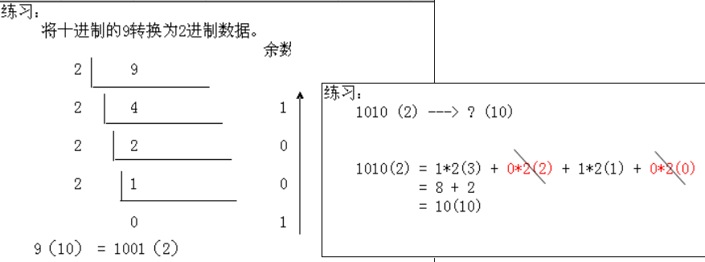
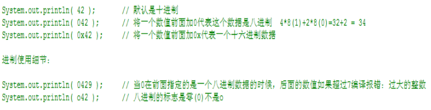
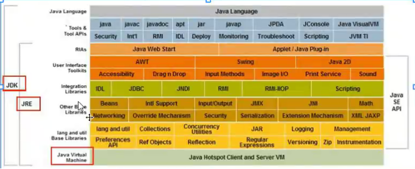
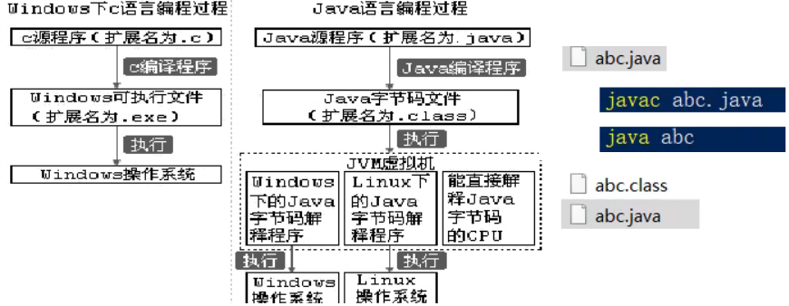

[TOC]


# 1 计算机基础

## 1.1 **常见的dos命令**

```shell
盘符： 进入指定的盘符下。
dir : 列出当前目录下的文件以及文件夹
md : 创建目录 
rd : 删除目录    注意：rd不能删除非空的文件夹，而且只能用于删除文件夹。
cd : 进入指定目录
cd.. : 退回到上一级目录
*cd * : 退回到根目录
echo "hello java">a.txt  写入文本到指定文件  
type a.txt 显示文件内容命令
del : 删除文件    注意：不能删除文件夹，只能删除文件。
exit : 退出dos命令行
cls  : 通知计算机将当前的命令清空
tab  命令补全。
方向键上下是找回上次你写过的命令。
set [name] 设置临时环境变量
```

Window上没有telnet

https://jingyan.baidu.com/article/ed15cb1b76b6021be2698110.html


## 1.2 字符编码

```
ASCII 	编码针对英文
ISO-8859-1   
GBK
UTF-8	
```

## 1.3 进制

### 1.3.1 **定义**

进制：进制是一种记数方式 ，可以用有限的[数字](http://baike.baidu.com/view/37407.htm)符号代表所有的数值。由特定的数值组成。

**整型的四种表现形式**

1. 十进制： 都是以0-9这九个数字组成，不能以0开头。

2. 二进制： 由0和1两个数字组成。

3. 八进制： 由0-7数字组成，为了区分与其他进制的数字区别，开头都是以0开始。

4. 十六进制：由0-9和A-F组成。为了区分于其他数字的区别，开头都是以0x开始。


### 1.3.2 进制转换

#### **十进制与二进制之间的转换**

​	十进制转二进制的转换原理：除以2，反向取余数，直到商为0终止。二进制转十进制的转换原理:就是用二进制的每一个乘以2的n次方，n从0开始，每次递增1。然后得出来的每个数相加

​	存在问题：书写特别长，不方便记忆。



####  **十进制与八进制之间转换**

 

1. **八进制的特点**

由数字0-7组成。即使用三个开关表示一个八进制数。

 10进制转换8进制原理：就是用十进制的数字不断除于8，取余数。

八进制转十进制原理： 用把进制的数不断乘以8的n次方，n从0开始，每次递增1。


#### 十进制与十六进制之间的转换

十六进制特点：由0~9 a(10) b(11) c(12) d(13) e(14) f(15)组成。

十进制转十六进制原理：就是不断除以16，取余数。


### 1.3.3 java中进制表示




# 2 **java简介**

## 2.1 **概述**

​	简单易用、静态语言、面向对象、跨平台、多线程和并发、安全性**

​	开发的原则：高内聚（内聚：就是自己完成某件事情的能力），低耦合（耦合：类与类的关系）。

​	 Java的三大平台： JavaSE、Java EE、Java ME

## 2.2 **Jdk、jre和jvm**

###  2.2.1 三者关系

​	具体参看java安装， 三者关系[www.oracle.com](http://www.oracle.com)

 

### 2.2.1 **JDK（java开发工具包）**

```
bin目录：存放Java的编译器、解释器等工具(可执行文件)。
db目录：JDK7附带的一个轻量级的数据库，名字叫做Derby。
include目录：存放的调用系统资源的接口文件。
jre目录：存放Java运行环境文件。
lib目录：存放Java的类库文件。
src.zip文件：JDK提供的类的源代码。
```

**安装JDK需要注意的事项：**不要包含中文**。不要包含空格。

### 2.2.2 **JRE（java运行环境）**

​	JRE  Java Runtime Environment Java运行环境。包括Java虚拟机(JVM Java Virtual Machine)和Java程序所需的核心类库等，如果想要运行一个开发好的Java程序，计算机中只需要安装JRE即可。

 

## 2.3 **java****语言重要特性**

### 2.3.1 **静态语言**

所以java数组、对象被初始化后他的长度是不可变的

 

### 2.3.2 **跨平台** 

#### Java跨平台的原理

Java的跨平台是通过Java虚拟机（JVM）来实现的。  

 

#### **Java语言编译过程**

Java虚拟机的核心是所谓的字节码指令（直接被识别和执行的一种由0,1组成的序列代码）

Java虚拟机将java源文件编译成为字节码文件

 

 

 

 


