菜鸟教程：http://www.runoob.com/java/java-methods.html

 

# 1 **方法**

## 1.1 **概念**

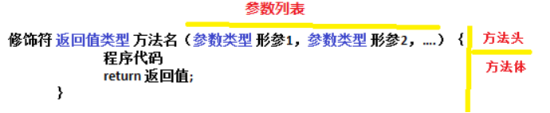 

```
修饰符：目前就用 public static。后面我们再详细的讲解其他的修饰符。
返回值类型：就是功能结果的数据类型。
方法名：符合命名规则即可。方便我们的调用。
	参数：
    	实际参数：就是实际参与运算的。
		形式参数；就是方法定义上的，用于接收实际参数的。
	参数类型：就是参数的数据类型
	参数名：就是变量名
方法体语句：就是完成功能的代码。
	return：结束方法的。
	返回值：就是功能的结果，由return带给调用者。
```

作用及特点：

1. 定义方法可以将功能代码进行封装，便于对该功能进行复用（提高了代码的复用性）
2. 方法只有被调用才会被执行
3. 对于方法没有具体返回值的情况，返回值类型用关键字void表示，那么该方法中的return语句可省略不写。

## 1.2 **分类**

​	实列方法		

​	类方法(静态方法)       static

特殊的：构造方法，抽象方法


## 1.3 方法重载（Overload）

​	在同一个类中（同一作用域）

​	方法名相同，

​	返回类型+参数不同（参数个数，参数类型，参数顺序）不同。与返回值无关。

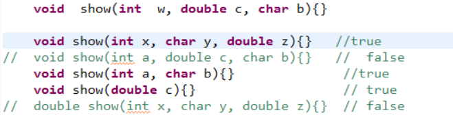 

  **方法的重载存在的原因：**为了增强方法的阅读性，优化了程序设计。


菜鸟教程：http://www.runoob.com/java/java-methods.html

 

 

 

# 2 **构造方法Constructor**

## 2.1 **作用**

使用 new + 构造方法 创建一个新的对象。给对象的数据(属性)进行初始化

 

## 2.2 **特征**

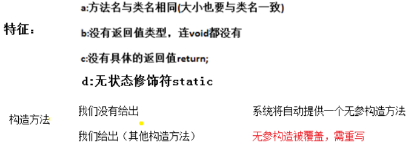 

 

## 2.3 **构造方法的调用**

使用new+构造函数创建一个新的对象。

​			eg: Person tom = new Person(1,25);

 

## 2.4 **构造方法重载**

方法重载的一个重要应用就是重载构造方法；

可以定义一组构造方法，使其构成重载关系，从而方便使用者能够灵活机动地以各种不同的方式来实例化对象。

重载:方法名相同,与返回值类型无关(构造方法没有返回值),只看参数列表

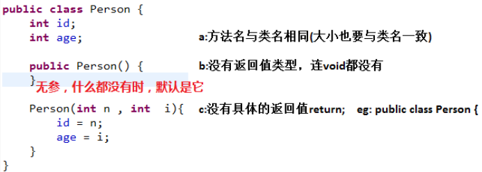 

 

# 3 **参数传值**

## 3.1 **概述**

​	java中是没有指针的，java中只存在值传递，只存在值传递！！！  

 

​	然而我们经常看到对于对象（数组，类，接口）的传递似乎有点像引用传递，可以改变对象中某个属性的值。但是不要被这个假象所蒙蔽，实际上这个传入函数的值是对象引用的拷贝，即传递的是引用的地址值，所以还是按值传递。

 

## 3.2 **参数传递**

### 3.2.1 **值传递**

​	值传递的数据类型包括，**八种基本数据类型和String**。值传递是指方法调用时，实际参数把它的值传递给对应方法的形参，如change()方法中i和j，也在内存空间中分配了存储单元，这样形参在change()方法中的改变不会影响实际参数的值。

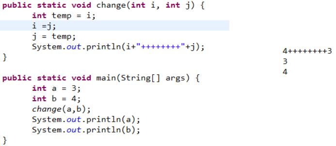 


### 3.2.2 **引用传递（改变地址值）**

​	指的是在方法调用时，传递的参数是按引用进行传递，其实传递的引用的地址，也就是变量所对应的内存空间的地址。**除了String**

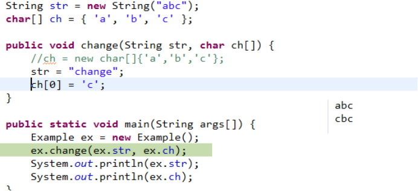

 

### 3.2.3 **值传递和引用传递比较**

​	值传递和引用传递的本质区别在于是否在传递的时候进行对象的内存拷贝。

​	基本类型是由于在JVM中存储区域不同于普通对象所以传递前会拷贝，传递的是拷贝后的值，但是对象在传递的时候不拷贝，直接传“引用值”，指向同一片对象堆内存区域，当然要注意String这种特殊情况。

 

### 3.2.4 **String本质是值传递**

https://blog.csdn.net/u010469514/article/details/80838678

 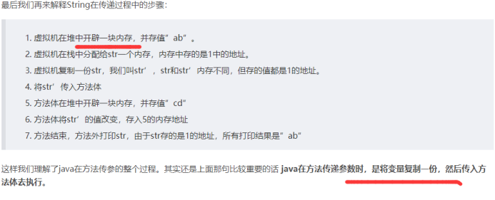

### 3.2.5 **面试题**

#### 值传递和引用传递

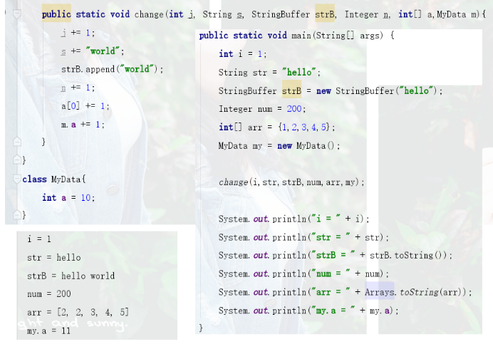

 

## 3.3 **可变参数**		

 

​	 public double Stu(double a , int … x){ }

​	Teacher  oa = new Teacher ();

​	double  obj = oa.Stu(1.0 /3); 	

 


# 4 **方法调用**

## 4.1 **方法的调用形式**

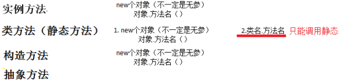

 

## 4.2 **赋值调用**

```java
单独调用,一般来说没有意义，所以不推荐。
	add(30, 40);
赋值调用,推荐方案。
	int sum = add(30, 40);
```

 

## 4.3 **方法的调用顺序**

类的加载，对象的创建，方法的调用

静态  -> 对象 （构造方法 -> 一般方法）->局部变量

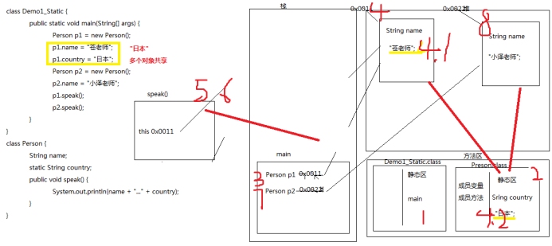

 

 

## 4.4 **方法调用之代码块**

### 4.4.1 **概述**

​	在Java中，使用{}括起来的代码被称为代码块。

​	根据其位置和声明的不同，可以分为局部代码块，构造代码块，静态代码块，同步代码块(多线程讲解)。

| 类型       |                              |                                                    |
| ---------- | ---------------------------- | -------------------------------------------------- |
| 普通代码块 | 方法或语句中出现的{}         |                                                    |
| 构造代码块 | 类中定义的代码块为{}         | 在创建对象时被调用，每次创建对象都会被调用         |
| 静态代码块 | 类中定义的加static代码块为{} | 静态块用于初始化类，为类的属性初始化。只会执行一次 |
| 同步代码块 |                              |                                                    |

 

### 4.4.2 **常见代码块的应用**

 **局部代码块**

​	在方法中出现；限定变量生命周期，及早释放，提高内存利用率

**构造代码块 (初始化块)**

​	给所有的对象进行统一的初始化。

​	对象一建立就运行并且优先于构造函数。

**静态代码块** 

​	静态代码块不能存在于任何方法体内。静态代码块不能直接访问静态实例变量和静态实例方法，需要通过类的实例对象来访问。

​	在类中方法外出现，并加上static修饰；用于给类进行初始化，在加载的时候就执行，并且只执行一次。	一般用于加载驱动

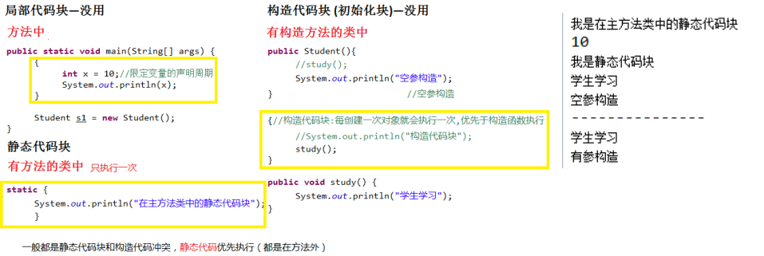

 

### 4.4.3 代码块优先级

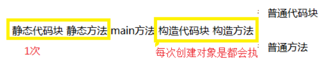

### 4.4.4 **面试题**

#### 代码块优先级

```java
class Student {
	static {
		System.out.println("Student 静态代码块");
	}
	
	{
		System.out.println("Student 构造代码块");
	}
	
	public Student() {
		System.out.println("Student 构造方法");
	}
}

class Demo2_Student {
	static {
		System.out.println("Demo2_Student静态代码块");
	}
	
	public static void main(String[] args) {
		System.out.println("我是main方法");
		
		Student s1 = new Student();
		Student s2 = new Student();
	}
}
```

 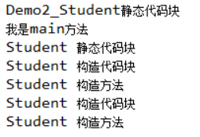

## 4.5 方法调用之**变量**赋值

### 4.5.1 **给私有成员变量赋值**

来源：私有变量不能直接修改值，延伸出来的方法

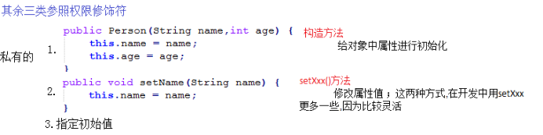 

 

 

 

 

 

 

 

 

 

 

 

 

 

 

 

