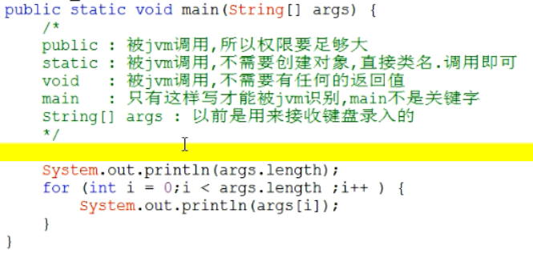
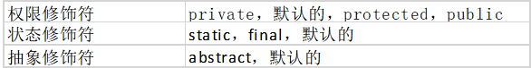
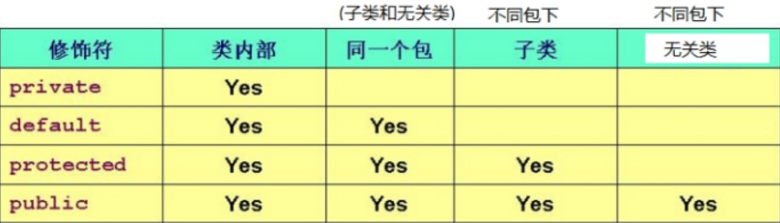
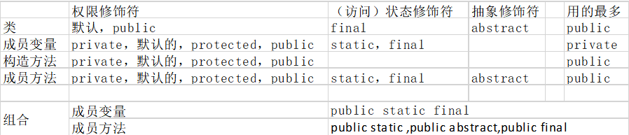

# 1 Main

 

 

# 2 **包**

## 2.1 **概述及作用**

**为什么要有包**

​	解决可能会发生类名的重复问题,  字节码(.class)进行分类存放 , 

​	包其实就是文件夹

 

**包的概述**

​	有时候，类和类的名称可能发生冲突；

​	Java提供了把类名空间划分为更容易管理的块的机制，这就是包；包允许将类组合成较小的单元，类似于文件夹；

​	有助于避免命名冲突，分属不同包的类即便名称相同也不会引起误会；能在包与包之间对于类的访问权限提供更有力的约束。

 

**缺省包**

​	如果省略了package语句，类将保存在一个缺省的没有名称的包中；

​	尽管缺省包很方便，但对于大型的程序，它是不恰当的；请尽量为自己编写的类定义具体的包。

 

**带包的类编译和运行**

​	javac编译的时候带上-d即可: 		javac -d . HelloWorld.java

​	通过java命令执行: 				java 包名.HellWord

 

## 2.2 **package关键字** 

定义包的格式

​	* package 包名;

​	* 多级包用.分开即可

建议包名和域名相反	com.laolan….

 

注意事项

​	package语句必须是程序的第一条可执行的代码

​	package语句在一个java文件中只能有一个

​	如果没有package，默认表示无包名

 

## 2.2 **import关键字**

​	为什么要有import

​		其实就是让有包的类对调用者可见,不用写全类名了

 

​	导包格式

​		import 包名;

​		注意：

​			这种方式导入是到类的名称。

​			虽然可以最后写 * ，但是不建议。建议全路径 

 菜鸟教程：http://www.runoob.com/java/java-modifier-types.html

 

 

# 3 **修饰符**

## 3.1 **修饰符**

 

## 3.2 **四种权限修饰符**

 

 

## 3.3 **常见修饰符应用**

 