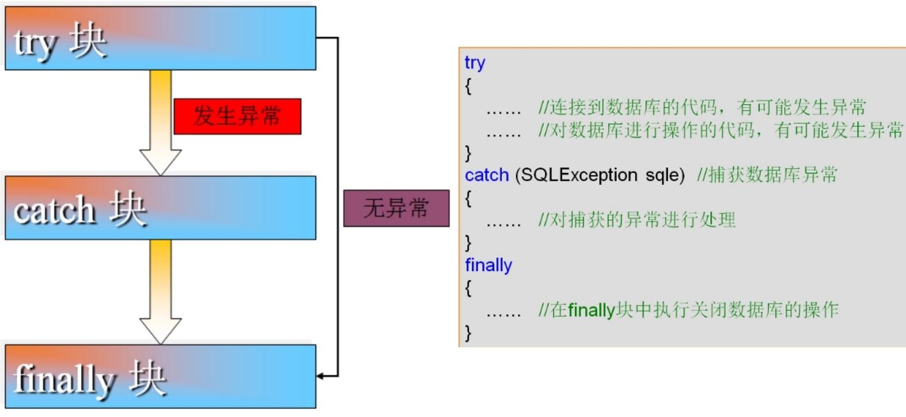

# 1 **异常**

## 1.1 **Throwable 类**

### 1.1.1 **概述**

Throwable 类是 Java 语言中所有错误或异常的超类

 

### 1.1.2 子类

Throwable有两个直接子类，它们是：


### 1.1.3 **常见方法**

getMessage()		获取异常信息，返回字符串。

toString()			获取异常类名和异常信息，返回字符串。

printStackTrace()	获取异常类名和异常信息，以及异常出现在程序中的位置。返回值void。

 

## 1.2 **异常**

### 1.2.1 **概述**

异常就是Java程序在运行过程中出现的错误。异常可分为两大类：编译时异常和运行时异常；

编译时异常一般是指语法错误，可以通过编译器的提示加以修正，这里我们不予讨论；

运行时异常包括：运行错误：如数组下标越界，除数为0等；逻辑错误：如年龄超过200岁等。

 

### 1.2.2 **构造方法**

 

| 方法                                                         |                                                              |
| ------------------------------------------------------------ | ------------------------------------------------------------ |
| [Exception](#Exception())()                                  | 构造详细消息为 null 的新异常。                               |
| [Exception](#Exception(java.lang.String))([String](mk:@MSITStore:F:\a桌面数据\参考API\jdk\JDK_API_1_6_zh_CN.CHM::/java/lang/String.html) message) | 构造带指定详细消息的新异常。                                 |
| [Exception](#Exception(java.lang.String, java.lang.Throwable))([String](mk:@MSITStore:F:\a桌面数据\参考API\jdk\JDK_API_1_6_zh_CN.CHM::/java/lang/String.html) message, [Throwable](mk:@MSITStore:F:\a桌面数据\参考API\jdk\JDK_API_1_6_zh_CN.CHM::/java/lang/Throwable.html) cause) | 构造带指定详细消息和原因的新异常。                           |
| [Exception](#Exception(java.lang.Throwable))([Throwable](mk:@MSITStore:F:\a桌面数据\参考API\jdk\JDK_API_1_6_zh_CN.CHM::/java/lang/Throwable.html) cause) | 根据指定的原因和 (cause==null ? null : cause.toString()) 的详细消息构造新异常（它通常包含 cause 的类和详细消息）。 |

 

### 1.2.3 异常子类

​	所有的RuntimeException类及其子类的实例被称为运行时异常，其他的异常就是编译时异常

 

 

### 1.2.4 区别

 

 

## 1.3 **异常处理**

### 1.3.1 **处理异常方式**

```
try..catch..finally
	try..catch
	try..catch..finally
	try..finally
	try-with-resources
	
throws
```

 

### 1.3.2 **检测捕获**

#### **trycatch**

try...catch的方式处理多个异常

多重嵌套catch：不论有多少个catch块，最多只会执行其中的一个；请注意catch块的书写顺序：类层次越低的越往上写，越高的越往下写。

 


#### **finally**

特点

​	无论是否发生异常，被finally控制的语句体一定会执行

​	特殊情况：在执行到finally之前jvm退出了(比如System.exit(0))

 

作用

当异常发生时，程序可能会意外中断，有些被占用的资源就得不到清理（用于释放资源，在IO流操作和数据库操作中会见到）。finally块可以确保执行所有的清理工作；

 

注意

finally块必须和try块一起使用，不能单独存在。是可选的，可视具体情况决定是否添加

​	千万不要在finally里面写return语句: 如果在这里面写返回语句,那么try和catch的结果都会被改变,所以这么写就是犯罪

 

#### **执行流程**

try开始执行，发生异常跳过异常之后的语句，走catch，再走finally；无异常直接走finally

 

 

#### try-with-resources 

https://www.jianshu.com/p/6adb6dbc4140


### 1.3.3 抛出

throws的方式处理异常

​	定义功能方法时，需要把出现的问题暴露出来让调用者去处理。

​	用在方法声明后面，跟的是异常类名，可以跟多个异常类名，用逗号隔开，那么就通过throws在方法上标识。

 

throw的概述

​	在功能方法内部出现某种情况，程序不能继续运行，需要进行跳转时，就用throw把异常对象抛出。

​	用在方法体内，跟的是异常对象名，只能抛出一个异常对象名，表示抛出异常，由方法体内的语句处理


 

 

 