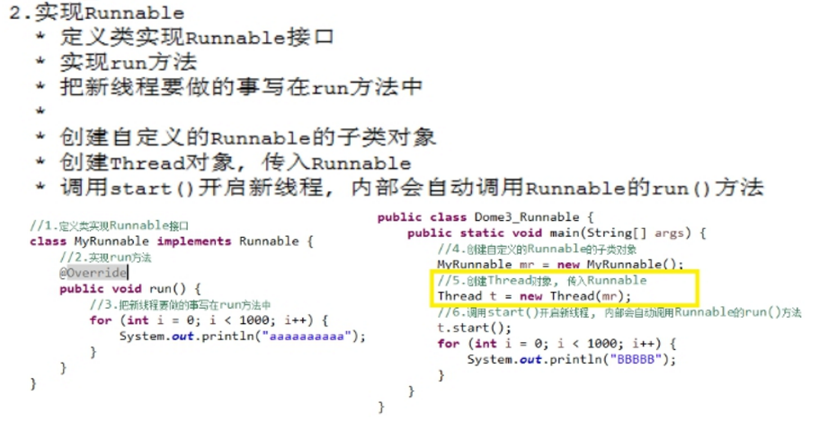
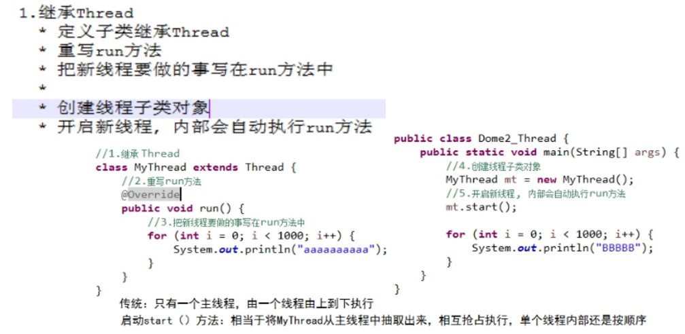
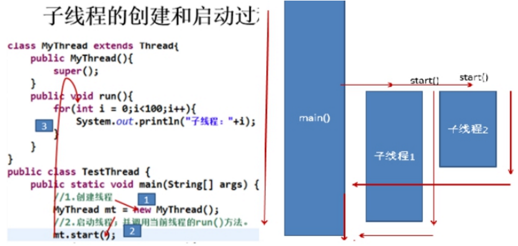
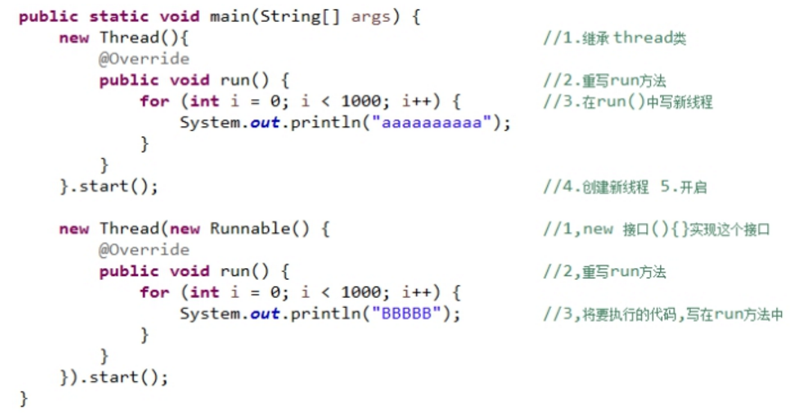
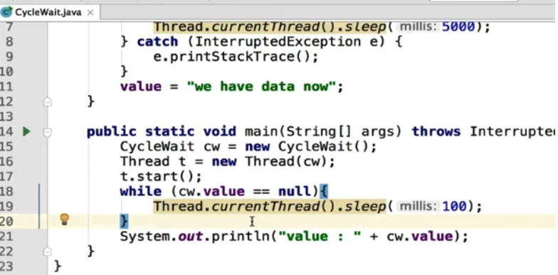
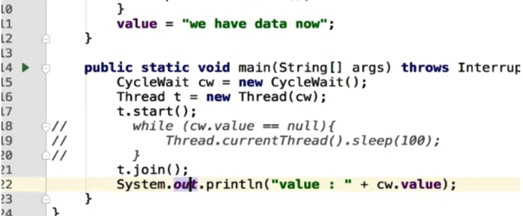
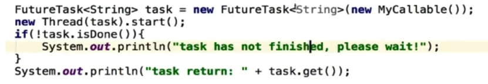
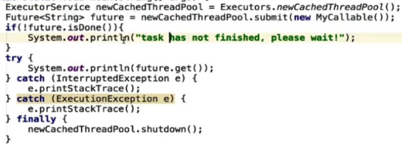

# 1 **创建线程**

## 1.1  创建线程（2种）

### 1.1.1  创建线程（2种）

继承Thread：线程代码存放Thread子类run方法中。

实现Runnable：线程代码存在接口的子类的run方法。


实现Callable接口和FutureTask创建线程*

创建线程池


### 1.1.2 方法一：**实现Runnable接口**




### 1.1.3 方法二：继承Thread




子线程的创建启动过程

 结果：两个线程相互抢占资源输出



## 1.2 Thread 和Runnable

### **1.2.1 实现Runnable接口 更好**

1. 从代码架构角度： `具体的任务（run方法）应该和“创建和运行线程的机制（Thread类）”解耦`，用runnable对象可以实现解耦。
2. 使用继承Thread的方式的话，那么每次想创建一个新任务，只能新建一个独立的线程，而`这样做的损耗会比较大`（比如重头开始创建一个线程，执行完毕以后再销毁等。如果线程的实际工作内容，就是run方法里面只是简单的打印一行字的话，那么可能线程的实际工作内容还不如损耗来的大）。`如果使用Runnable和线程池，就可以大大减少这样的损耗`。
3. 继承Thread类后，由于Java语言不支持双继承，这样就无法再继承其他的类，`限制了可扩展性`。

### **1.2.2 本质对比**

​	继承Thread : 由于子类重写了`Thread类的run()`, 当调用start()时, 直接找子类的run()方法

​	实现Runnable : 构造函数中传入了Runnable的引用, 成员变量记住了它, start()调用run()方法时内部判断成员变量Runnable的引用是否为空, 不为空编译时看的是Runnable的run(),运行时执行的是子类的run()方法 

```java
@Override
    public void run() {
        if (target != null) {
            target.run();
        }
    }
```

 	Thread类也是实现Runnable接口

​	1,看Thread类的构造函数,传递了Runnable接口的引用 

​	2,通过init()方法找到传递的target给成员变量的target赋值

​	3,查看run方法,发现run方法中有判断,如果target不为null就会调用Runnable接口子类对象的run方


### 1.2.3  **匿名内部类实现方式**



 

 

 

# 2 传参和返回 

## 2.1 **如何给run()方法传参**

https://blog.csdn.net/saycheesenn/article/details/52956331

```
实现方式主要有三种
构造函数传参
成员变量传参
回调函数传参
```

 

## 2.2 **如何处理线程返回值**

```
主线程等待法
使用Thread类的join() 阻塞当前线程以等待子线程处理完毕
通过Callable接口实现：通过FutureTask Or 线程池获取 
```

### 2.2.1 **主线程等待法**

在没有得到返回值，无限循环去暂停主线程

 

 

 

### 2.4.2 **Join阻塞当前线程**

使用Thread类的join()阻塞当前线程以等待子线程处理完毕



 

### 2.4.3 **Callable接口**

通过Callable接口实现：通过FutureTask Or 线程池获取

#### 2.4.3.1 **FutureTask**



 

#### 2.4.3.2 **线程池Future获取**



 

 

 

 

 

 