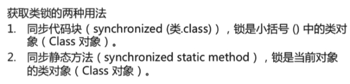
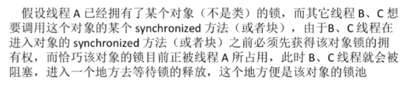

# 1 **Thread类的有关方法**

## 1.1 **构造方法**

| 方法                                       |                                          |
| ------------------------------------------ | ---------------------------------------- |
| Thread()                                   | 创建新的Thread对象                       |
| Thread(String threadname)                  | 创建线程并指定线程实例名                 |
| Thread(Runnable target)                    | 创建新的Thread对象,实现Runnable的run方法 |
| Thread(String threadname，Runnable target) | 创建线程并指定线程实例名                 |

| 方法  |                        |
| ----- | ---------------------- |
| run() | 线程在调度时执行的操作 |

## 1.2 **成员**方法

| 方法                 |                                 |
| -------------------- | ------------------------------- |
| start()              | 启动线程，并执行对象的run()方法 |
| currentThread()      | 返回当前线程                    |
| getName()            | 返回当前线程的名称              |
| setName(String name) | 设置改线程名称                  |
| setPriority(10)      | 设置优先级                      |

| 方法            |                                                              |
| --------------- | ------------------------------------------------------------ |
| sleep(long l)   | 显示的让当前线程睡眠1ms                                      |
| join()          |                                                              |
| yield()         |                                                              |
| ...             |                                                              |
| isAlive()       | 当前线程是否还存活                                           |
| setDaemon(true) | 设置为守护线程，该线程不会单独执行，当其他非守护线程都执行结束后，自动退出 |

### wait、notify、notifyAll

### sleep

Thread.sleep(毫秒,纳秒), 控制当前线程休眠若干毫秒1秒= 1000毫秒 1秒 = 1000 * 1000 * 1000纳秒 1000000000

 

### join

join(), 当前线程暂停, 等待指定的线程执行结束后, 当前线程再继续

\* join(int), 可以等待指定的毫秒之后继续

### yield

yield让出cpu（并不是强制，最终还是取决于线程调度）

yield 不会对锁造成影响

### Thread.currentThread()

Thread.*currentThread*()

### start、run

### stop、suspend、resume

# 2 **线程安全与同步**

## 2.1 **线程安全与同步问题**

线程安全问题的主要诱因

​	存在共享数据（也称临界资源）

​	存在多条线程共同操作这些共享数据

解决问题的根本方法（同步）

​	同一时刻有且只有一个线程在操作共享数据，其他线程必须等到改线程处理完数据后再对共享数据进行操作

 

## 2.2 **Synchronized**

### 2.3.1 **锁的本质**

Synchronized锁的不是代码，锁的都是对象

 

### 2.3.2 **获取对象锁**

 

 

### 2.3.3 **获取类锁**

 

### 2.2.4 **锁池EntryList**

 

 

# 3 **线程通信**

## 3.1 **线程通信**

​	Java.lang.Object提供的这三个方法只有在synchronized方法或synchronized代码块中才能使用，否则会报java.lang.IllegalMonitorStateException异常

 

​	使当前线程进入等待（某对象）状态  对象名.wait()。

​	调用此方法后，当前线程将释放对象监控权  ，然后进入等待

​	在当前线程被notify后，要重新获得监控权，然后从断点处继续代码的执行。

## 3.2 **wait()** 

### 3.2.1 **概述**

​	在当前线程中调用方法：  对象名.wait()

​	调用方法的必要条件：当前线程必须具有对该对象的监控权（加锁）

### 3.2.2 **等待池WaitSet**

调用进入等待池

###   3.2.3 s**leep** **和 wait** **的区别**

基本的差别

​	sleep是Thread类的方法，wait是Object类中的定义的方法

​	sleep()方法可以在任何地方使用，wait()只能在Synchronized方法或Synchronized块中使用

最主要的本质区别

​	Thread.sleep()只会让出CPU，不会导致锁行为的改变

​	Object.wait不仅会让出CPU，还会释放已经占用的同步资源锁

 

## 3.3 **notify()/notifyAll()**

**概述**

​	在当前线程中调用方法：  对象名.notify()

​	功能：唤醒等待该对象监控权的一个线程。

​	调用方法的必要条件：当前线程必须具有对该对象的监控权（加锁）

 

**区别**

notifyAll会让所有处于等待池的线程全部进入锁池去竞争获取锁的机会；notify是随意选择一个

 

## 3.4 **实例**

看对应源码

1.使用两个线程打印 1-100.

2.经典例题：生产者/消费者问题

3.模拟银行取钱的问题

 

 

 

 

 

 

 

 

 

 

 

 

 

 

 

 

 

 

 