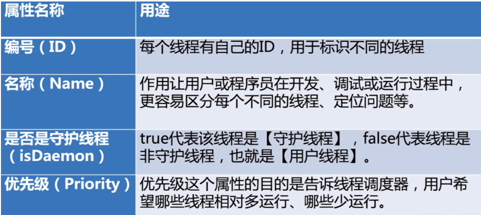

# 1 属性

 

# 1 **Thread****类的有关方法**

## 1.1 **构造方法**

| 方法                                       |                                          |
| ------------------------------------------ | ---------------------------------------- |
| Thread()                                   | 创建新的Thread对象                       |
| Thread(String threadname)                  | 创建线程并指定线程实例名                 |
| Thread(Runnable target)                    | 创建新的Thread对象,实现Runnable的run方法 |
| Thread(String threadname，Runnable target) | 创建线程并指定线程实例名                 |

| 方法  |                        |
| ----- | ---------------------- |
| run() | 线程在调度时执行的操作 |

## 1.2 **成员**方法**

| 方法                 |                                 |
| -------------------- | ------------------------------- |
| start()              | 启动线程，并执行对象的run()方法 |
| currentThread()      | 返回当前线程                    |
| getName()            | 返回当前线程的名称              |
| setName(String name) | 设置改线程名称                  |
| setPriority(10)      | 设置优先级                      |

| 方法            |                                                              |
| --------------- | ------------------------------------------------------------ |
| sleep(long l)   | 显示的让当前线程睡眠1ms                                      |
| join()          |                                                              |
| yield()         |                                                              |
| ...             |                                                              |
| isAlive()       | 当前线程是否还存活                                           |
| setDaemon(true) | 设置为守护线程，该线程不会单独执行，当其他非守护线程都执行结束后，自动退出 |

### wait、notify、notifyAll

### sleep

Thread.sleep(毫秒,纳秒), 控制当前线程休眠若干毫秒1秒= 1000毫秒 1秒 = 1000 * 1000 * 1000纳秒 1000000000

 

### join

join(), 当前线程暂停, 等待指定的线程执行结束后, 当前线程再继续

\* join(int), 可以等待指定的毫秒之后继续

### yield

yield让出cpu（并不是强制，最终还是取决于线程调度）

yield 不会对锁造成影响

### Thread.currentThread()

Thread.*currentThread*()

### start、run

### stop、suspend、resume

 

 

 

 

 

 

 

 

 

 

 

 

 

 

 

 

 

 

 