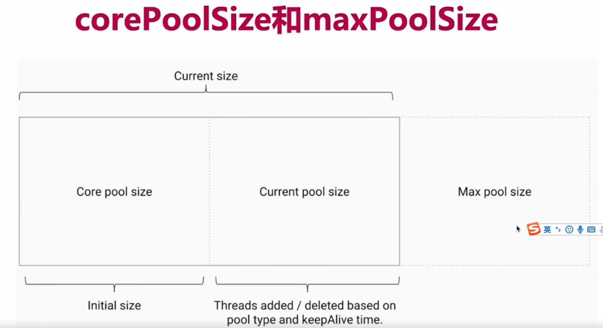

# 线程池

## 线程池的自我介绍

### 线程池解决的问题

- 线程的重要性
- 什么是“池”
  - 软件中的“池”，可以理解为计划经济


>
> #### 多线程带来的问题
>

如果不使用线程池，每个任务都可以新开一个线程处理

- 一个线程 threadpool.EveryTaskOneThread

```java
public static void main(String[] args) {
        Thread thread = new Thread(new Task());
        thread.start();
    }
```

- for循环创建线程 threadpool.ForLoop
- 当任务数量上升到1000 threadpool.ForLoop

```java
public static void main(String[] args) {
        for (int i = 0; i < 1000; i++) {
            Thread thread = new Thread(new Task());
            thread.start();
        }
    }
```

这样开销太大，我们希望有固定数量的线程，来执行这1000个线程，这样就避免了反复创建并销毁线程所带来的开销问题

> #### 线程池解决的问题
>

问题

- **问题一：反复创建线程开销大**
- **问题二：过多的线程会占用太多内存**

解决以上问题的思路

- 用少量的线程--避免内存占用过多
- 让这部分线程都保持工作，且可以反复执行任务--避免生命周期的损耗


### 线程池的好处

- 加快响应速度
- 合理利用CPU和内存
- 统一管理

### 线程池适合的应用的场合

- 服务器接收到大量请求时，使用线程池技术是非常合适的，它可以大大减少线程的创建和销毁次数，提高服务器的工作效率
- 实际上，在开发中，如果需要创建5个以上的线程，那么就可以使用线程来管理


## 增减线程的时机

- 线程池`构造函数的参数`
- 线程池应该`手动创建`还是自动创建
- 线程池里的`线程数量`设定为多少比较合适
- `停止`线程池的正确方法


### 线程池构造函数参数


### 参数中的corePoolSize和maxPoolSize

- `corePoolSize`指的是核心线程数：线程池在完成初始化后，默认情况下，线程池并没有任何线程，线程池等待有任务到来时再创建新线程去执行任务
- 线程池有可能会在核心线程数的基础上，额外增加一些线程，但是这些新增加的线程有个上限，这就是最大量`maxPoolSize`



### 添加线程规则

1. 如果线程小于corePoolSize，即使其他工作线程处于空闲状态，也会创建一新的线程来运行新任务
2. 如果线程数大于（或等于）corePoolSize但是小于maximumPoolSize，则放入队列
3. 如果队列已满，并且线程数小于maxPoolSize，则创建一个新线程来运行任务
4. 如果队列已满，并且线程数大于（或等于）maxPoolSize，则拒绝该任务


是否需要增加线程的判断顺序是：

- corePoolSize
- workQueue
- maxPoolSize

线程池：核心池大小为5，最大池大小为10，队列为100

因为线程中的请求最多会创建5个，然后任务将被添加到队列中，直到达到100。当队列已满时，将创建最新的线程maxPoolSize，最多到10个线程，如果再来任务，就拒绝

### 增减线程的特点


## keepAliveTime和线程工程

### keepAliveTime

如果线程池当前线程数多于corePoolSize，那么多余的线程空闲时间超过keepAliveTime，它们会被终止

### ThreadFactory用来创建线程

- 新的线程是由ThreadFactory创建的，默认使用Exectors.defaultThreadFactory()，创建出来的线程都在同一个线程组，拥有同样的NORM_PRIORITY优先级并且都不是守护线程。如果自己制定ThreadFactory，那么就可以改变线程名，线程组，优先级、是否是守护线程等
- 通常我们使用默认的线程工厂

```java
public interface ThreadFactory {
    Thread newThread(Runnable r);
}

Executors
static class DefaultThreadFactory implements ThreadFactory {
        private static final AtomicInteger poolNumber = new AtomicInteger(1);
        private final ThreadGroup group;
        private final AtomicInteger threadNumber = new AtomicInteger(1);
        private final String namePrefix;

        DefaultThreadFactory() {
            SecurityManager s = System.getSecurityManager();
            group = (s != null) ? s.getThreadGroup() :
                                  Thread.currentThread().getThreadGroup();
            namePrefix = "pool-" +
                          poolNumber.getAndIncrement() +
                         "-thread-";
        }

        public Thread newThread(Runnable r) {
            Thread t = new Thread(group, r,
                                  namePrefix + threadNumber.getAndIncrement(),
                                  0);
            if (t.isDaemon())
                t.setDaemon(false);
            if (t.getPriority() != Thread.NORM_PRIORITY)
                t.setPriority(Thread.NORM_PRIORITY);
            return t;
        }
    }
```

### 工作队列

有最常见的队列类型workQueue：

1. ArrayBlockingQueue 数组型阻塞队列
2. LinkedBlockingQueue 链表型阻塞队列
3. DelayQueue 延时队列
4. SynchronousQueue 同步队列
5. PriorityBlockingQueue 优先阻塞队列

## 可能内存溢出的情况

### newFixedThreadPool

由于传进去LinkedBlockingQueue是没有容量上限的，所以当请求数越来越多，并且无法及时处理完毕的时候，也就是请求堆积的时候，会容易造成占用大量的内存，可能会导致OOM

```java
threadpool.FixedThreadPoolOOM
```


### newSingleThreadExecutor

可以看出，和上面原理基本相同，只不过吧线程数直接设置成了1，也会导致同样问题，请求堆积的时候，会容易造成占用大量的内存，可能会导致OOM

### newCachedThreadPool

这里的弊端在于第二个参数maximumPoolSize被设置为Integer.MAX_VALUE，这里会创建数量非常多的线程导致OOM


## 线程池的用法演示

### newFixedThreadPool

正常使用 threadpool.FixedThreadPoolTest

```java
  public static ExecutorService newFixedThreadPool(int nThreads) {
        return new ThreadPoolExecutor(nThreads, nThreads,
                                      0L, TimeUnit.MILLISECONDS,
                                      new LinkedBlockingQueue<Runnable>());
    }
```


### newSingleThreadExecutor

单线程的线程池：只会用唯一的工作线程来执行任务

threadpool.SingleThreadExecutor

```java
   public static ExecutorService newSingleThreadExecutor() {
        return new FinalizableDelegatedExecutorService
            (new ThreadPoolExecutor(1, 1,
                                    0L, TimeUnit.MILLISECONDS,
                                    new LinkedBlockingQueue<Runnable>()));
    }
```


### newCachedThreadPool

可缓存线程池

特点：无界线程池，具有自动回收多余线程的功能

threadpool.CachedThreadPool

```java
public static ExecutorService newCachedThreadPool() {
        return new ThreadPoolExecutor(0, Integer.MAX_VALUE,
                                      60L, TimeUnit.SECONDS,
                                      new SynchronousQueue<Runnable>());
    }
```


### newScheduledThreadPool

支持定时及周期性任务执行的线程池

```java
        ScheduledExecutorService threadPool = Executors.newScheduledThreadPool(10);
        threadPool.schedule(new Task(), 5, TimeUnit.SECONDS);
        threadPool.scheduleAtFixedRate(new Task(), 1, 3, TimeUnit.SECONDS);
```


### 线程池应该手动创建还是自动创建

手动创建更好，因为这样可以让我们更加明确线程池的运行规则，避免资源耗尽的风险

自动创建线程池可能带来的问题

正确的创建线程池的方法：`根据不同的业务场景`，自己设置线程池参数，比如我们的内存多大，我们想给线程取什么名字等等


### 线程池里的线程数量设置为多少


## 对比线程池的特点

### 线程池的构造函数参数对比


### 阻塞队列分析

```
newFixedThreadPool和newSingleThre的Queue是LinkedBlockingQueuead
newCachedThreadPool的Queue是SynchronousQueue
newScheduledThreadPool来说，他使用延时队列DelayWorkQueue
```

### workStealingPool是JDK1.8加入的

子任务

窃取，递归树


## 停止线程池的正确方法

### shutdown

通知线程池停止，已经存在的继续执行，新加入的线程不再执行

```java
  ExecutorService executorService = Executors.newFixedThreadPool(10);
        for (int i = 0; i < 100; i++) {
            executorService.execute(new ShutDownTask());
        }
        Thread.sleep(1500);

        executorService.shutdown();
        executorService.execute(new ShutDownTask());

结果：
pool-1-thread-4
pool-1-thread-8
Exception in thread "main" java.util.concurrent.RejectedExecutionException: Task threadpool.ShutDownTask@29453f44 rejected from java.util.concurrent.ThreadPoolExecutor@5cad8086[Shutting down, pool size = 10, active threads = 10, queued tasks = 66, completed tasks = 24]
	at java.util.concurrent.ThreadPoolExecutor$AbortPolicy.rejectedExecution(ThreadPoolExecutor.java:2063)
	at java.util.concurrent.ThreadPoolExecutor.reject(ThreadPoolExecutor.java:830)
	at java.util.concurrent.ThreadPoolExecutor.execute(ThreadPoolExecutor.java:1379)
	at threadpool.ShutDown.main(ShutDown.java:22)
pool-1-thread-7
pool-1-thread-1
```

### isShutdown

判断是不是进入了停止状态

```java
System.out.println(executorService.isShutdown());//falase
executorService.shutdown();
System.out.println(executorService.isShutdown());//true
```

### isTerminated

判断线程池的所有线程都停止了

```java
executorService.shutdown();
System.out.println(executorService.isTerminated());//false
Thread.sleep(10000);
System.out.println(executorService.isTerminated());//true
```

### awaitTermination

检测一段时间内是不是运行完毕

```java
  Thread.sleep(1500);
executorService.shutdown();
  boolean b = executorService.awaitTermination(7L, TimeUnit.SECONDS);//false 主要是还没到10s，所有还没结束
```

### shutdownNow（重要）

给线程发出中断信号

```java
List<Runnable> runnableList = executorService.shutdownNow();
```

## **handler**任务拒绝策略

### 拒绝时机

1.当Execttor关闭时，提交`新任务`会`被拒绝`

2.当Execttor对最大线程和工作队列容量使用有线边界并且`已经饱和`时

### 4种拒绝策略


### 钩子方法

每个方法执行前后，日志，统计

演示每个任务执行前后放钩子函数	threadpool.PauseableThreadPool

```java
 @Override
    protected void beforeExecute(Thread t, Runnable r) {
        super.beforeExecute(t, r);
        lock.lock();
        try {
            while (isPaused) {
                unpaused.await();
            }
        } catch (InterruptedException e) {
            e.printStackTrace();
        } finally {
            lock.unlock();
        }
    }

private void pause() {
        lock.lock();
        try {
            isPaused = true;
        } finally {
            lock.unlock();
        }
    }

    public void resume() {
        lock.lock();
        try {
            isPaused = false;
            unpaused.signalAll();
        } finally {
            lock.unlock();
        }
    }
```

## Executor家族的辨析

### 实现原理以及源码分析


### 线程池家族


#### Executor

```java
public interface Executor {
    void execute(Runnable command);	// 执行任务
}
```


#### ExecutorService

```java
// 具备初步操作线程池的方法
public interface ExecutorService extends Executor {
    void shutdown();
    List<Runnable> shutdownNow();
    boolean isShutdown();
    boolean isTerminated();
    boolean awaitTermination(long timeout, TimeUnit unit) throws InterruptedException;
    <T> Future<T> submit(Callable<T> task);
    <T> Future<T> submit(Runnable task, T result);
    Future<?> submit(Runnable task);
}
```

#### Executors

帮我们快速创建线程池的工具类


#### ThreadPoolExecutor

线程池


### 线程池实现线程复用的原理

相同的线程执行不同的任务


## 线程池状态

### 线程池状态


### **状态转换图**


### 使用线程池注意点

