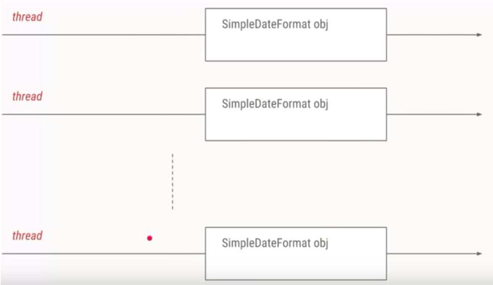
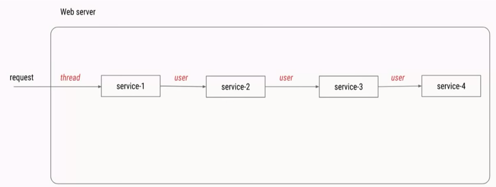

# ThreadLocal【一次解决老大难问题】

## 两大使用场景——ThreadLocal的用途

### 两大使用场景

#### 典型场景1：每个线程需要一个独享的对象

​	典型场景1：每个线程需要一个独享的对象（通常是工具类，典型需要使用的类有SimpleDateFormat和Random）

​	每个Thread内有自己的实例副本，不共享

​	比喻：`教材`只有一本，一起做笔记有线程安全问题。`复印`后没问题

​	SimpleDateFormat进化之路


#### 典型场景2：避免参数传递的麻烦

​	典型场景2：每个线程内需要保存类似于`全局变量`的信息（例如在拦截器中获取`用户信息`，该信息在本线程执行的各方法中保持不变），可以让`不同方法直接使用`，却不想被多线程共享（因为不同线程获取到的用户信息不一样），避免参数传递的麻烦

​	总结: ThreadLocal的两个作用; 两大场景的区别分析

#### 


### SimpleDateFormat进化之路

1. 2个线程分别用`自己`的SimpleDateFormat，这没问题
2. 后来延伸出`10`个，就有10个线程和10个SimpleDateFormat，这虽然写法不优雅（应该复用对象），但勉强接受
3. 但是当需求变成`1000`个，那么必然要使用`线程池`（否则消耗内存太多）
4. 所有的线程都`共用同一个`simpleDateFormat对象
5. 这是线程`不安全`的，出现了并发`安全问题`
6. 我们可以选择`加锁`，加锁后结果正常，但是`效率低`
7. 在这里使用的更好`解决方案`是`ThreadLocal`
8. lambda表达式

#### 两个单纯的线程

没问题，threadlocal.ThreadLocalNormalUsage00


#### 10个线程打印日期

没问题，threadlocal.ThreadLocalNormalUsage01, 在线程数还比较少的情况下，日期格式化目前还是正常的



#### 1000个线程打印日期

没问题，threadlocal.ThreadLocalNormalUsage02

 在线程数还比较少的情况下，日期格式化目前还是正常的，但是创建了1000个对象，太尼玛耗内存的了


#### 共同使用一个对象

有问题，threadlocal.ThreadLocalNormalUsage03

```java
static SimpleDateFormat dateFormat = new SimpleDateFormat("yyyy-MM-dd HH:mm:ss");
```

由于simpleDateFormat本身不是线程安全，所以会出现日期得到相同的值，理论上结果都该不一样


暂时加锁解决，不过效率不好恭维 threadlocal.ThreadLocalNormalUsage04

```java
synchronized (ThreadLocalNormalUsage04.class) {
            s = dateFormat.format(date);
        }
```


#### 更好的解决方案是使用ThreadLocal

 利用ThreadLocal，给每个线程分配自己的dateFormat对象，保证了线程安全，高效利用内存


```java
class ThreadSafeFormatter {

    public static ThreadLocal<SimpleDateFormat> dateFormatThreadLocal = new ThreadLocal<SimpleDateFormat>() {
        @Override
        protected SimpleDateFormat initialValue() {
            return new SimpleDateFormat("yyyy-MM-dd HH:mm:ss");
        }
    };

    // 
     public static ThreadLocal<SimpleDateFormat> dateFormatThreadLocal2 = ThreadLocal
            .withInitial(() -> new SimpleDateFormat("yyyy-MM-dd HH:mm:ss"));
}
```

### 实例：当前用户信息信息需要被线程内的所有方法共享

一个比较繁琐的解决方案是把user作为参数`层层传递`，从service-1()传递到service-2()，再从service-2()传递到

service-3()，以此类推，但是这样会导致`代码冗余且不易维护`




`每个线程内需要保存全局变量，可以让不同的方法直接调用，避免参数传递的麻烦`

> 方法

- 用ThreadLocal保存一些业务内容（用户权限信息、从用户系统获取到用户名、user ID等）

- 这些信息在`同一个线程内相同`，但是不同线程使用的业务内容是`不相同`的

- `在线程生命周期内`，都可以适应这个静态ThreadLocal实例的get()方法取得自己set过的那个对象，`避免`了将这个对象（列如user对象）作为自己`参数传递`的麻烦

- 在此基础可以严谨，使用`UserMap`


- 当多线程同时工作时，我们需要保证线程安全，可以使用`synchronized`, 也可以使用`ConcurrentHashMap`,但是无论使用什么，都会对性能有所影响


- 更好的方式是使用`ThreadLocal`，无需synchronized，可以在不影响性能的情况下，也无需层层传递参数，就可以达到保存当前线程对应的用户信息的目的
  - 强调是同一个请求内（同一个线程内）`不同方法`间的共享
  - 不需要重写`initValue()`方法，但是必须手动调用`set()`方法


```java
/**
 * 描述：     演示ThreadLocal用法2：避免传递参数的麻烦
 */
public class ThreadLocalNormalUsage06 {
    public static void main(String[] args) {
        new Service1().process("");
    }
}

class Service1 {
    public void process(String name) {
        User user = new User("超哥");
        UserContextHolder.holder.set(user);
        new Service2().process();
    }
}

class Service2 {
    public void process() {
        User user = UserContextHolder.holder.get();
        ThreadSafeFormatter.dateFormatThreadLocal.get();
        System.out.println("Service2拿到用户名：" + user.name);
        new Service3().process();
    }
}

class Service3 {
    public void process() {
        User user = UserContextHolder.holder.get();
        System.out.println("Service3拿到用户名：" + user.name);
        UserContextHolder.holder.remove();
    }
}

class UserContextHolder {
    public static ThreadLocal<User> holder = new ThreadLocal<>();
}
```

### ThreadLocal的两个作用

1.让某个需要用到的对象在`线程间隔离`（每个线程都有自己独立的对象）

2.在任何方法都可以`轻松获取`到该对象

### 两大场景区分分析

#### 场景一：initialValue

在ThreadLocal第一次get的时候把对象给`初始化`出来，对象的初始化时机由我们控制

#### 场景二：set

如果需要保存到ThreadLocal里的对象生成时机不由我们随意控制，列如拦截器生成用户信息，用`ThreadLocal.set`直接放到我们的ThreadLocal中去，以便我们后续使用


## 使用ThreadLocal带来的好处

1. 达到`线程安全`
2. `不需要加锁`，提高执行`效率`
3. 更高效地`利用内存、节省开销`：相比于每个任务都新建一个SimpleDateFormat，显然用ThreadLocal可以节省内存和开销。
4. `免去传参`的繁琐：无论是场景一的工具类，还是场景二的用户名，都可以在任何地方直接通过ThreadLocal拿到，再也不需要每次都传同样的参数。ThreadLocal使得代码耦合度更低，更优雅。


## 主要方法介绍


## 原理源码分析

### ThreadLocal原理


### get方法

​	get方法是先取出当前线程的`ThreadLocalMap`，然后调用`map.getEntry(this)`方法，把本ThreadLocal的应用`作为参数`传入，取出map中属于本ThreadLocal的value

```java
 public T get() {
        Thread t = Thread.currentThread();	// 获取当前线程
        ThreadLocalMap map = getMap(t);	// 获得当前线程的ThreadLocalMap
        // 如果存在，就直接取值 
        if (map != null) {
            ThreadLocalMap.Entry e = map.getEntry(this);
            if (e != null) {
                @SuppressWarnings("unchecked")
                T result = (T)e.value;
                return result;
            }
        }
        // 如果不存在，就初始化
        return setInitialValue();
    }
```

### getMap方法

​	这个map以及map中的key和value都是`保存在线程`中，而不是保存在ThreadLocal中

```java
// 这个map以及map中的key和value都是保存在线程中，而不是保存在ThreadLocal中
ThreadLocalMap getMap(Thread t) {
        return t.threadLocals;
    }

class Thread implements Runnable {
	 ThreadLocal.ThreadLocalMap threadLocals = null;
}
```


### set方法

和setInitialValue类型

```java
 public void set(T value) {
        Thread t = Thread.currentThread();
        ThreadLocalMap map = getMap(t);// 获得当前线程的ThreadLocalMap
        // ThreadLocalMap 不是空put,是空就create
        if (map != null)
            map.set(this, value);
        else
            createMap(t, value);
    }

// 这个map以及map中的key和value都是保存在线程中，而不是保存在ThreadLocal中
ThreadLocalMap getMap(Thread t) {
        return t.threadLocals;
    }

class Thread implements Runnable {
	 ThreadLocal.ThreadLocalMap threadLocals = null;
}
```

### initialValue方法

initialValue方法： 是没有默认实现的，如果我们要用initialValue方法，需要自己实现，通常是匿名内部类的方式

```java
    protected T initialValue() {
        return null;
    }
```

### remove方法

```java
public void remove() {
         ThreadLocalMap m = getMap(Thread.currentThread());
         if (m != null)
             m.remove(this);
     }
```

### ThreadLocalMap类

ThreadLocalMap类，也就是Thread.threadLocals

```java
class Thread implements Runnable {
	 ThreadLocal.ThreadLocalMap threadLocals = null;
}
```

ThreadLocalMap类是每个线程Thread类里面的变量，里面最重要的是一个键值对数组Entry[] table，可以认为是一个map, 键值对：

​	`键：这个ThreadLocal`

   	`值：实际需要的成员变量`，比如user或者simpleDateFormat对象

> Hash冲突

​	ThreadLocalMap这里使用线性探测法，也就是如果发生冲突，就`继续寻找下一个空位置`，而不是链表拉链


### 两种使用场景殊途同归


## 注意点

### 内存泄漏

#### 什么是内存泄漏

什么是内存泄漏：某个对象不再有用，但是占用的内存却不能被回收


#### Key泄漏

ThreadLocalMap中的`Entry继承自WeakReference`, 是`弱引用`


#### Value泄漏

```java
static class Entry extends WeakReference<ThreadLocal<?>> {
            Object value;

            Entry(ThreadLocal<?> k, Object v) {
                super(k);	// 弱引用
                value = v;	// 强引用
            }
        }
```


#### 如何避免内存泄漏（阿里规约）

调用`remove()`方法，就会删除对应的Entry对象，可以避免内存泄漏，所以使用完ThreadLocal

之后，应该调用该方法

### 空指针异常

在进行get之前，必须先set,否则可能报空指针异常

### 共享对象

如果在每个线程中ThreadLocal.set()进去的东西本来就是多线程共享的同一个对象；比如static对象，那么多个线程的ThreadLocal.get()取得了还是这个共享对象本身（static），还是有并发问题


### 如果可以不使用Threadlocal就解决问题，不要强行使用

​	列如在任务数很少的时候，在局部变量中可以新建对象就解决问题，那么不需要使用Threadlocal


### 优先使用框架的支持，而不是自己创造

​	列如在spring中，如果可以使用RequestCotextHolder, 那么就不需要自己维护ThreadLocal, 因为自己可能会忘记调用remove()方法等，造成内存泄漏


## 在Spring中实例分析

DateTimeCotextHolder类，里面可以看到用ThreadLocal

RequestCotextHolder每次HTTP请求都对应一个线程，线程之间是相互隔离，这就是ThreadLocal的典型应用场景

