# 锁

## 概述

1.  `Lock`接口
2. 锁的`分类`
3. 乐观锁和悲观锁
4. 可重复锁和非可重锁，以`ReentrantLock`为例（重点）
5. 公平锁和非公平锁
6. 共享锁和排他锁：以`ReentrantReadWriteLock`读写锁为例
7. 自旋锁和阻塞锁
8. 可中断锁：顾名思义，就是可以响应中断的锁
9. 锁优化


## Lock接口

1. 简介、地位、作用
2. 为什么synchronuzed不够用？为什么需要Lock
3. 方法介绍
4. 可见性保证

### 简介、地位、作用

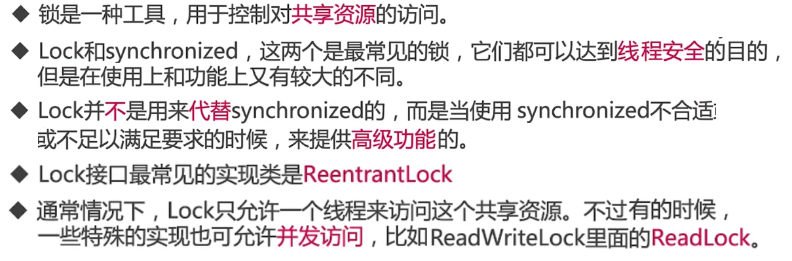

### 为什么synchronuzed不够用？


### 方法介绍

#### lock()

- lock()就是最普通的获取锁。如果锁已被其他线程获取，则进行等待
- lock不会像synchronized一样在`异常时自动释放锁`
- 因此最佳实践是，在`finally中释放锁`，以保证发生异常时锁一定被释放

```java
lock.lock.MustUnlock
/**
 * 描述：     Lock不会像synchronized一样，异常的时候自动释放锁，所以最佳实践是，finally中释放锁，以便保证发生异常的时候锁一定被释放
 */
public class MustUnlock {

    private static Lock lock = new ReentrantLock();

    public static void main(String[] args) {
        lock.lock();
        try{
            //获取本锁保护的资源
            System.out.println(Thread.currentThread().getName()+"开始执行任务");
        }finally {
            lock.unlock();
        }
    }
}
```

- lock()方法不能被中断，这会带来很大的隐患：一旦陷入`死锁`,lock()就会陷入永久等待

#### tryLock()


```java
lock.lock.TryLockDeadlock	用tryLock来避免死锁
    public static void main(String[] args) {
        TryLockDeadlock r1 = new TryLockDeadlock();
        TryLockDeadlock r2 = new TryLockDeadlock();
        r1.flag = 1;
        r1.flag = 0;
        new Thread(r1).start();
        new Thread(r2).start();
    }

	@Override
    public void run() {
        for (int i = 0; i < 100; i++) {
            if (flag == 1) {
                try {	// 先拿锁1再拿锁2
                    if (lock1.tryLock(800, TimeUnit.MILLISECONDS)) {
                        try {
                            System.out.println("线程1获取到了锁1");
                            Thread.sleep(new Random().nextInt(1000));
                            if (lock2.tryLock(800, TimeUnit.MILLISECONDS)) {
                                try {
                                    System.out.println("线程1获取到了锁2");
                                    System.out.println("线程1成功获取到了两把锁");
                                    break;
                                } finally {
                                    lock2.unlock();
                                }
                            } else {
                                System.out.println("线程1获取锁2失败，已重试");
                            }
                        } finally {
                            lock1.unlock();
                            Thread.sleep(new Random().nextInt(1000));
                        }
                    } else {
                        System.out.println("线程1获取锁1失败，已重试");
                    }
                } catch (InterruptedException e) {
                    e.printStackTrace();
                }
            }

            if (flag == 0) {
                try {	// 先拿锁2再拿锁1
                    if (lock2.tryLock(3000, TimeUnit.MILLISECONDS)) {
                        try {
                            System.out.println("线程2获取到了锁2");
                            Thread.sleep(new Random().nextInt(1000));
                            if (lock1.tryLock(800, TimeUnit.MILLISECONDS)) {
                                try {
                                    System.out.println("线程2获取到了锁1");
                                    System.out.println("线程2成功获取到了两把锁");
                                    break;
                                } finally {
                                    lock1.unlock();
                                }
                            } else {
                                System.out.println("线程2获取锁1失败，已重试");
                            }
                        } finally {
                            lock2.unlock();
                            Thread.sleep(new Random().nextInt(1000));
                        }
                    } else {
                        System.out.println("线程2获取锁2失败，已重试");
                    }
                } catch (InterruptedException e) {
                    e.printStackTrace();
                }
            }
        }
    }
// 当锁获取失败时，进行等待重试，获得锁后执行
线程1获取到了锁1
线程2获取到了锁2
线程1获取锁2失败，已重试
线程2获取到了锁1
线程2成功获取到了两把锁
线程1获取到了锁1
线程1获取到了锁2
线程1成功获取到了两把锁
```

#### lockInterruptibly


#### unLock()

解锁

### 可见性保证

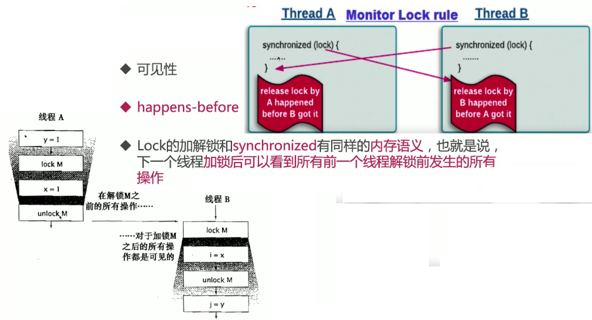

## 锁的分类

这些分类，是从`不同角度`出发看的

这些分类并`不是互斥`的，也局势多种类型可以`并存`；好比一个人同时是男人，也是军人

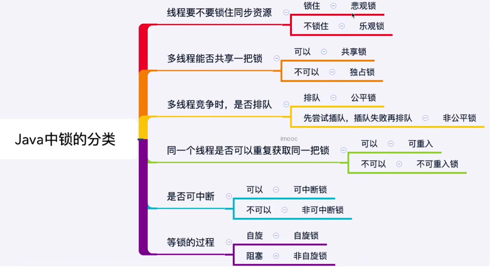

## 乐观锁和悲观锁

乐观锁又名非互斥同步锁

### 为什么需要非互斥同步锁


### 悲观锁/互斥同步锁

#### 悲观锁


#### 悲观锁执行流程

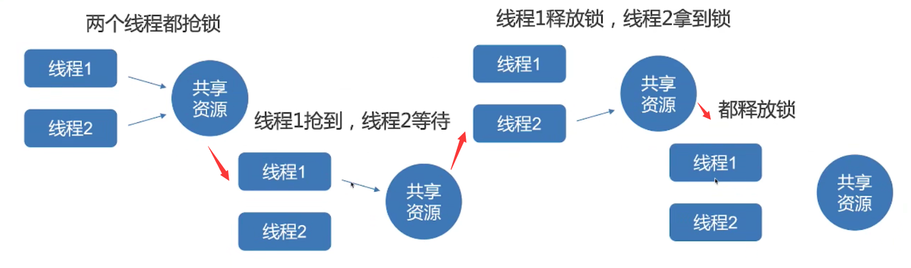

### 乐观锁

#### 乐观锁/非互斥同步锁


#### 乐观锁执行流程

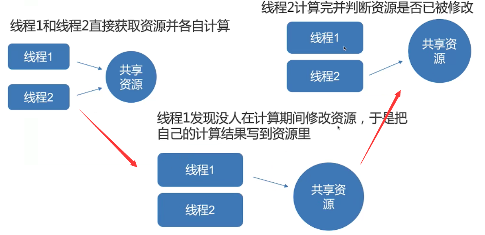

#### 典型例子

- 悲观锁：synchronized和lock接口
- 乐观锁的典型列子就是`原子类，并发容器`等

```java
    int a;

    public static void main(String[] args) {
        AtomicInteger atomicInteger = new AtomicInteger();
        atomicInteger.incrementAndGet();	// 乐观锁保证安全
    }

    public synchronized void testMethod() {
        a++;	// 悲观锁保证安全
    }

```

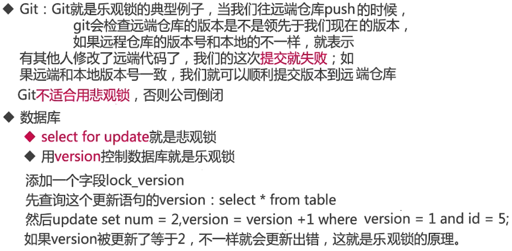

### 开销对比


## 可重入锁和非可重入锁

### ReentrantLock

是一种可重入锁，不需要解锁就可再次获得锁

#### 案例预定电影院座位

线程1拿到电影院钥匙，开门买票后，再把钥匙给后面的线程

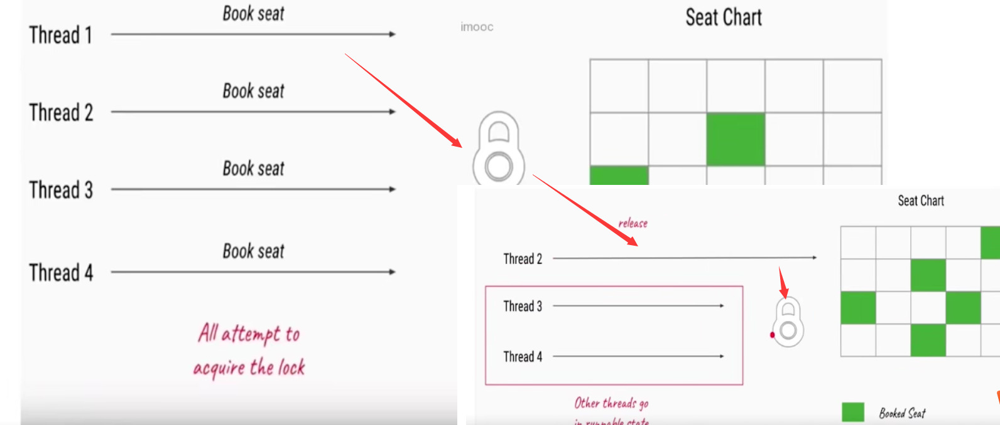

```java
lock.reentrantlock.CinemaBookSeat

private static ReentrantLock lock = new ReentrantLock();

    private static void bookSeat() {
        lock.lock();
        try {
            System.out.println(Thread.currentThread().getName() + "开始预定座位");
            Thread.sleep(1000);
            System.out.println(Thread.currentThread().getName() + "完成预定座位");
        } catch (InterruptedException e) {
            e.printStackTrace();
        } finally {
            lock.unlock();
        }
    }

// 线程1拿到电影院钥匙，开门买票后，再把钥匙给后面的线程
Thread-0开始预定座位
Thread-0完成预定座位
Thread-1开始预定座位
Thread-1完成预定座位
```

#### 案例打印字符串

```java
lock.reentrantlock.LockDemo

static class Outputer {

        Lock lock = new ReentrantLock();

        //字符串打印方法，一个个字符的打印
        public void output(String name) {

            int len = name.length();
            lock.lock();
            try {
                for (int i = 0; i < len; i++) {
                    System.out.print(name.charAt(i));
                }
                System.out.println("");
            } finally {
                lock.unlock();
            }
        }
    }
    

```

### 可重入锁

可重入就是说某个线程已经获得某个锁，可以再次获取锁而不会出现死锁

就是一个方法里，`外层方法占用了锁，但是里面还有方法要获得锁`，如果不是重入锁，程序无法继续运行，陷入死锁，是重入锁就继续执行。

#### 可重入性


#### 案例可重入数量

```java
lock.reentrantlock.GetHoldCount
public class GetHoldCount {
    private  static ReentrantLock lock =  new ReentrantLock();

    public static void main(String[] args) {
        System.out.println(lock.getHoldCount());
        lock.lock();
        System.out.println(lock.getHoldCount());
        lock.lock();
        System.out.println(lock.getHoldCount());
        lock.lock();
        System.out.println(lock.getHoldCount());
        lock.unlock();
        System.out.println(lock.getHoldCount());
        lock.unlock();
        System.out.println(lock.getHoldCount());
        lock.unlock();
        System.out.println(lock.getHoldCount());
    }
}

0	// 锁的数量
1
2
3
2
1
0
```

```java
在递归中使用	lock.reentrantlock.RecursionDemo

private static ReentrantLock lock = new ReentrantLock();

    private static void accessResource() {
        lock.lock();
        try {
            System.out.println("已经对资源进行了处理");
            if (lock.getHoldCount()<5) {
                System.out.println(lock.getHoldCount());
                accessResource();
                System.out.println(lock.getHoldCount());
            }
        } finally {
            lock.unlock();
        }
    }
```


### 不可重入锁


### 可重入锁和非可重入锁源码对比

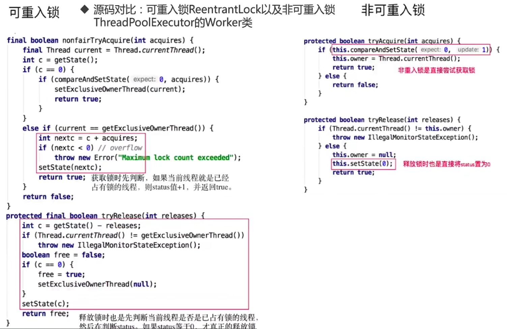

## 公平锁和非公平锁

### 什么是公平和非公平


### 为什么要有非公平锁


### 公平的情况（ReentrantLock为例）

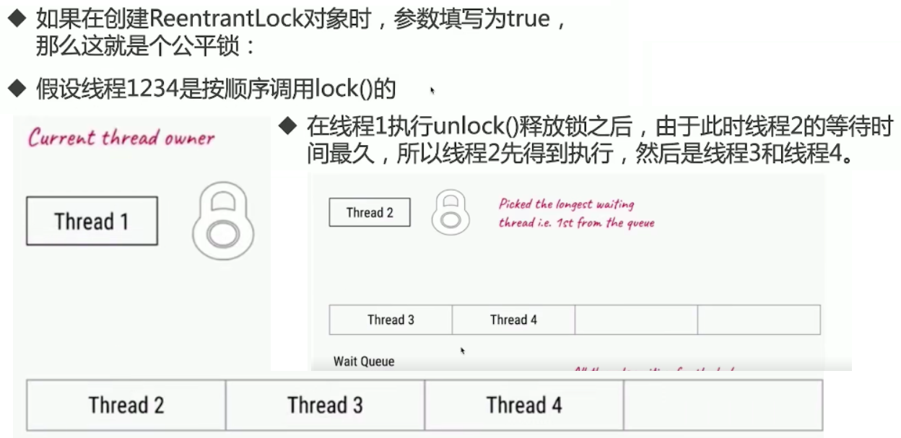

### 非公平的情况（ReentrantLock为例）


### tryLock()特列

tryLock()特列自带非公平锁


### 公平锁和非公平锁优缺点


### 公平锁和非公平锁源码分析

公平锁判断前面是否有人排队，没有的话就尝试获取锁，、；非公平的不判断，不管有人没都尝试获取

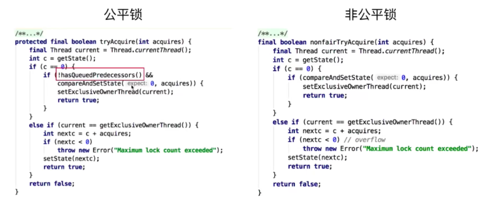


## 共享锁和排他锁

### 什么是共享锁和排他锁


### 读写锁的作用


### 读写锁的规则

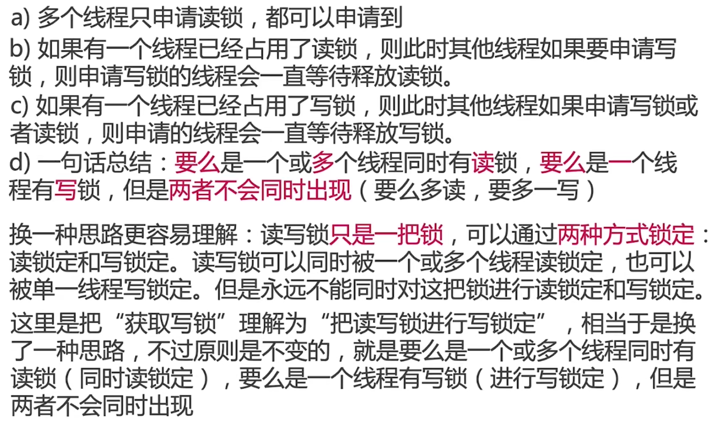

### ReentrantReadWriteLock

#### 具体用法


```java
lock.readwrite.CinemaReadWrite 
public static void main(String[] args) {
        new Thread(()->read(),"Thread1").start();
        new Thread(()->read(),"Thread2").start();
        new Thread(()->write(),"Thread3").start();
        new Thread(()->write(),"Thread4").start();
    }
    
Thread1得到了读锁，正在读取
Thread2得到了读锁，正在读取
Thread1释放读锁
Thread2释放读锁
Thread3得到了写锁，正在写入
Thread3释放写锁
Thread4得到了写锁，正在写入
Thread4释放写锁
```

#### 读锁插队策略

https://www.freesion.com/article/7575418657/

`ReentrantReadWriteLock`大体选用了策略2，对于非公平锁来说，读锁在等待队列头节点是写锁的线程的时候不能插队，但是在等待队列的头节点为读锁的时候可以插队；对于写锁都是可以插队的

lock.readwrite.NonfairBargeDemo

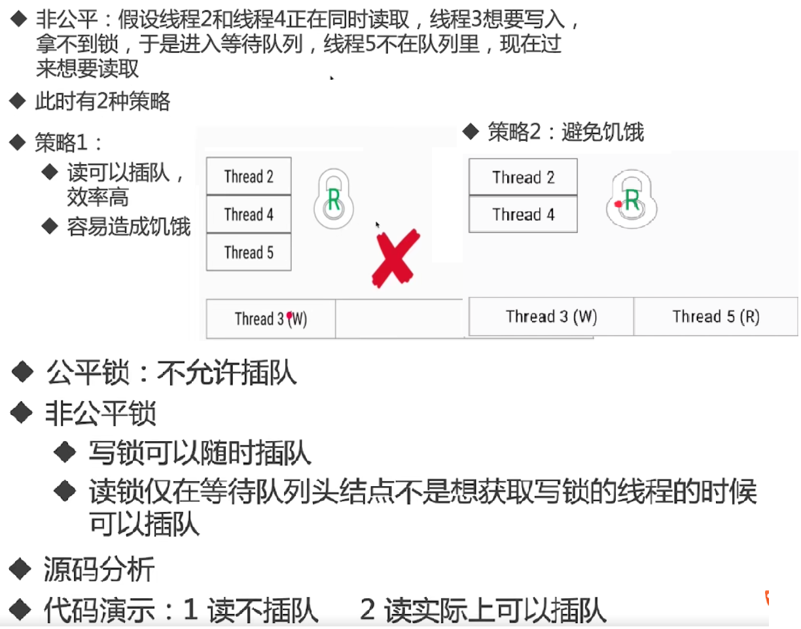


#### 升降级

假设我现在有一个线程，线程的前半部分是对日志的写操作，而线程的后半部分是对一个资源的读操作，当然我一开始要获取写锁，但是当我写操作执行完了我还持有写锁不就是对资源的一种浪费么？(别的读线程不能读)，**对于这一点ReentrantReadWriteLock对写锁可以降级为读锁，但是读锁不能升级为写锁**


### 共享锁和排他锁总结

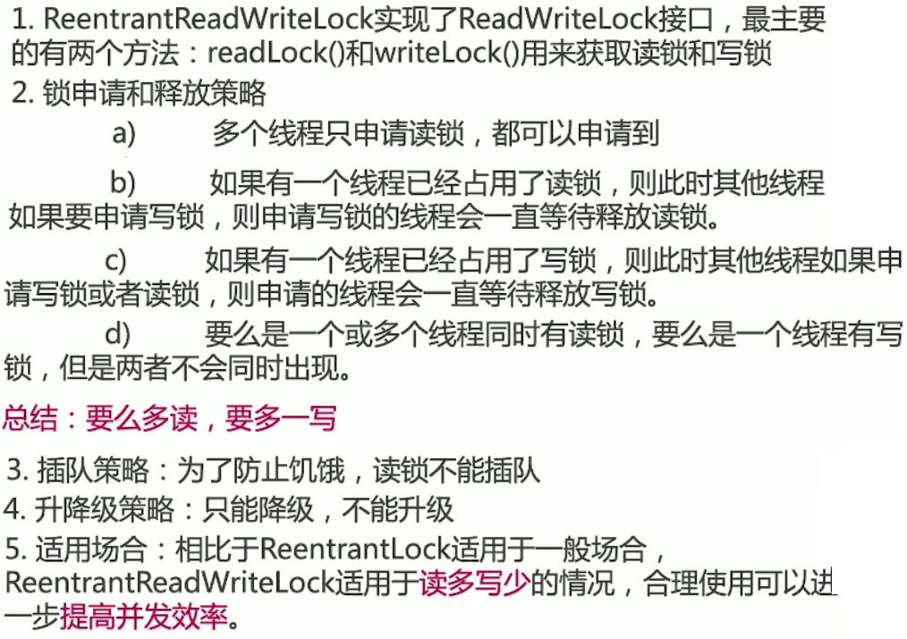

## 自旋锁和阻塞锁

### 自旋锁和阻塞锁


### 自旋锁缺点


### 原理源码分析

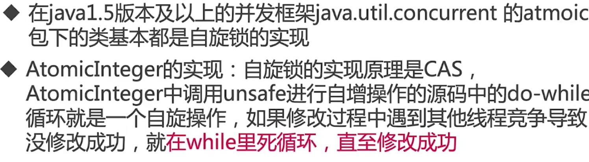

```java
// 实现一个简单的自选锁
// lock.spinlock.SpinLock
private AtomicReference<Thread> sign = new AtomicReference<>();

    public void lock() {
        Thread current = Thread.currentThread();
        while (!sign.compareAndSet(null, current)) {
            System.out.println("自旋获取失败，再次尝试");
        }
    }

    public void unlock() {
        Thread current = Thread.currentThread();
        sign.compareAndSet(current, null);
    }
```

## 可中断锁


## 锁优化

### Java虚拟机对锁的优化

自旋转和自适应

锁消除

锁粗化

### 人员代码方面

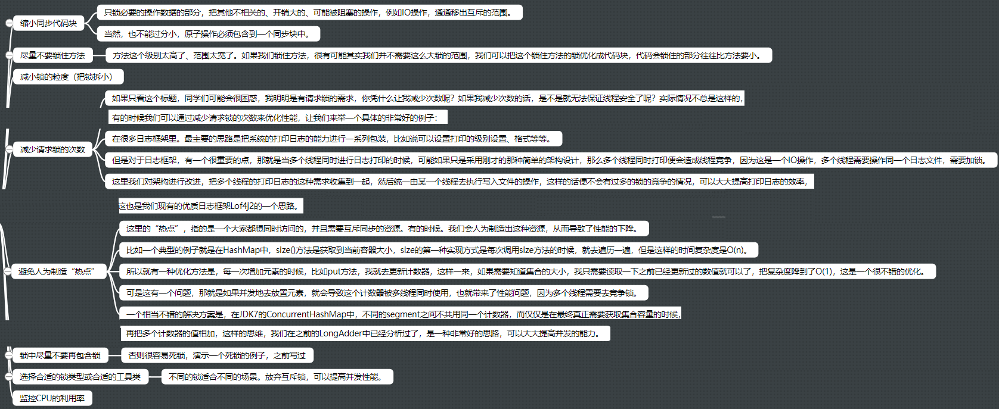


