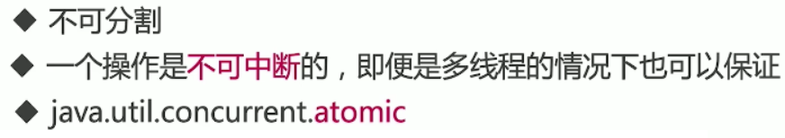
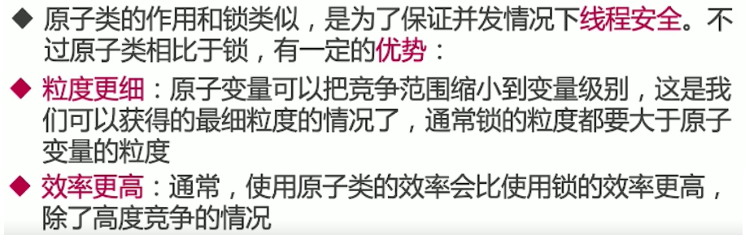
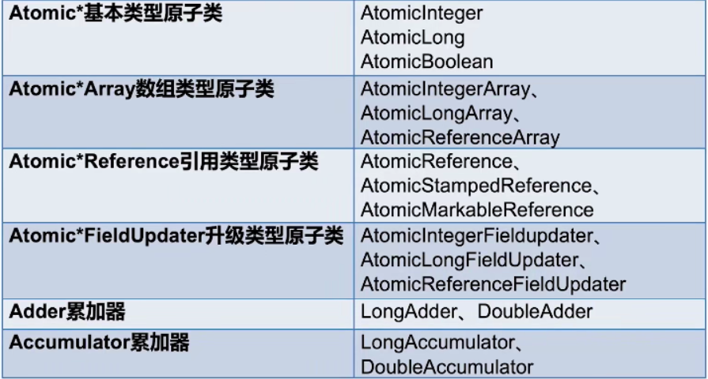
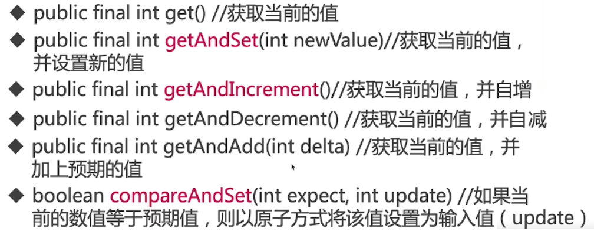
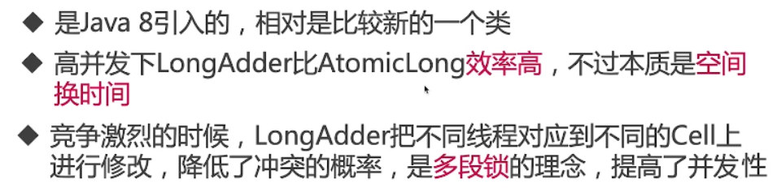
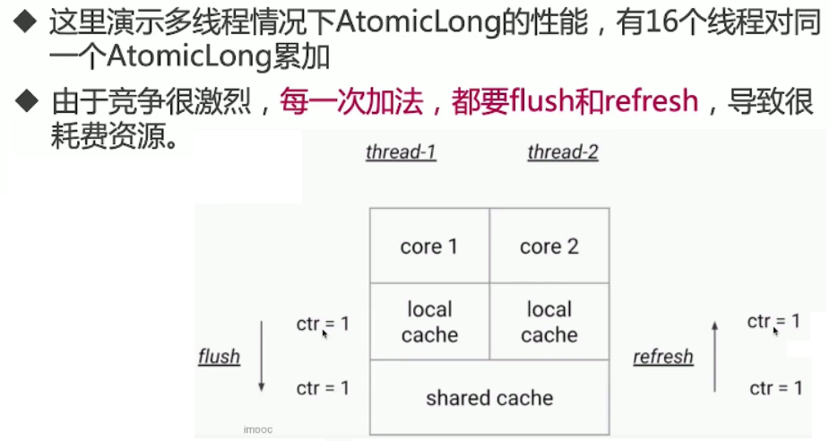
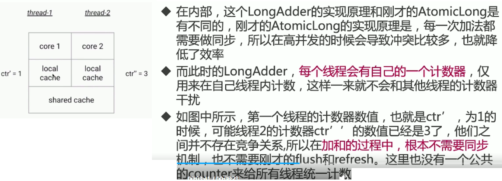
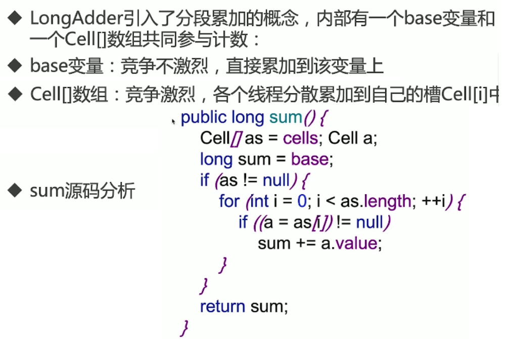

# 原子类

## 原子类

### 什么是原子类




### 原子类的作用



### 6类原子总览



## Atomic基本类型原子类

### Atomic基本类型原子类

AtomicInteger：整形原子类

AtomicLong：长整形原子类

AtomicBoolean：布尔型原子类

### AtomicInteger常用方法



```java
atomic.AtomicIntegerDemo1
public class AtomicIntegerDemo1 implements Runnable {

    private static final AtomicInteger atomicInteger = new AtomicInteger();

    public void incrementAtomic() {
        atomicInteger.getAndIncrement();
    }

    private static volatile int basicCount = 0;

    public void incrementBasic() {
        basicCount++;
    }

    public static void main(String[] args) throws InterruptedException {
        AtomicIntegerDemo1 r = new AtomicIntegerDemo1();
        Thread t1 = new Thread(r);
        Thread t2 = new Thread(r);
        t1.start();
        t2.start();
        t1.join();
        t2.join();
        System.out.println("原子类的结果：" + atomicInteger.get());
        System.out.println("普通变量的结果：" + basicCount);
    }

    @Override
    public void run() {
        for (int i = 0; i < 10000; i++) {
            incrementAtomic();
            incrementBasic();
        }
    }
}

原子类的结果：20000	// 没毛病，多线程的情况下不具备线程安全
普通变量的结果：18784

普通变量加锁解决
    public synchronized void incrementBasic() {
        basicCount++;
    }
原子类的结果：20000
普通变量的结果：20000	// 也没毛病，不过当方法里代码越来越多，再加上什么数据库连接，就不是很明智了
```

## Atomic数组类型原子类

atomic.AtomicArrayDemo

## Atomic引用在自旋锁的应用

让一个对象保证原子性

```java
/**
 * 如果sets做原子的更新，设置为当前线程的引用
 */
public final boolean compareAndSet(V expect, V update) {
    return unsafe.compareAndSwapObject(this, valueOffset, expect, update);
}
```

```java
lock.spinlock.SpinLock 
// Atomic引用在自旋锁的应用
private AtomicReference<Thread> sign = new AtomicReference<>();

    public void lock() {
        Thread current = Thread.currentThread();
        while (!sign.compareAndSet(null, current)) {
            System.out.println("自旋获取失败，再次尝试");
        }
    }

    public void unlock() {
        Thread current = Thread.currentThread();
        sign.compareAndSet(current, null);
    }
```

## Atomic升级类型原子类

### 把普通变量升级成原子类型

AtomicIntegerFieldUpdater


```java
public class AtomicIntegerFieldUpdaterDemo implements Runnable{

    static Candidate tom;
    static Candidate peter;

    public static AtomicIntegerFieldUpdater<Candidate> scoreUpdater = AtomicIntegerFieldUpdater
            .newUpdater(Candidate.class, "score");

    @Override
    public void run() {
        for (int i = 0; i < 10000; i++) {
            peter.score++;
            scoreUpdater.getAndIncrement(tom);
        }
    }

    public static class Candidate {

        volatile int score;
    }

    public static void main(String[] args) throws InterruptedException {
        tom=new Candidate();
        peter=new Candidate();
        AtomicIntegerFieldUpdaterDemo r = new AtomicIntegerFieldUpdaterDemo();
        Thread t1 = new Thread(r);
        Thread t2 = new Thread(r);
        t1.start();
        t2.start();
        t1.join();
        t2.join();
        System.out.println("普通变量："+peter.score);
        System.out.println("升级后的结果"+ tom.score);
    }
}

普通变量：17975
升级后的结果20000
```

### AtomicIntegerFieldUpdater注意点

可见范围：public

不支持static

## Adder累加器

### Adder累加器



### 演示高并发场景下，LongAdder比AtomicLong性能好

```java
atomic.AtomicLongDemo

/**
 * 描述：     演示高并发场景下，LongAdder比AtomicLong性能好
 */
public class AtomicLongDemo {

    public static void main(String[] args) throws InterruptedException {
        AtomicLong counter = new AtomicLong(0);
        ExecutorService service = Executors.newFixedThreadPool(20);
        long start = System.currentTimeMillis();
        for (int i = 0; i < 10000; i++) {
            service.submit(new Task(counter));
        }
        service.shutdown();
        while (!service.isTerminated()) {

        }
        long end = System.currentTimeMillis();
        System.out.println(counter.get());
        System.out.println("AtomicLong耗时：" + (end - start));
    }

    private static class Task implements Runnable {

        private AtomicLong counter;

        public Task(AtomicLong counter) {
            this.counter = counter;
        }

        @Override
        public void run() {
            for (int i = 0; i < 10000; i++) {
                counter.incrementAndGet();
            }
        }
    }
}

100000000
AtomicLong耗时：1757
```

```java
/**
 * 描述：     演示高并发场景下，LongAdder比AtomicLong性能好
 */
public class LongAdderDemo {

    public static void main(String[] args) throws InterruptedException {
        LongAdder counter = new LongAdder();
        ExecutorService service = Executors.newFixedThreadPool(20);
        long start = System.currentTimeMillis();
        for (int i = 0; i < 10000; i++) {
            service.submit(new Task(counter));
        }
        service.shutdown();
        while (!service.isTerminated()) {

        }
        long end = System.currentTimeMillis();
        System.out.println(counter.sum());
        System.out.println("LongAdder耗时：" + (end - start));
    }

    private static class Task implements Runnable {

        private LongAdder counter;

        public Task(LongAdder counter) {
            this.counter = counter;
        }

        @Override
        public void run() {
            for (int i = 0; i < 10000; i++) {
                counter.increment();
            }
        }
    }
}

100000000
LongAdder耗时：183
```

### AtomicLong弊端



### LongAdder带来的改进

说白了，空间换时间



### LongAdder原理



## Accumulator累加器

atomic.LongAccumulatorDemo

### 适用场景

适合需要大量并行计算。可多核同时处理问题

计算的顺序不能有要求