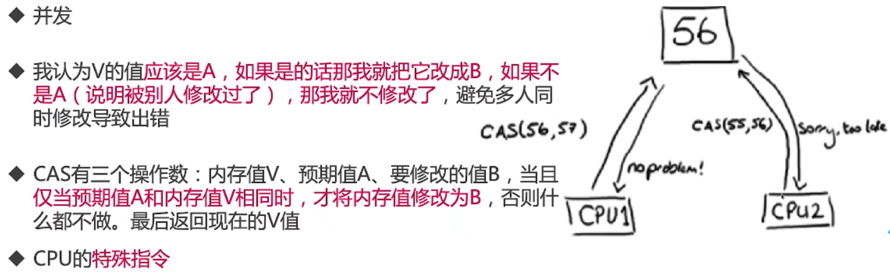
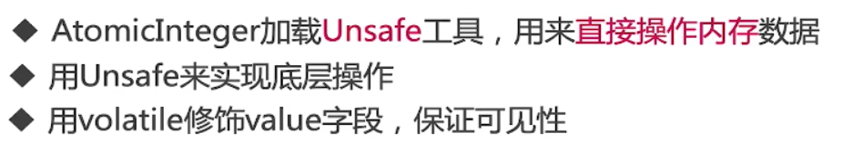
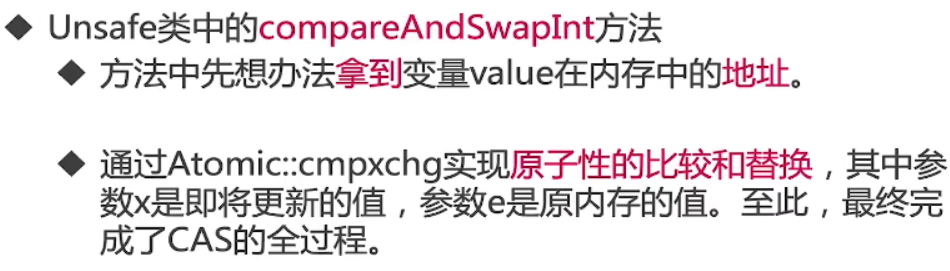
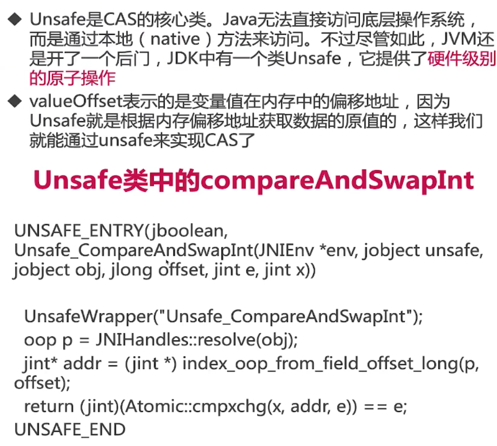

# CAS

## 什么是CAS




## CAS等价代码

```java
/**
 * 描述：     模拟CAS操作，等价代码
 */
public class SimulatedCAS {
    private volatile int value;

    public synchronized int compareAndSwap(int expectedValue, int newValue) {
        int oldValue = value;
        if (oldValue == expectedValue) {
            value = newValue;
        }
        return oldValue;
    }
}
```
两个线程竞争，其中一个线程失败
```java
/**
 * 描述：     模拟CAS操作，等价代码
 */
public class TwoThreadsCompetition implements Runnable {

    private volatile int value;

    public synchronized int compareAndSwap(int expectedValue, int newValue) {
        int oldValue = value;

        if (oldValue == expectedValue) {
            // 线程1进来，判断老值，修改
            value = newValue;
        }
        // 线程2进来，判断跳过
        return oldValue;
    }

    public static void main(String[] args) throws InterruptedException {
        TwoThreadsCompetition r = new TwoThreadsCompetition();
        r.value = 0;
        Thread t1 = new Thread(r,"Thread 1");
        Thread t2 = new Thread(r,"Thread 2");
        t1.start();
        t2.start();
        t1.join();
        t2.join();
        System.out.println(r.value);
    }

    @Override
    public void run() {
        compareAndSwap(0, 1);
    }
}
```
## 应用场景及源码分析

### 应用场景

乐观锁

并发容器

原子类

### 分析原子类中CAS的应用



```java
AtomicInteger

// Unsafe工具
	static {
        try {
            valueOffset = unsafe.objectFieldOffset
                (AtomicInteger.class.getDeclaredField("value"));
        } catch (Exception ex) { throw new Error(ex); }
    }
    
    private volatile int value;
```

### getAndAdd源码分析



```java
public final int getAndAdd(int delta) {
    return unsafe.getAndAddInt(this, valueOffset, delta);
}

public final int getAndAddInt(Object var1, long var2, int var4) {
        int var5;
        do {
            var5 = this.getIntVolatile(var1, var2);
        } while(!this.compareAndSwapInt(var1, var2, var5, var5 + var4));

        return var5;
    }
```

### Unsafe类




## CAS的缺点

ABA问题

自旋时间过长

