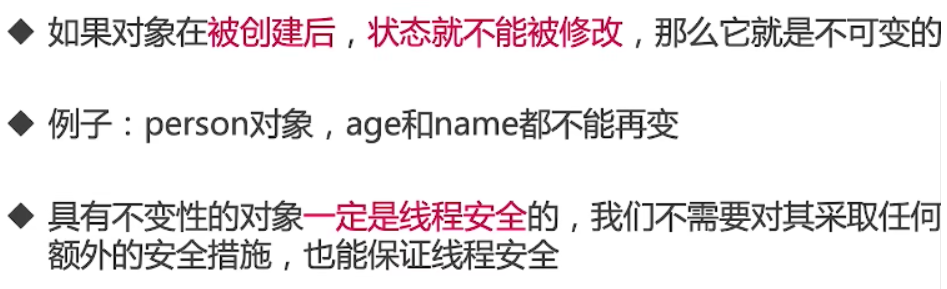
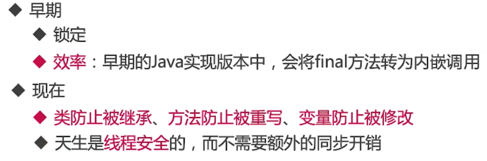
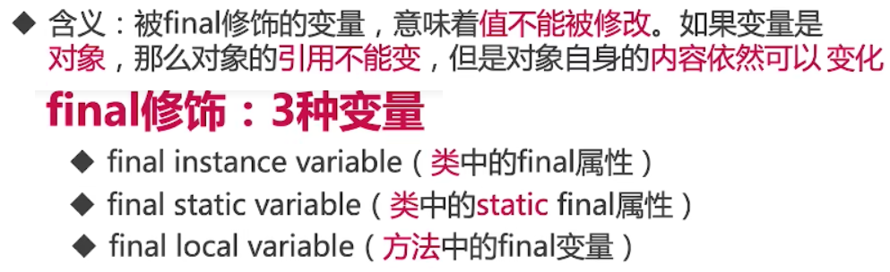
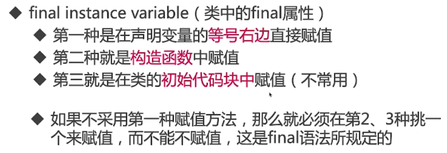
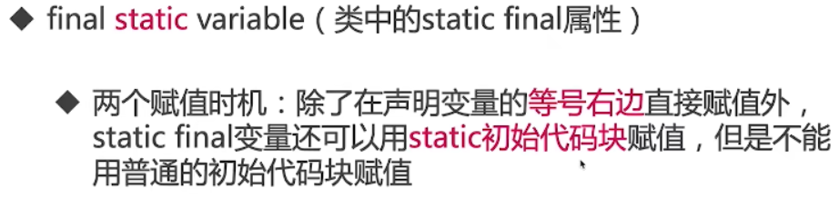
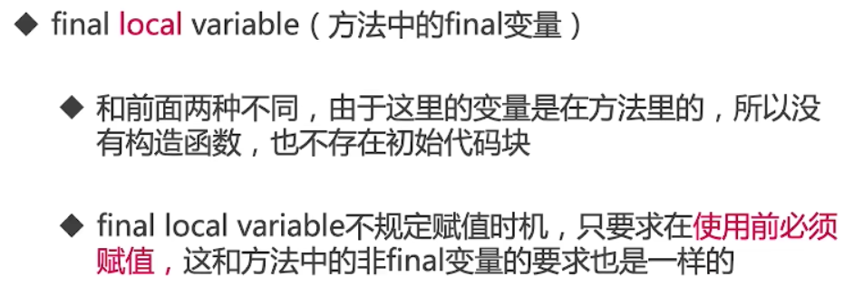
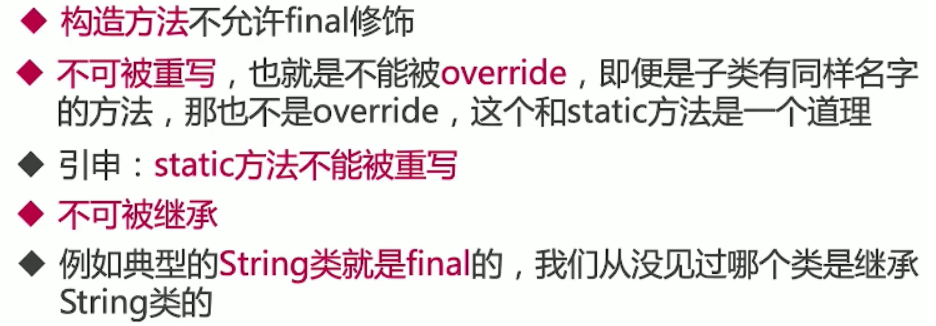
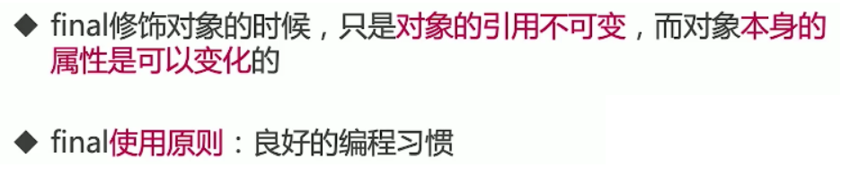
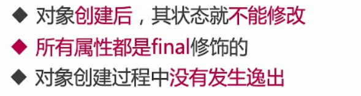
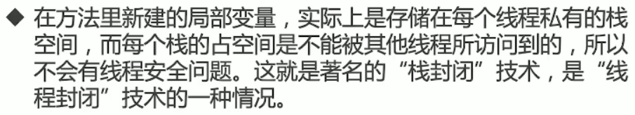

# final关键字和不变性

## 什么是不变性




```java
//  描述：     不可变的对象，演示其他类无法修改这个对象，public也不行
public class Person {// 必须全部不变
    final int age = 18;	
    final String name = alice;
    final TestFinal testFinal = new TestFinal();
}
```

## final

### final的作用



### final的3种用法

- final修饰变量
- final修饰方法
- final修饰类

## final修饰

### final修饰变量




### final修饰变量赋值时机


#### 类中的final属性



```java
public class FinalVariableDemo {

    private final int a = 6;	//1

    public FinalVariableDemo(int a) {
       this.a = a;	//2
    }

    {
        a = 7;	//3
    }
}
```

#### 类中的static的final属性



```java
public class FinalVariableDemo {

    private static final int a = 6;	//1

    static {
        a = 7;	//3
    }
}
```

#### 方法中的final变量



### 为什么要规定赋值时机


### final修饰方法



### final修饰类



## 不可变和final的关系

### 对象满足不可变



### 把变量写在线程内部-栈封闭



## final对象引用面试题

```java
immutable.FinalStringDemo1
public static void main(String[] args) {
    String a = "wukong2";
    final String b = "wukong";
    String d = "wukong";
    String c = b + 2;
    String e = d + 2;
    System.out.println((a == c));//c直接拿的栈b（常量池）的内容，没毛病
    System.out.println((a == e));
}

true
false
```

```java
immutable.FinalStringDemo2
public static void main(String[] args) {
    String a = "wukong2";
    final String b = getDashixiong();//拿的方法（堆）
    String c = b + 2;
    System.out.println(a == c);

}

private static String getDashixiong() {
    return "wukong";
}

false
```