# 并发容器

## 并发容器概览

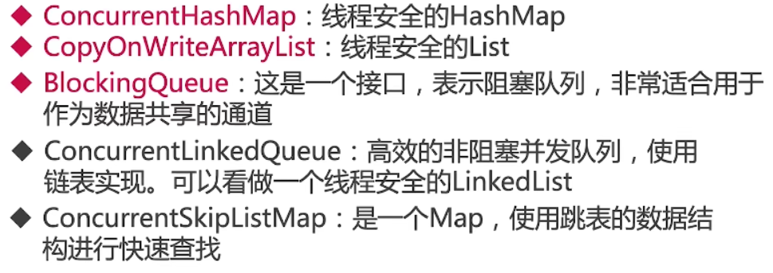

## 集合类的历史

### Vector和hashtable

#### 不足

并发性能差

#### Vector

方法全是synchronized，线程安全，不过多线程效率低下

```java
collections.predecessor.VectorDemo
    public synchronized int size() {
        return elementCount;
    }
```

#### hashtable

就是个线程安全的hashmap, 方法全是synchronized，线程安全，不过多线程效率低下

```java
collections.predecessor.HashtableDemo

public synchronized int size() {
    return count;
}
```

### hashmap和arraylist

#### 升级为线程安全


#### 分析源码

```java
java.util.Collections.SynchronizedList

// 在判断时，几乎方法使用同步代码块的修饰
		public boolean equals(Object o) {
            if (this == o)
                return true;
            synchronized (mutex) {return list.equals(o);}
        }
	   public E get(int index) {
            synchronized (mutex) {return list.get(index);}
        }
        public E set(int index, E element) {
            synchronized (mutex) {return list.set(index, element);}
        }
        public void add(int index, E element) {
            synchronized (mutex) {list.add(index, element);}
        }
        public E remove(int index) {
            synchronized (mutex) {return list.remove(index);}
        }
```

### ConcurrentHashMap和CopyOnWriteArrayList


## ConcurrentHashMap

### Map简介

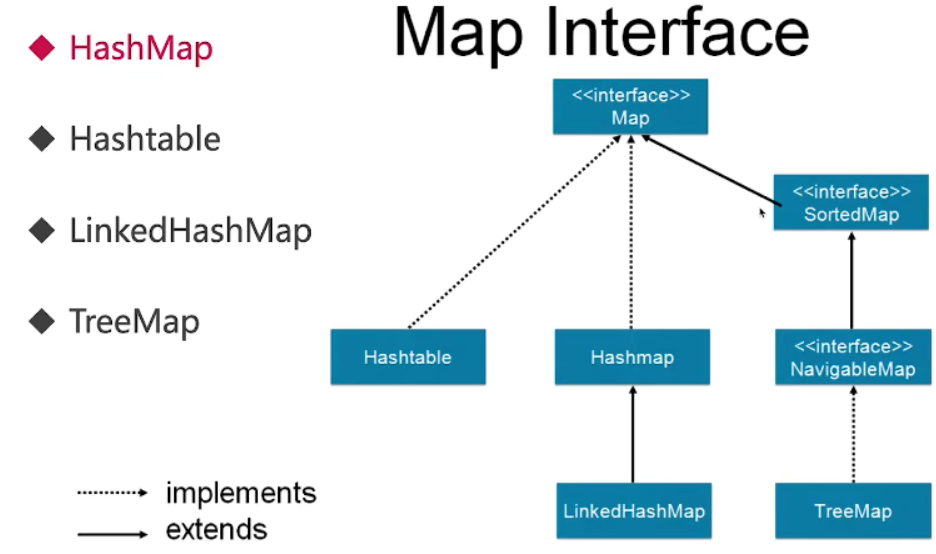

### 为什么HashMap是线程不安全的

同时put碰撞导致数据丢失

​	多线程同时进行put,可能得到的hashcode是一样的，会放在同一个位置，有且一个值put成功，造成其他的数据丢失

同时put扩容导致数据丢失

​	多线程同时进行扩容,扩容之后的数组也只有一个会被保留下来

死循环造成CPU100%

​	https://coolshell.cn/articles/9606.html

### 结构图

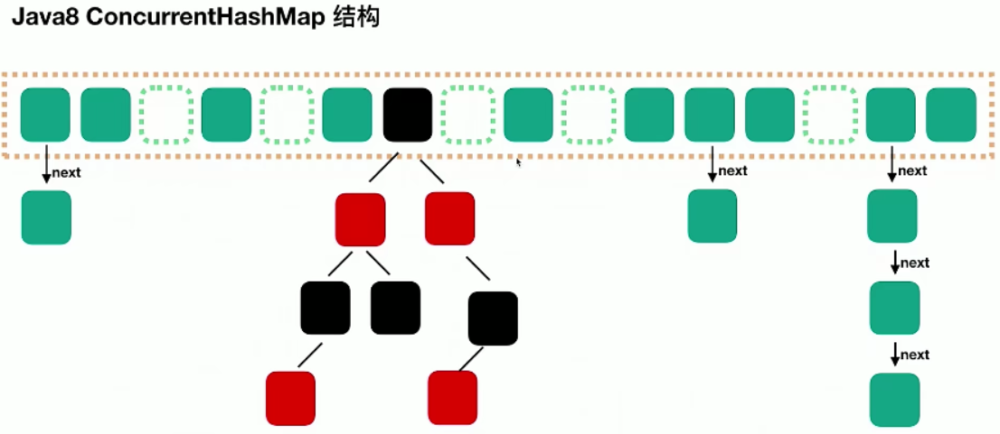

### put源码解析

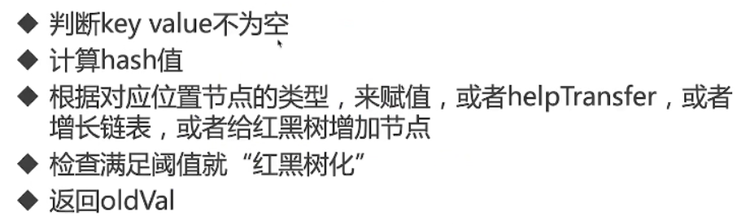

```java
public V put(K key, V value) {
    return putVal(key, value, false);
}

final V putVal(K key, V value, boolean onlyIfAbsent) {
     // key等于null直接返回
    if (key == null || value == null) throw new NullPointerException();
     // 计算hash值
    int hash = spread(key.hashCode());
    int binCount = 0;
    for (Node<K,V>[] tab = table;;) {
        Node<K,V> f; int n, i, fh;
        // 判断为空不？
        if (tab == null || (n = tab.length) == 0)
            tab = initTable();	//为空，进行初始化
        else if ((f = tabAt(tab, i = (n - 1) & hash)) == null) {
            // 利用cas算法将value送入？
            if (casTabAt(tab, i, null, new Node<K,V>(hash, key, value, null)))
                    break;      // 利用cas算法成功就退出，(tab刚好初始化为0的时候)
        }
        // 利用cas算法失败
        else if ((fh = f.hash) == MOVED)	
            tab = helpTransfer(tab, f);	// 情况1，此节点正在扩容，帮助扩容
        else {	//情况2节点有值
            V oldVal = null;
            synchronized (f) {	//锁住当前节点
                if (tabAt(tab, i) == f) {	//进行链表操作
                    ...
                }else if (f instanceof TreeBin) {	//进行红黑数的操作
                    ...   
                }
                if (binCount != 0) {	//进行是否把链表转成树的操作
                    if (binCount >= TREEIFY_THRESHOLD)
                        treeifyBin(tab, i);
                    if (oldVal != null)
                        return oldVal;
                    break;
                }
            }
        }
        addCount(1L, binCount);
        return null;
```

```java
// cas算法进行比较
static final <K,V> boolean casTabAt(Node<K,V>[] tab, int i,
                                    Node<K,V> c, Node<K,V> v) {
    return U.compareAndSwapObject(tab, ((long)i << ASHIFT) + ABASE, c, v);
}
```

```java
// 条件1，链表数是8
static final int TREEIFY_THRESHOLD = 8;

// 条件2，最小容量64
 private final void treeifyBin(Node<K,V>[] tab, int index) {
        Node<K,V> b; int n, sc;
        if (tab != null) {
            if ((n = tab.length) < MIN_TREEIFY_CAPACITY)
                ...
        }
     
static final int MIN_TREEIFY_CAPACITY = 64;    
```

### get源码解析

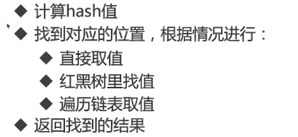

```java
public V get(Object key) {
    Node<K,V>[] tab; Node<K,V> e, p; int n, eh; K ek;
    int h = spread(key.hashCode());	// 计算hash值
    if ((tab = table) != null && (n = tab.length) > 0 &&(e = tabAt(tab, (n - 1) & h)) != null) {
        // 所有非空判断后进入
        if ((eh = e.hash) == h) {
            // 1.直接取值，hash值符合，key符合
            if ((ek = e.key) == key || (ek != null && key.equals(ek)))
                return e.val;
        }
        else if (eh < 0)	//	2.去红黑数查找
            return (p = e.find(h, key)) != null ? p.val : null;
        while ((e = e.next) != null) {	//	3.去链表查找
            if (e.hash == h && ((ek = e.key) == key || (ek != null && key.equals(ek))))
                return e.val;
        }
    }
    return null;
}
```


### 组合操作

错误使用使其线程不安全

collections.concurrenthashmap.OptionsNotSafe

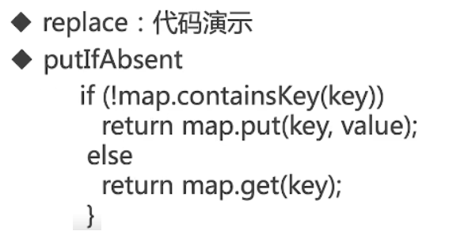

## CopyOnWriteArrayList

1. 诞生的历史和原因
2. 适用场景
3. 读写规则
4. 实现原理
5. 缺点
6. 源码分析

### 诞生的历史和原因

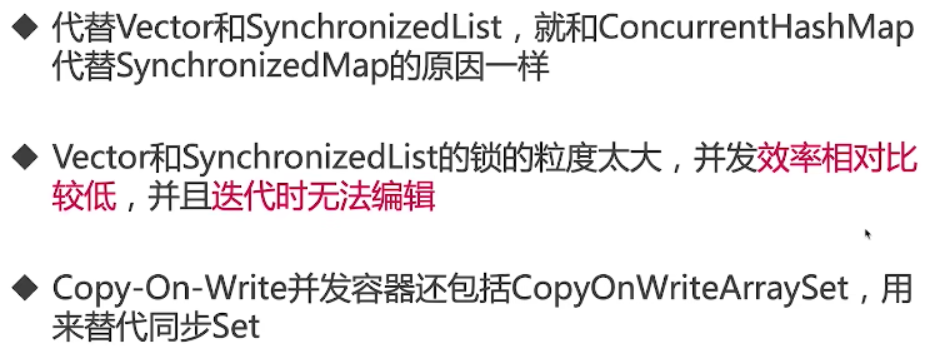

```java
// 演示CopyOnWriteArrayList可以在迭代的过程中修改数组内容，但是ArrayList不行，对比
	while (iterator.hasNext()) {
            System.out.println("list is" + list);
            String next = iterator.next();
            System.out.println(next);

            if (next.equals("2")) {
                list.remove("5");
            }
            if (next.equals("3")) {
                list.add("3 found");
            }
        }
```


### 使用场景


### 读写规则

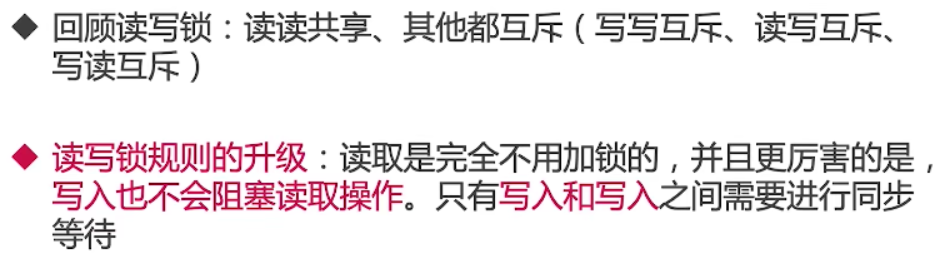

### 实现原理

[CopyOnWriteArrayList实现原理及源码分析](https://www.cnblogs.com/chengxiao/p/6881974.html)

​	很多时候，我们的系统应对的都是**读多写少**的并发场景。CopyOnWriteArrayList容器允许并发读，读操作是无锁的，性能较高。至于写操作，比如向容器中添加一个元素，**则首先将当前容器复制一份，然后在新副本上执行写操作，结束之后再将原容器的引用指向新容器。**

### 缺点


### 源码分析

数据结构

get

add

```java
// 核心可重入锁
final transient ReentrantLock lock = new ReentrantLock();
```

```java
public boolean add(E e) {
    final ReentrantLock lock = this.lock;	//加可重入锁
    lock.lock();
    try {
        Object[] elements = getArray();
        int len = elements.length;
        Object[] newElements = Arrays.copyOf(elements, len + 1);	// 复制原来的数组
        newElements[len] = e;	// +1
        setArray(newElements);
        return true;
    } finally {
        lock.unlock();
    }
}
```

```java
// 未加锁，不存在线程安全问题
private E get(Object[] a, int index) {
    return (E) a[index];
}
```

## 并发队列Queue

1. 为什么要使用队列
2. 并发队列简介
3. 各并发队列关系图
4. 阻塞队列BlockingQueue
5. 非阻塞队列
6. 如何选择适合自己的队列

### 为什么要使用队列


### 并发队列简介

Queue

BlockingQueue

### 各并发队列关系图

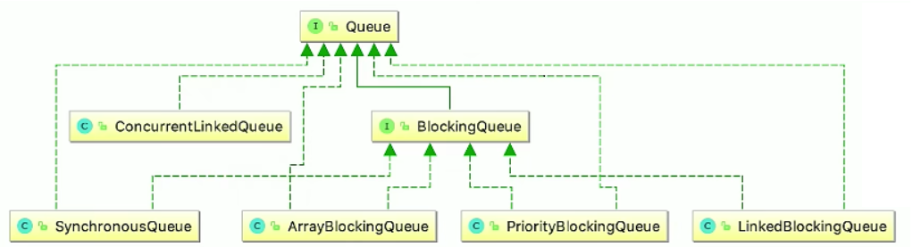

### 阻塞队列BlockingQueue


#### 什么是阻塞队列

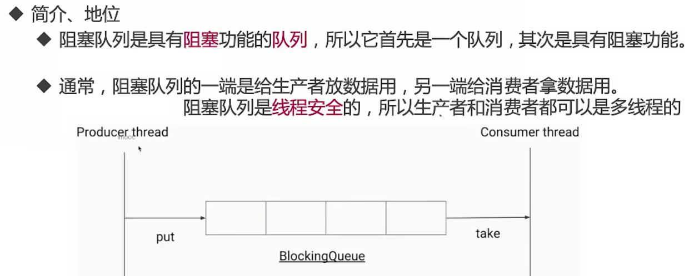

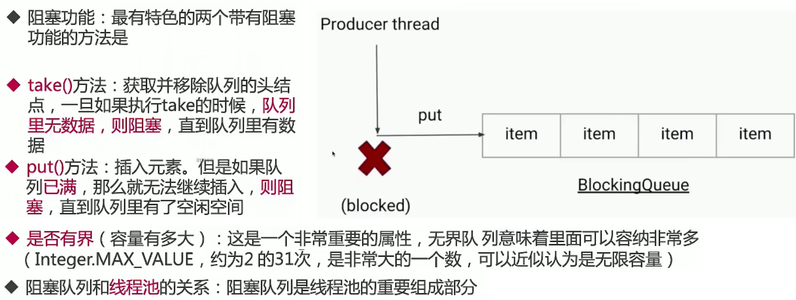

#### BlockingQueue主要方法


#### ArrayBlockingQueue

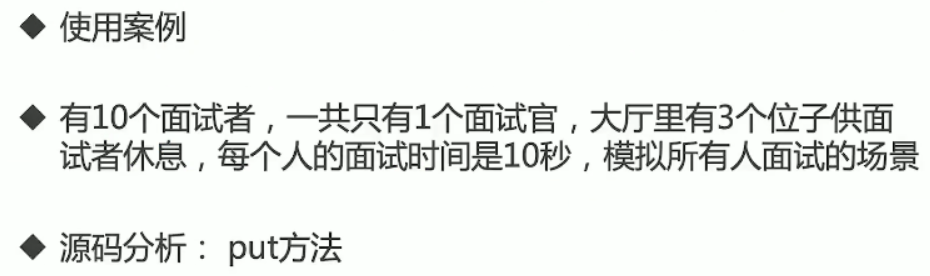

```java
collections.queue.ArrayBlockingQueueDemo

 	public void put(E e) throws InterruptedException {
        checkNotNull(e);
        final ReentrantLock lock = this.lock;
        lock.lockInterruptibly();	//等待期间可被中断
        try {
            while (count == items.length)	//判断容量满没？
                notFull.await();	//1.等待
            enqueue(e);		//2.执行
        } finally {
            lock.unlock();
        }
    }
```

#### LinkedBlockingQueue


#### PriorityBlockingQueue


#### SynchronousQueue

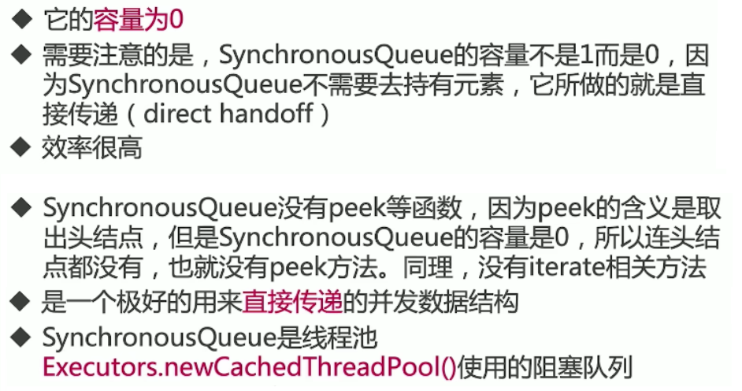

#### DelayQueue


### 非阻塞队列

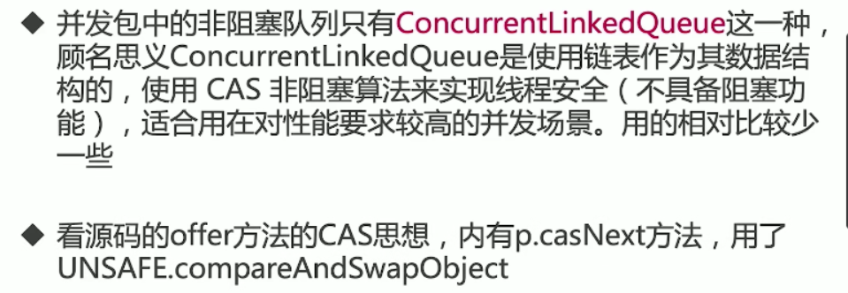


### 如何选择适合自己的队列

边界

空间

吞吐量