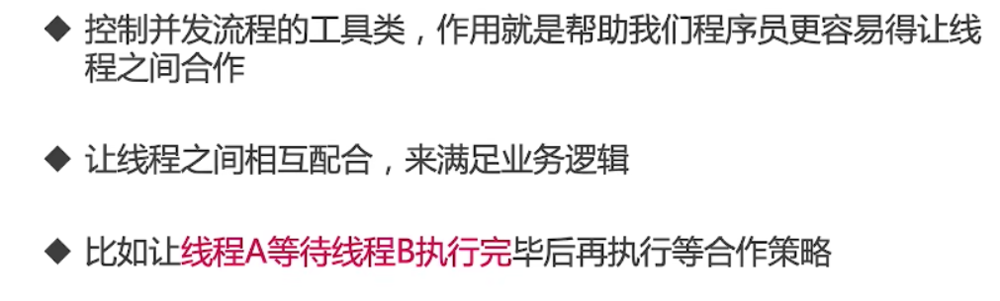
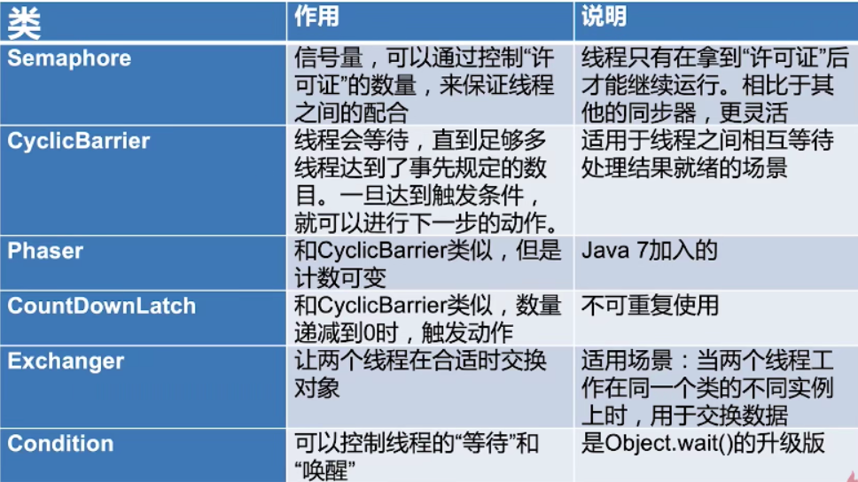
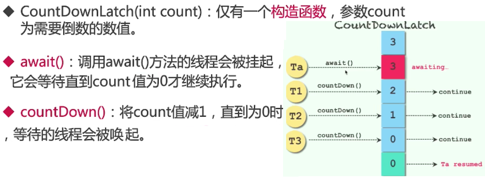
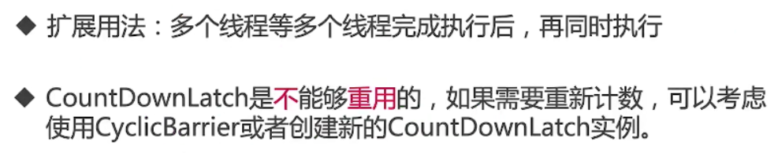
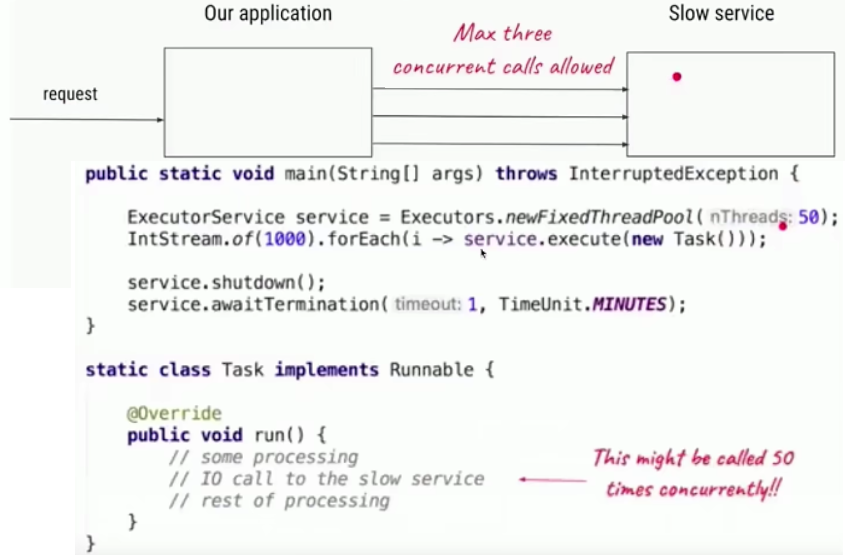
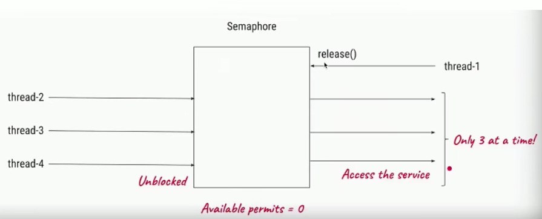
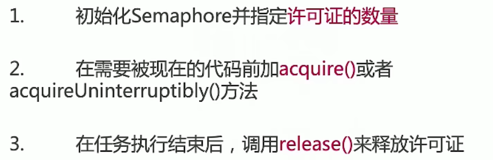
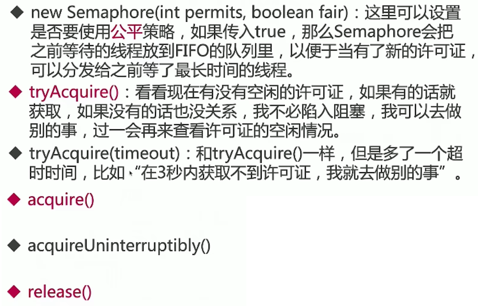

# 控制并发流程

## 什么是控制并发流程

### 什么是控制并发流程



### 控制并发流程常见类




## CountDownLatch倒计时

### CountDownLatch类的作用


### 类的主要方法介绍



### 典型用法一：一等多

用法一：一个线程等待多个线程都执行完毕，再继续自己的工作

```java
flowcontrol.countdownlatch.CountDownLatchDemo1
//描述：     工厂中，质检，5个工人检查，所有人都认为通过，才通过
public static void main(String[] args) throws InterruptedException {
    CountDownLatch latch = new CountDownLatch(5);
    ExecutorService service = Executors.newFixedThreadPool(5);
    for (int i = 0; i < 5; i++) {
        final int no = i + 1;
        Runnable runnable = new Runnable() {

            @Override
            public void run() {
                try {
                    Thread.sleep((long) (Math.random() * 10000));
                    System.out.println("No." + no + "完成了检查。");
                } catch (InterruptedException e) {
                    e.printStackTrace();
                } finally {
                    latch.countDown();
                }
            }
        };
        service.submit(runnable);
    }
    System.out.println("等待5个人检查完.....");
    latch.await();
    System.out.println("所有人都完成了工作，进入下一个环节。");
}

等待5个人检查完.....
No.2完成了检查。
No.4完成了检查。
No.1完成了检查。
No.5完成了检查。
No.3完成了检查。
所有人都完成了工作，进入下一个环节。
```


### 典型用法二：多等一

用法二：多个线程等待某一个线程的信号，同时开始执行

```java
flowcontrol.countdownlatch.CountDownLatchDemo2
// 描述：     模拟100米跑步，5名选手都准备好了，只等裁判员一声令下，所有人同时开始跑步。
public static void main(String[] args) throws InterruptedException {
    CountDownLatch begin = new CountDownLatch(1);
    ExecutorService service = Executors.newFixedThreadPool(5);
    for (int i = 0; i < 5; i++) {
        final int no = i + 1;
        Runnable runnable = new Runnable() {
            @Override
            public void run() {
                System.out.println("No." + no + "准备完毕，等待发令枪");
                try {
                    begin.await();
                    System.out.println("No." + no + "开始跑步了");
                } catch (InterruptedException e) {
                    e.printStackTrace();
                }
            }
        };
        service.submit(runnable);
    }
    //裁判员检查发令枪...
    Thread.sleep(5000);
    System.out.println("发令枪响，比赛开始！");
    begin.countDown();
}

No.1准备完毕，等待发令枪
No.5准备完毕，等待发令枪
No.4准备完毕，等待发令枪
No.2准备完毕，等待发令枪
No.3准备完毕，等待发令枪
发令枪响，比赛开始！
No.1开始跑步了
No.4开始跑步了
No.5开始跑步了
No.3开始跑步了
No.2开始跑步了
```

### CountDownLatch注意点



### CountDownLatch总结


## Semaphore信号量

### Semaphore信号量


### Semaphore应用实例



Semaphore流程：多个线程来，只允许其中三个线程通过，线程4被阻塞，线程1执行完毕后，线程4被唤起然后继续执行



### 信号量使用流程



### 信号量重要方法介绍



