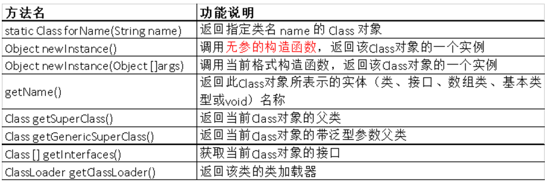

# 1 **反射**

## 1.1 **什么是反射**

​	程序在运行状态中，可以动态加载一个只有名称的类，对于任意一个已加载类，都能够知道这个类的所有属性和方法，对于任意一个对象，都能调用它的任意一个方法和属性。

 

## 1.2 **功能**

- 在运行时构造任意一个类的对象

- 在运行时获取任意一个类所具有的成员变量和方法

- 在运行时调用任意一个对象的方法（属性）

- 生成动态代理 

 

# 2 **反射对象**

 

## 2.1 **Class对象**

### 2.1.1 **概念**

​	Class:  是一个类；一个描述类的类。封装了描述方法的Method，描述字段的Filed，描述构造器的 Constructor 等属性 

### 2.1.2 **获取4种方式**

 

（4）类加载器

**类加载器的主要方法**， 调用路径下的文件：比如C3-p0..

//获取类路径下对应的文件输入流

InputStream in = **this**.getClass().getClassLoader().getResourceAsStream("1.properties ");

### 2.1.3 **Class类的常用方法**

 

 

## 2.2 **Constructor 对象** 

### 2.2.1 **概念**

​	构造器	类似  get Constructor()…    没有指定

### 2.2.2 获取构造器对象

**获取无参构造器**

 

**获取有参构造器**

 

## 2.3 **Method 对象**

### 2.3.1 概念

### 2.3.2 **Class 对象获取 Method 的方法**

 

### 2.3.3 invoke方法

执行方法：[invoke](mk:@MSITStore:E:\Java\docs\J2SE6.0.chm::/java/lang/reflect/Method.html)([Object](mk:@MSITStore:E:\Java\docs\J2SE6.0.chm::/java/lang/Object.html) obj, [Object](mk:@MSITStore:E:\Java\docs\J2SE6.0.chm::/java/lang/Object.html)... args)

执行私有方法：method.setAccessible(true); 

 

## 2.4 **Field 对象**

### 2.4.1 **概念**

\3. Field 对象（字段）  都改为Field

​	类似：getFields()… 

 

#  3 反射对象扩展

## 3.1 **父类**

clazz.getSuperclass();

## 3.2 **Annotation 相关  注释**

\1. Annotation 相关  注释

获取 Annotation 实例：

[getAnnotation](mk:@MSITStore:E:\Java\docs\J2SE6.0.chm::/java/lang/reflect/Method.html)([Class](mk:@MSITStore:E:\Java\docs\J2SE6.0.chm::/java/lang/Class.html)<T> annotationClass) 

[getDeclaredAnnotations](mk:@MSITStore:E:\Java\docs\J2SE6.0.chm::/java/lang/reflect/Method.html)() 

[getParameterAnnotations](mk:@MSITStore:E:\Java\docs\J2SE6.0.chm::/java/lang/reflect/Method.html)() 

 

## 3.3 **泛型**

2.泛型相关

(1)获取父类泛型类型：

[type](mk:@MSITStore:E:\Java\docs\J2SE6.0.chm::/java/lang/reflect/Type.html) getGenericSuperclass()

(2)获取具体的泛型类型：

If (type  Instanceof  ParameterizedType){

​		获取实际的泛型类型参数数组：

[getActualTypeArguments](mk:@MSITStore:E:\Java\docs\J2SE6.0.chm::/java/lang/reflect/ParameterizedType.html)() 

}

 

 

## 3.4 **接口**

clazz.getInterfaces();

 

## 3.5 **获取包名**

clazz.getPackage();

 

 

 

 

 

 