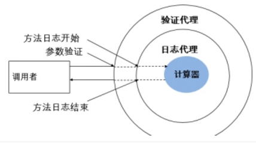

# 1 **代理**

## 1.1 **代理设计模式 的原理**

代理设计模式的原理: 

**使用一个代理将对象包装起来**, 然后用该代理对象取代原始对象. 任何对原始对象的调用都要通过代理. 代理对象决定是否以及何时将方法调用转到原始对象上.

 

## 1.2 **静态代理**

静态代理：要求被代理类和代理类同时实现相应的一套接口；通知代理类的对象调用重写接口的方法时，实际执行的是被代理类的同样的方法的调用  

 

# 2 **动态代理**

## 2.1 动态代理

动态代理 （静态代理+反射)

## 2.2**动态代理AOP**

TestAop.java

 

 

 

 

 