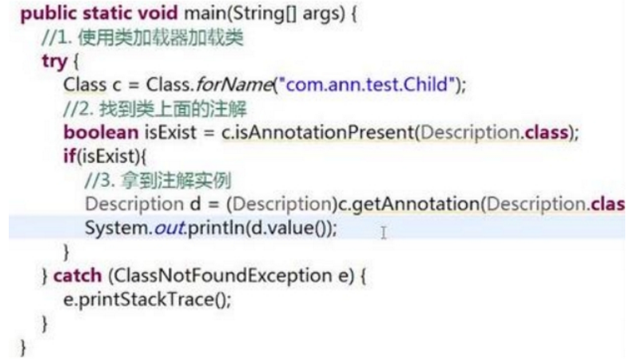

# 1 **注解**

## 1.1 **概念**

　	Java提供了一种原程序中的元素关联任何信息和任何元数据的途径和方法。

​	java注解是附加在代码中的一些元信息，用于一些工具在编译、运行时进行解析和使用，起到说明、配置的功能。
	注解不会也不能影响代码的实际逻辑，仅仅起到辅助性的作用。包含在 java.lang.annotation 包中，java自定义注解和运行时靠反射获取注解。

 

## 1.2 **Annotation的工作原理：**

​	JDK5.0中提供了注解的功能，允许开发者定义和使用自己的注解类型。该功能由一个定义注解类型的语法和描述一个注解声明的语法，读取注解的API，一个使用注解修饰的class文件和一个注解处理工具组成。

​	Annotation并不直接影响代码的语义，但是他可以被看做是程序的工具或者类库。它会反过来对正在运行的程序语义有所影响。

 	Annotation可以冲源文件、class文件或者在运行时通过反射机制多种方式被读取。

 

## 1.3 **分类**

### 1.3.1 **按运行机制**

​	按运行机制（注解存在于程序的那个阶段）将注解分为三类：源码注解(只在源码存在)、编译注解(在class文件中也存在)、运行时注解(在运行阶段仍然起作用)

 

 

### 1.3.2 **按来源**

1：JDK自带的注解（Java目前只内置了三种标准注解：@Override、@Deprecated、@SuppressWarnings，以及四种元注解：@Target、@Retention、@Documented、@Inherited）

@Override 表示覆盖或重写父类的方法；

@Deprecated 表示该方法已经过时了。（*当方法或是类上面有@Deprecated注解时，说明该方法或是类都已经过期不能再用，但不影响以前项目使用，提醒你新替代待的方法或是类。如果程序员不小心使用了它的元素,那么编译器会发出警告信息。*）

@SuppressWarnings 表示忽略指定警告，比如@Suppvisewarnings("Deprecation")

2：第三方的注解——这一类注解是我们接触最多和作用最大的一类

 

3：自定义注解——也可以看作是我们编写的注解，其他的都是他人编写注解

 

# 2 注解详解

## 2.1 jdk内置三种标准注解

### 2.2.1 **@Override**

**概念**

@Override 表示覆盖或重写父类的方法；

Override是一个Marker annotation，用于标识的Annotation，Annotation名称本身表示了要给工具程序的信息。

  **源代码**

```java
java.lang
注解类型 Override
@Target(value=METHOD)
@Retention(value=SOURCE)
public @interface Override
```

表示一个方法声明打算重写超类中的另一个方法声明。如果方法利用此注释类型进行注解但没有重写超类方法，则编译器会生成一条错误消息。

**示列**

```java
下面是一个使用@Override注解的例子：
class A {
	private String id;
    A(String id) {
    	this.id = id;
    }
    @Override
    public String toString() {
    	return id;
    }
}
```

### 2.2.2 **@Deprecated**

**概念**

@Deprecated 表示该方法已经过时了。（*当方法或是类上面有@Deprecated注解时，说明该方法或是类都已经过期不能再用，但不影响以前项目使用，提醒你新替代待的方法或是类。如果程序员不小心使用了它的元素,那么编译器会发出警告信息。*）

 

**源代码**

```java
java.lang
注解类型 Deprecated
@Documented
@Retention(value=RUNTIME)
public @interface Deprecated
```

用 @Deprecated 注释的程序元素，不鼓励程序员使用这样的元素，通常是因为它很危险或存在更好的选择。在使用不被赞成的程序元素或在不被赞成的代码中执行重写时，编译器会发出警告。

 

**示列**

```java
下面是一个使用@Override注解的例子：
class A {
	private String id;
    A(String id) {
    	this.id = id;
    }
    @Deprecated
    public String toString() {
    	return id;
    }
}
```

 

### 2.2.3 **@SuppressWarnings**

**概念**

@SuppressWarnings 表示忽略指定警告，比如@Suppvisewarnings("Deprecation")

**源代码**

```java
java.lang
注解类型 SuppressWarnings
@Target(value={TYPE,FIELD,METHOD,PARAMETER,CONSTRUCTOR,LOCAL_VARIABLE})
@Retention(value=SOURCE)
public @interface SuppressWarnings 
```

指示应该在注释元素（以及包含在该注释元素中的所有程序元素）中取消显示指定的编译器警告。注意，在给定元素中取消显示的警告集是所有包含元素中取消显示的警告的超集。例如，如果注释一个类来取消显示某个警告，同时注释一个方法来取消显示另一个警告，那么将在此方法中同时取消显示这两个警告。

  

## 2.2 **元注解**


### 2.2.1 @Target

**@Target 是注解的作用域** ：表示该注解可以用于一个类中的那些属性及方法上，如果作用域类型有多个用英文逗号分隔

下面是注解的作用域的列表：

 

### 2.2.2 **@Retention**

@Retention：表示该注解的生命周期注解按声明周期有个分类：

 

 

### 2.2.3 @Inherited

**@Inherited:此注解是标识性的元注解**，表示当前注解可以由子注解来继承

 

### 2.2.4 @Documented

**@Documented:表示生成javadoc的时候会包含注解**


## 2.3 **自定义注解**

### 2.3.1 **自定义注解的语法要求**

 

 

### 2.3.2 **使用自定义注解**


注解的定义看起来很像接口的定义，事实上，与其他任何Java接口一样，注解也将会编译成class文件。

定义注解时，会需要一些元注解（meta-annotation），如@Target和@Retention。@Target用来定义你的注解将用于什么地方（例如是一个方法或一个域）。@Retention用来定义该注解在哪一个级别可用，在源代码（SOURCE）、类文件中（CLASS）或者运行时（RUNTIME）。

 

### 2.3.3 **解析注解**

概念：通过反射获取类、函数或成员上运行时注解信息，从而实现动态控制程序运行的逻辑。

 

使用forName()方法加载类，并使用getAnnotation(Description.class)检查该类是否带有@Description注解。

注解的继承只能作用在类上，方法上的注解不会被继承，Interface中的所有注解不会被继承。

 

###  2.3.4 反射注解应用

 

 

 

 

 

 


