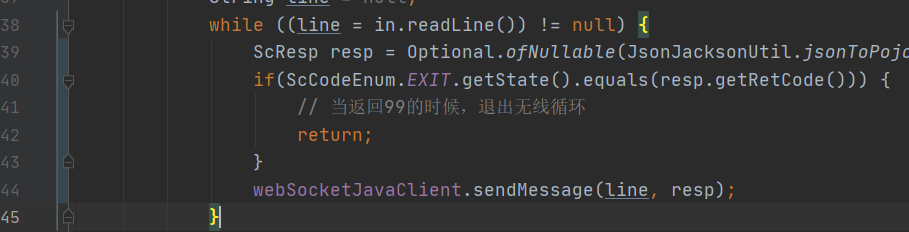

# 1 Process

## 1.1 Runtime.getRuntime().exec（）

https://www.cnblogs.com/xinmengwuheng/p/5970255.html


## 1.2 Process的waitFor()阻塞

https://blog.csdn.net/hz_chenwenbiaotmb/article/details/83709203


## 1.3 使用join 多线程实现超时

超时2分钟断开


# 2 Java调用Python

<https://www.jianshu.com/p/c5e88f9880d3>

## 2.1 接受和返回

```python
python
接受：sys.argv[0]
返回：print(func(a[0],a[1]))
```

```java
String[] args = new String[] { "python", "D:\\demo2.py", String.valueOf(a), String.valueOf(b) };
Process proc = Runtime.getRuntime().exec(args);// 执行py文件
BufferedReader in = new BufferedReader(new InputStreamReader(proc.getInputStream()));
```

## 2.2 问题

### 2.2.1 调用cmd命令

cmd /c

### 2.2.2 java调用python返回乱码

https://www.cnblogs.com/qilin20/p/12369483.html

```
BufferedReader in = new BufferedReader(new InputStreamReader(proc.getInputStream(),"gbk"));
```

### 2.2.3 无线循环关闭

一定记得某个条件关闭无线循环



### 

