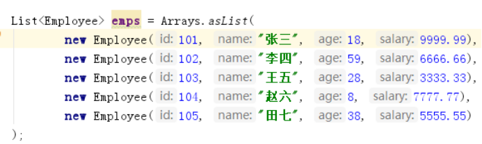
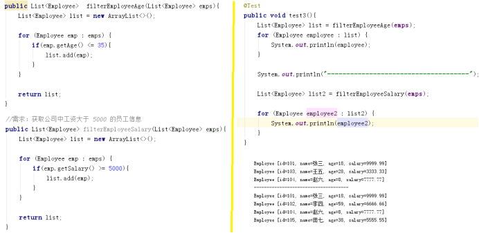
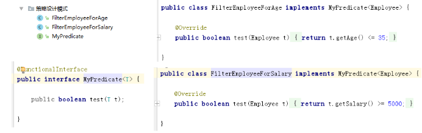
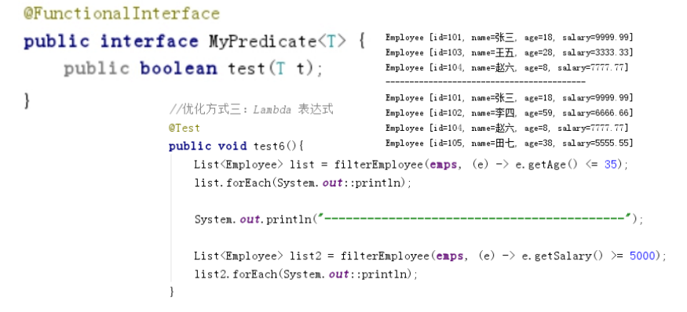

# 1 **基础语法**

## 1.1 **概念**

​	以前是使用匿名内部类，也可称为闭包

​	Java8中引入了一个新的操作符 "->" 该操作符称为箭头操作符或 Lambda 操作符，箭头操作符将 Lambda 表达式拆分成两部分：

​	左侧：Lambda 表达式的参数列表；

​	右侧：Lambda 表达式中所需执行的功能， 即 Lambda 体

 

## 1.2 **语法**

com.lan.java8._1lambda.TestLambda（test1-test5）

上联：左右遇一括号省；下联：左侧推断类型省；横批：能省则省

```
语法格式一：无参数，无返回值  () -> System.out.println("Hello Lambda!");
语法格式二：有一个参数，并且无返回值 	(x) -> System.out.println(x)
语法格式三：若只有一个参数，小括号可以省略不写*    x -> System.out.println(x)
语法格式四：有两个以上的参数，有返回值，并且 Lambda 体中有多条语句
语法格式五：若 Lambda 体中只有一条语句， return 和 大括号都可以省略不写    Comparator<Integer> com = (x, y) -> Integer.compare(x, y);
语法格式六：Lambda 表达式的参数列表的数据类型可以省略不写，因为JVM编译器通过上下文推断出，数据类型，即“类型推断”    (Integer x, Integer y) -> Integer.compare(x, y);
```


## 1.3  **函数式接口支持**

com.lan.java8._1lambda.TestLambda（test6）

​	Lambda 表达式需要“函数式接口”的支持* *函数式接口：接口中只有一个抽象方法的接口，称为函数式接口。 可以使用注解 @FunctionalInterface 修饰可以检查是否是函数式接口

# 2 优化

## 2.1 **优化匿名内部类**

com.lan.java8._1lambda.TestLambda1#test_匿名内部类


## 2.2 优化集合

com.lan.java8._1lambda.TestLambda1

### 2.1.1 **需求**

*//需求：获取公司中年龄小于 35 的员工信息*

*//需求：获取公司中工资大于 5000 的员工信息*



思路：筛选条件存入一个新的list

 

### 2.1.2 **传统**

 

### 2.1.3 优化方式一：策略设计模式

*//优化方式一：策略设计模式*

设计模式接口设计



 测试：更据条件选择新的list和测试

```java
//实现接口：更据条件选择新的list
public List<Employee> filterEmployee(List<Employee> emps, MyPredicate<Employee> mp){
   List<Employee> list = new ArrayList<>();
   for (Employee employee : emps) {
      if(mp.test(employee)){
         list.add(employee);
      }
   }
   return list;
}
```

### 2.1.4 优化方式二：匿名内部类

```java
//优化方式二：匿名内部类
@Test
public void test5(){
   List<Employee> list = filterEmployee(emps, new MyPredicate<Employee>() {
      @Override
      public boolean test(Employee t) {
         return t.getAge() <= 35;
      }
   });
   
   for (Employee employee : list) {
      System.out.println(employee);
   }
}
```

### 2.1.5 优化方式三:**Lambda 表达式**

只是多设计模式的简化

实现接口和更据条件选择新的list

 

 

 

### 2.1.6 优化方式四:**Stream API**

```java
//优化方式四：Stream API
@Test
public void test7(){
   emps.stream()
      .filter((e) -> e.getAge() <= 35)
      .forEach(System.out::println);
   
   System.out.println("----------------------------------------------");
   
   emps.stream()
      .map(Employee::getName)
      .limit(3)
      .sorted()
      .forEach(System.out::println);
}
```


## 2.3 **练习**

### 1.1 **练习1**： 

​	调用Collections.sort() 方法，通过定制排序比较两个Employee (先按年龄比，年龄相同按姓名比)，使用Lambda作为参数传递。

### 1.1 **练习2**

  ①声明函数式接口，接口中声明抽象方法，public String getValue(String str);:

  ②声明类TestLambda，类中编写方法使用接口作为参数，将一-个字符串转换成大写，并作为方法的返回值。，

  ③再将一个字符串的第2个和第4个索引位置进行截取子串。

### 1.1 **练习3**

  ①声明一个带两个泛型的函数式接口，泛型类型为<T,R> T 为参数，R为返回值

  ②接口中声明对应抽象方法，

  ③在TestLambda类中声明方法，使用接口作为参数，计算两个long型参数的和。。

④再计算两个long 型参数的乘积。。