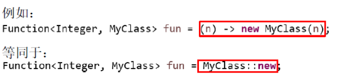
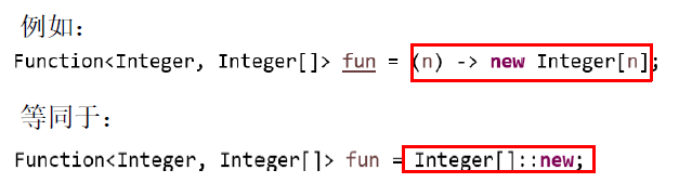

# 1 **方法引用**

## 1.1 概念

​	方法引用：若 Lambda 体中的功能，已经有方法提供了实现，可以使用方法引用（可以将方法引用理解为 Lambda 表达式的另外一种表现形式）

 	①方法引用所引用的方法的参数列表与返回值类型，需要与函数式接口中抽象方法的参数列表和返回值类型保持一致！

​	②若Lambda 的参数列表的第一个参数，是实例方法的调用者，第二个参数(或无参)是实例方法的参数时，格式： ClassName::MethodName

 

## 1.2 **三种方式**

```java
1.对象实例	 对象的引用 :: 实例方法名 
	Consumer<String> con2 = ps2::println;
	Supplier<String> sup2 = emp::getName;
	BiFunction<Double, Double, Double> fun2 = Math::max;
2.类静态	  类名 :: 静态方法名
	Comparator<Integer> com2 = Integer::compare;
3.类实例	  类名 :: 实例方法名
	BiPredicate<String, String> bp2 = String::equals;
	Function<Employee, String> fun2 = Employee::show;
```

# 2 **构造器引用**

格式：ClassName::new 

​	与函数式接口相结合，自动与函数式接口中方法兼容。可以把构造器引用赋值给定义的方法，与构造器参数列表要与接口中抽象方法的参数列表一致！



```java
	Supplier<Employee> sup2 = Employee::new;
	BiFunction<String, Integer, Employee> fun2 = Employee::new;
```

# 3 **数组引用**

格式：type[] :: new

 

```java
Function<Integer, Employee[]> fun2 = Employee[] :: new;
```

 