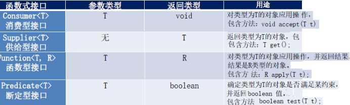
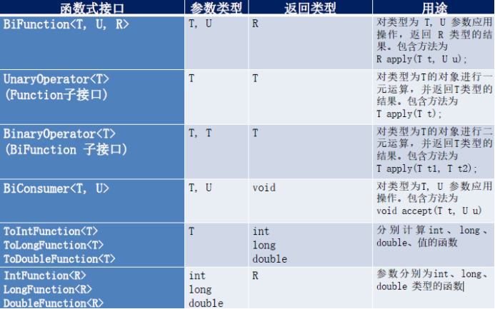
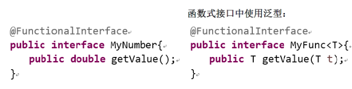
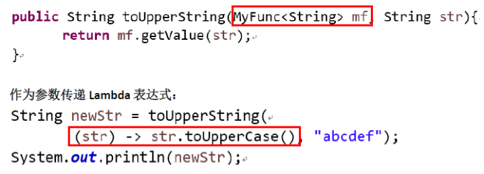

# 1 函数式接口

## 1.1 **内置函数接口**

### 1.1.1 **四大核心函数式接口**

com.lan.java8._3函数式接口.TestLambda3

四大核心函数式接口

- Consumer<T> : 消费型接口void accept(T t);
- Supplier<T> : 供给型接口T get();
- Function<T, R> : 函数型接口R apply(T t);
- Predicate<T> : 断言型接口boolean test(T t);*

### 1.1.2 其他接口

## 1.2 **自定义函数式接口**

### 1.2.1 **概念**

​	只包含一个抽象方法的接口，称为函数式接口。

​	你可以通过Lambda 表达式来创建该接口的对象。（若Lambda 表达式抛出一个受检异常，那么该异常需要在目标接口的抽象方法上进行声明）。

​	我们可以在任意函数式接口上使用@FunctionalInterface注解，这样做可以检查它是否是一个函数式接口，同时javadoc也会包含一条声明，说明这个接口是一个函数式接口。

 

### 1.2.2 **自定义函数式接口**

 

### 1.2.3 **作为参数传递Lambda表达式**

​	作为参数传递Lambda 表达式：为了将Lambda 表达式作为参数传递，接收Lambda 表达式的参数类型必须是与该Lambda 表达式兼容的函数式接口的类型。

 

 