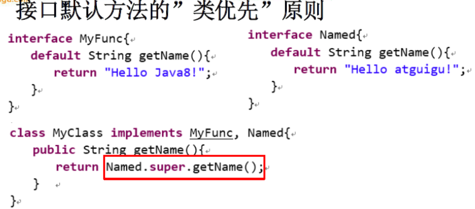

# 1 默认方法

## 1.1 概述

​	java8中允许接口中包含具体实现的方法，该方法称为“默认方法”，使用 **default**修饰

## 1.2 类优先原则

​	**接口默认方法的“类优先”原则**，若一个接口中的定义了一个默认方法，二另外一个父类或者接口中也定义了一个同名的默认方法时

- 选择父类中的方法。如果一个父类提供了具体实现，那么接口中具有的体现，那么接口具有相同名称和参数的默认方法会被忽略
- 接口冲突，两个接口拥有同名默认方法，必须覆盖接口来解决冲突

