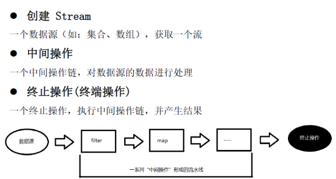
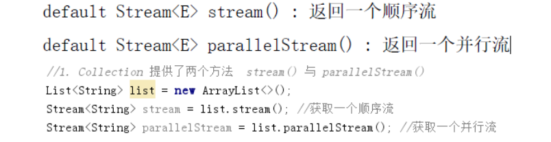
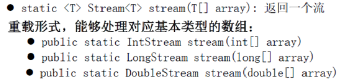
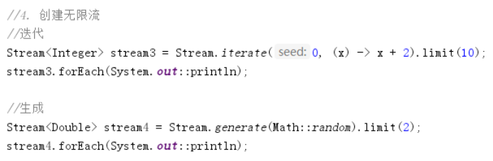
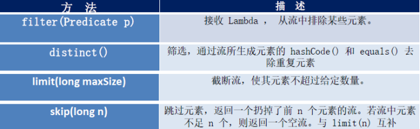
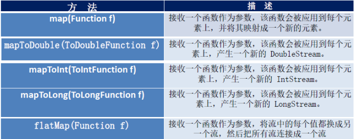
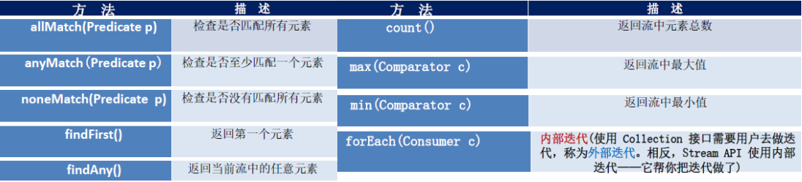
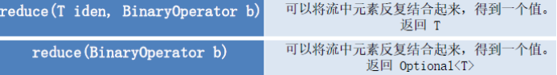
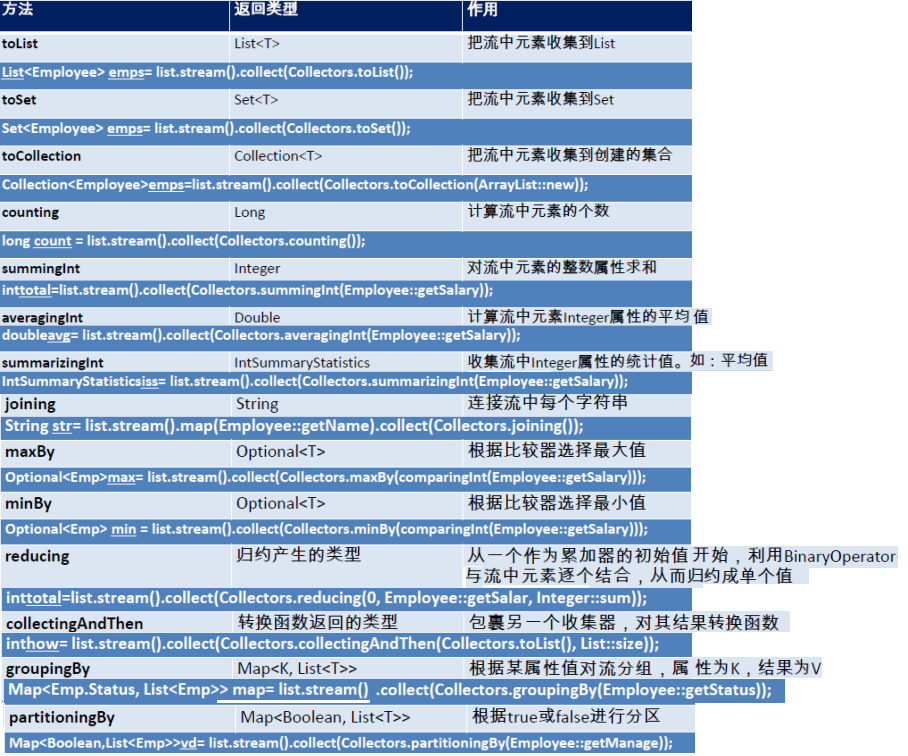

菜鸟教程：http://www.runoob.com/java/java8-streams.html

 

# 1 **Stream**

## 1.1 **什么是Stream**

 	流(Stream) 到底是什么呢？是数据渠道，用于操作数据源（集合、数组等）所生成的元素序列。“集合讲的是数据，流讲的是计算！”

注意：

​	①Stream 自己不会存储元素。

​	②Stream 不会改变源对象。相反，他们会返回一个持有结果的新Stream。

​	③Stream 操作是延迟执行的。这意味着他们会等到需要结果的时候才执行。

 

操作三个步骤

 

## 1.2 **创建Stream**

com.lan.java8._5Stream.TestStreamaAPI

### 1.2.1 **Collection** 接口

Collection 提供了两个方法  stream() 与 parallelStream()

 

### 1.2.2 **创建Stream**

#### **由数组创建流**：

Java8 中的Arrays 的静态方法stream() 可以获取数组流：

 

####  **由值创建流**

可以使用静态方法Stream.of(), 通过显示值创建一个流。它可以接收任意数量的参数。

public static<T> Stream<T> of(T... values) : 返回一个流

 

#### **由函数创建流：创建无限流**

## 1.3 中间操作

com.lan.java8._5Stream.TestStreamAPI1

### 1.3.1 惰性求值

​	多个中间操作可以连接起来形成一个流水线，除非流水线上触发终止操作，否则中间操作不会执行任何的处理！而在终止操作时一次性全部处理，称为“惰性求值”。

### 1.3.2 **筛选与切片**

### 1.3.3 **映射**

 

 

## 1.4 **终止操作**

com.lan.java8._5Stream.TestStreamAPI2

### 1.4.1 **概念**

终端操作会从流的流水线生成结果。其结果可以是任何不是流的值，例如：List、Integer，甚至是void 。

 

### 1.4.2 **查找与匹配**

 

### 1.4.3 **归纳**

 

备注：map 和reduce 的连接通常称为map-reduce 模式，因Google 用它来进行网络搜索而出名。

 

### 1.4.4 **收集**

 

Collector 接口中方法的实现决定了如何对流执行收集操作(如收集到List、Set、Map)。但是Collectors 实用类提供了很多静态方法，可以方便地创建常见收集器实例，具体方法与实例如下表：

 

 

 

 

 

 

 

 

 

 

 

 

 

 

 