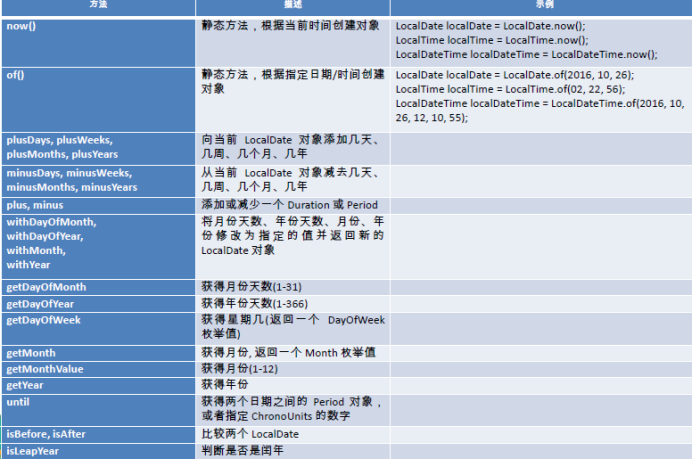
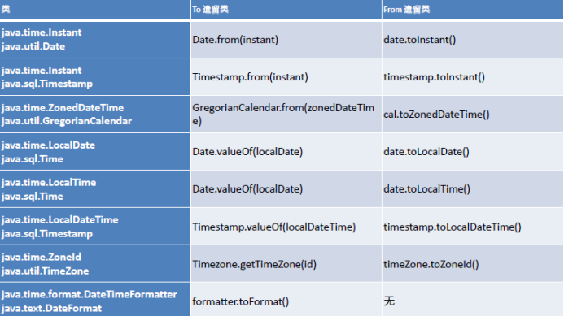

# 1 时间API

## 1.1 LocalDate LocalTime LocalDateTime

 	LocalDate、LocalTime、LocalDateTime 类的实例是不可变的对象，分别表示使用ISO-8601日历系统的日期、时间、日期和时间。它们提供了简单的日期或时间，并不包含当前的时间信息。也不包含与时区相关的信息。

## 1.2 **Instant** **时间戳**

 	用于“时间戳”的运算。它是以Unix元年(传统的设定为UTC时区1970年1月1日午夜时分)开始所经历的描述进行运算

## 1.3 **Duration**和Period

Duration:用于计算两个“时间”间隔

Persiod:用于计算两个“日期”间隔

 

## 1.4 **解析与格式化**

​	java.time.format.DateTimeFormatter 类：该类提供了三种格式化方法：预定义的标准格式、语言环境相关的格式、自定义的格式

 

## 1.5 **时区的处理**

 

​	Java8 中加入了对时区的支持，带时区的时间为分别为：ZonedDate、ZonedTime、ZonedDateTime

其中每个时区都对应着ID，地区ID都为“{区域}/{城市}”的格式例如：Asia/Shanghai 等

​	ZoneId：该类中包含了所有的时区信息

​	getAvailableZoneIds() : 可以获取所有时区时区信息

​	of(id) : 用指定的时区信息获取ZoneId 对象

 

## 1.6 **与传统日期处理的转换**

  

 

 