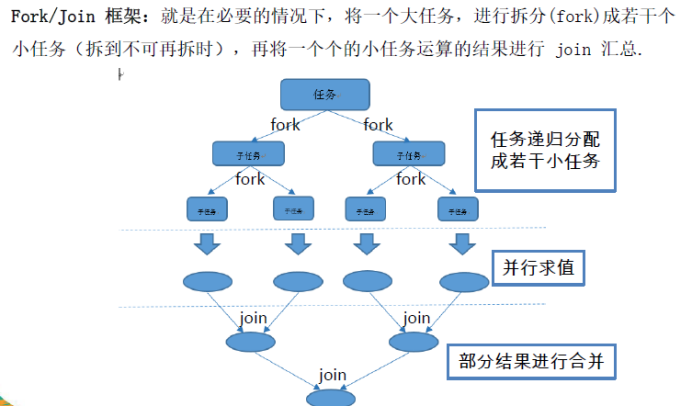
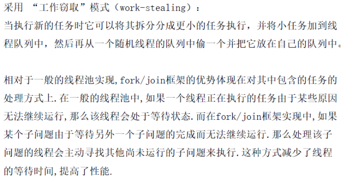

 

 

# 1 **并行流与串行流**

## 1.1  概念

​	并行流就是把一个内容分成多个数据块，并用不同的线程分别处理每个数据块的流。

Java 8 中将并行进行了优化，我们可以很容易的对数据进行并行操作。Stream API 可以声明性地通过parallel() 与sequential() 在并行流与顺序流之间进行切换。

 

## 1.2 **了解Fork/Join框架**

 

 

## 1.3 **Fork/Join** **框架与传统线程池的区别**

 

 

 

 

 

 

 

 

 

 

 

 