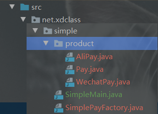
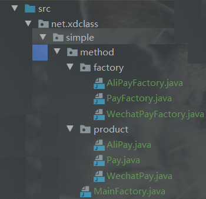

# 第四章 工程模式

## 第二集 简单工厂

项目结构



```java
	//简单工厂
    //        PayFactory pay = SimplePayFactory.createPay("WECHAT_PAY");
    PayFactory pay = SimplePayFactory.createPay("ALI_PAY");
    pay.unifiedorder();

支付宝支付 统一下单接口
```

## 第四集 工厂

在简单工厂的基础上，把创建实例的部分修改为具体的Factory类（同时也丢失了一个工厂类创建）



```java
//工厂
PayFactory aliPayFactory = new AliPayFactory();
Pay aliPay = aliPayFactory.getPay();
aliPay.unifiedorder();

PayFactory wechatPayFactory = new WechatPayFactory();
Pay wechatPay = wechatPayFactory.getPay();
wechatPay.unifiedorder();
```


## 第六集 抽象工厂

在工厂的基础上

​	1.找回了一个工厂类创建FactoryProducer

​	2.可实现多个产品功能（支付+退款）


```java
//抽象工厂
OrderFactory orderFactory = FactoryProducer.getFactory("ALI");
orderFactory.createPay().unifiedorder();
orderFactory.createRefund().refund();

支付宝支付 统一下单接口
支付宝 退款
```