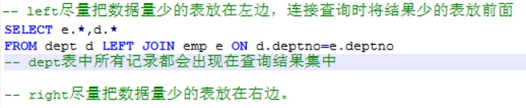

# 1 **数据库优化**

## 1.1  **访问优化思路**


```
1、减少磁盘访问（索引、SQL执行计划）
	SQL语句优化；
	避免全表扫描，尽量只取所需数据--索引

2、减少网络传输（返回更少的数据、减少交互次数）
	减少交互次数，减少网络传输等待时间
	磁盘IO：返回更少的数据（减少数据访问量）

3、减少CPU的开销（没法）
4、利用外部资源（没法）
```


# 2 **SQL优化**

## 2.1 **Sql执行顺序**

### 2.1.1 **单条语句sql执行顺序**

#### 2.1.1.1 **概述**

<https://www.cnblogs.com/huminxxl/p/3149097.html>

把sql拆分成一条一条小的，再组合成一条整的，通过整的去看执行顺序

 

#### 2.1.1.2 sql执行顺序-**Mysql**

 

 

###  2.1.2 **From**解析顺序

2.2.1 **From加载顺序**

1.多表关联时，表的加载顺序from是先加载内层再加载外层 

 

2.2.2 **From驱动表**

2.from  A  B  C  D

​			ß 驱动表

###  2.1.3 **where解析顺序**

1.where解析顺序: 右 ---> 左

​	所以选择性好的在右边：主键，=，in，…


## 2.2 关键字优化

### 2.2.1 **From临时表连接查询with** **as**

 

第三点：使用临时表，暂存中间结果

with as

概念：把一大堆重复用到的SQL语句放到with as中，取一个别名，然后通过别用调用这个sql语句。这样既可以对大批量的sql语句起一个优化作用且能让你的sql看起来更加的清晰明了 

 

eg1: with a as(select * from tableA)  select * from a,select count(1) from a 

 

 

### 2.2.2 **Where** 

#### 2.2.2.1 **列禁用聚集函数**

Where字句禁用聚集函数

 

#### 2.2.2.2 **列尽量规避函数**

尽量对常量使用函数，而不要对表中的列使用函数

 

 

#### 2.2.2.3 **exist取代in**

• in效率低于exists，尽量用exists查询替换in查询；

• not in尽量用not exists替换；

 

 

#### 2.2.2.4 **<>和between被取代**

• <> 用，> or < 替换；

• between and 尽量使用>= and <= 替换。


### 2.2.3 **Join**

 Select 驱动表字段，…

驱动表数据量最少

 

 

### 2.2.4 **集合union和union all**

能用union-all就禁止使用union

 

### 2.2.5 **Group** **by** **和distinct用于去重**

https://www.cnblogs.com/yangfeizbj/p/5446516.html

 空间换时间

| 数据分布 | 去重方式 | 原因                                                         |
| -------- | -------- | ------------------------------------------------------------ |
| 离散     | group    | distinct空间占用较大，在时间复杂度允许的情况下，group 可以发挥空间复杂度优势 |
| 集中     | distinct | distinct空间占用较小，可以发挥时间复杂度优势                 |

 

## 2.3 字段创建优化

### 2.3.1 维度来表示字段

存性别的时候，男和女使用1和2


### 2.3.2 **部分特殊列可以用常量**

部分特殊列可以用常量，可以加快查询效率，比如性别列男女可以用1/0值代替。默认值可以设置为0. 


#  3 索引优化

## 3.1 默认建索引的情况

1.列表页面最开始进入，建议创建时间做联合索引


## 3.2 like索引优化

- like %keyword    索引失效，使用全表扫描。但可以通过翻转函数+like前模糊查询+建立翻转函数索引=走翻转函数索引，不走全表扫描。
  - 翻转函数+like前模糊查询+建立翻转函数索引=走翻转函数索引
- like keyword%    索引有效。
- like %keyword% 索引失效，也无法使用反向索引。
  -  LOCATE(substr,str) 或  POSITION(substr IN str)


# 4 **返回更少的数据（减少数据访问量）**

## 4.1 **减少返回的行数**

jdbc的100行后很慢

### 4.1.1 **分页**

采用分页

 

### 4.1.2 结合group by分组wmsys.wm_concat获得所有合并数据

**原理**

将查询出来几百条数据的，通过分组压缩成几条数据 

 **分组起点终点获得所有车辆**

 

 

## 4.2 **减少返回的列数**

### 4.2.1 **禁止\***

避免使用select *，count *

  

## 4.3 **对表进行划分**-分库分表

• 表空间（按rang切分、按list、按hash）、分库分表。

 

#  5.减少交互次数-减少响应等待时间

## 5.1 **循环查询**


Map<Long,List<UserKycFile>> filesMap=files.stream().collect(Collectors.groupingBy(UserKycFile::getId)); 

 

 

 

 

 

 