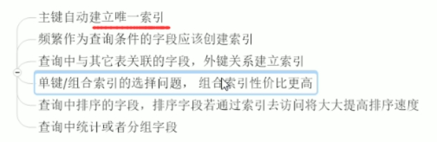
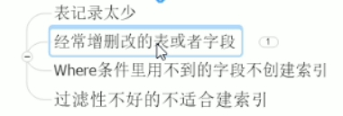

# 1. **Mysql检索方式**

## 1.1. **Mysql检索方式**

- 全盘扫描
- 通过索引进行检索 


## 1.2. **explain分析**

https://www.jianshu.com/p/be1c86303c80

### 1.2.1. **type**

```
ALL			全表扫描
index		索引全扫描
range		索引范围扫描，常用语<,<=,>=,between等操作
ref			使用非唯一索引扫描活唯一索引的前缀扫描，返回单条数据，常常出现在管理查询中
eq_ref		类似ref,区别在于使用唯一索引，使用主键的关联查询
const/system单条记录，系统会把匹配行中的其他列作为常数处理，如主键或唯一索引查询
```

 

  


# 2. **索引**

## 2.1. 概述

索引（index）的作用是提高程序的检索【查询效率】，相当于一本字段的目录

索引作为表的一部分，他们都是一个对象，存储在硬盘文件中

 

优势

1. 类似大学图书馆建立书本索引，提高数据**检索**的效率，降低数据库的IO成本
2. 通过索引列队数据进行**排序**，降低数据排序成本，降低了CPU的消耗

劣势

1. 同时**降低了更新表的速度**，如对表进行（增删改），mysql不仅要对保存数据，还会保存一下索引文件更新索引列的字段
2. 实际索引也是一张表，该表保存了主键和索引字段，并指向实体表的几率，所以索引列也是**占用空间**的

 

## 2.3. **索引数据结构**

### B+Tree索引和Hash索引

<https://blog.csdn.net/qq_19557947/article/details/76951912>


## 2.4. **索引类型**

https://www.cnblogs.com/luyucheng/p/6289714.html

 

<http://baijiahao.baidu.com/s?id=1641311517406582639&wfr=spider&for=pc>

 

### 2.4.1. **普通索引**

 

 

 

### 2.4.2. **唯一索引**

 

 

 

### 2.4.3. **主键索引**

 

 

 

### 2.4.4. **组合索引**

重点，以第一为准，第一个+后面的任意生效

 

 

 

### 2.4.5. **全文索引**

 

 

 

# 3. **索引创建与分析**

## 3.1. **是否创建索引**

### 3.1.1. **要创建索引**

 

 

 

### 3.1.2. **不要创建索引**

 

 

## 3.2 是否走索引

### 3.2.1 原则30%

如果达到 30% 则MYSQL不会再使用索引。因为使用索引的开销反而更大。

 <https://bbs.csdn.net/topics/390893506>

 

 

 

 

 

 

 