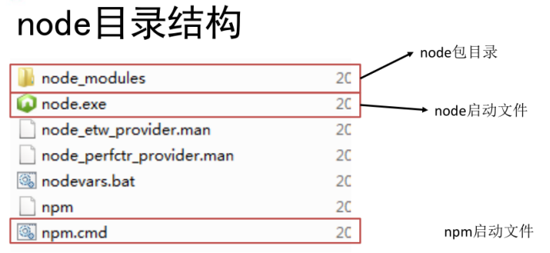
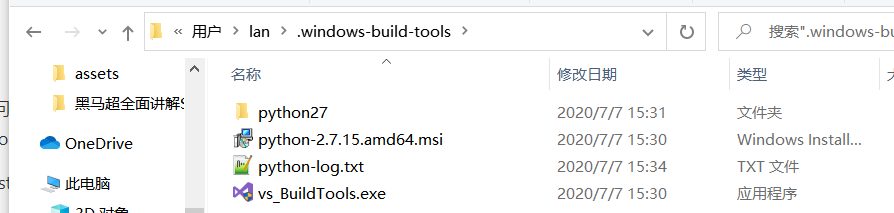
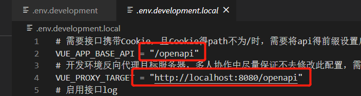
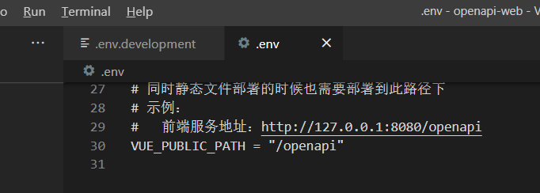
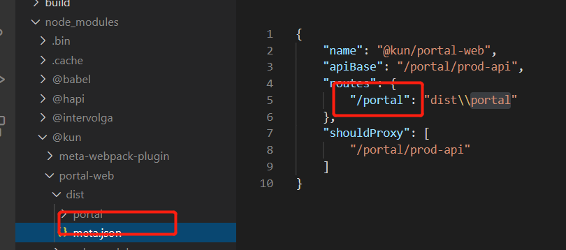
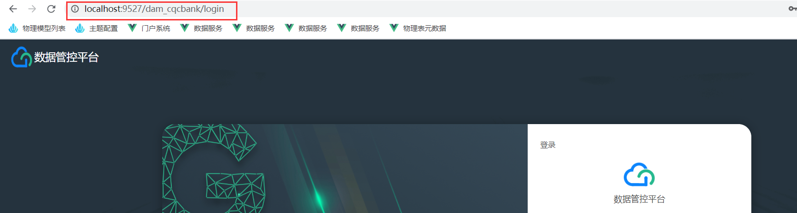

# 1 环境搭建

Node服务器单线程

## 1.1 **N**odejs环境搭建

 https://blog.csdn.net/qq_43285335/article/details/90696126

依赖环境，[Node](https://nodejs.org/en/),安装 `LTS` 

一路next

 

 

## 1.2 .windows-build-tools安装

https://blog.csdn.net/Chen_RuiMin/article/details/104220552

# 2 公司环境安装

## 2.1 安装@kun/cli

安装@kun/cli: [@kun/cli](http://139.159.243.23:10084/-/web/detail/@kun/cli)

查看模板`kun list`,  选择多页应用`web-mpa - web端多页应用模板`

## 2.2 yarn 安装问题

修改Yarn的全局安装和缓存位置

https://www.cnblogs.com/Jimc/p/11121632.html

## 2.3 项目可能存在的问题

### 2.3.1 前后端代理地址

最好与tomcat项目地址和前端一致

前端服务地址：vue启动后的地址

### 2.3.2 可能内存溢出的问题

FATAL ERROR: CALL_AND_RETRY_LAST Allocation failed - JavaScript heap out of memory

https://blog.csdn.net/weixin_42113124/article/details/94393671

使用yarn 启动，目前npm 不行（ps: 我也不知道为什么）

>  "serve": "cross-env NODE_OPTIONS=\"--max_old_space_size=4096\" vue-cli-service serve",

### 2.3.3 [vue 启动报错Error: Cannot find module 'E:\xx\xx\xx\dll\manifest.json']

`npm run build:dll`

https://www.cnblogs.com/js1314/p/12528073.html

## 2.4 前端打包问题

### 2.4.1 默认meta.jon

这里可能弄成undefined

## 2.5 v3.5.3 登录问题

必须用前端地址登录，完全代理他

