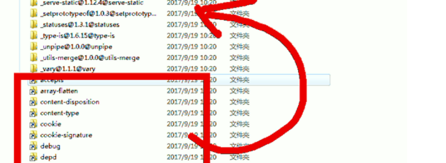

[TOC]

# 1.node

## 1.1 node

`node -V`: 查看版本信息


## 1.2 淘宝镜像cnpm

<https://developer.aliyun.com/mirror/NPM>

```powershell
$ npm install -g cnpm --registry=https://registry.npm.taobao.org
```



## 1.3 镜像管理nrm

​	npm默认的仓库地址是在国外网站，速度较慢，建议大家设置到淘宝镜像。但是切换镜像是比较麻烦的。推荐一款切换镜像的工具：`nrm`, 我们首先安装nrm，`    npm install nrm -g`这里-g代表全局安装。

`nrm ls`: 查看npm的仓库列表,带*的就是当前选中的镜像仓库

`nrm use taobao`:  指定要使用的镜像源

`nrm test taobao`:  测试速度

​	安装完成请一定要重启下电脑！！！


# 2.npm

## 2.1 npm/cnpm

### 2.1.1  **概念**

​	CommonJS包规范是理论，NPM是其中一种实践。

​	对于Node而言，NPM帮助其完成了第三方模块的发布、安装和依赖等。借助NPM，Node与第三方模块之间形成了很好的一个生态系统。

 

### 2.1.2. **NPM命令**

参看：https://www.cnblogs.com/itlkNote/p/6830682.html

 ` npm –v`	 查看版本

`npm --help`	 帮助说明

`npm search 包名`   搜索模块包

`npm install 包名`  在当前目录安装包 	 `npm i 包名 –g ` 全局模式安装包

​	install缩写i, global 缩写 -g

` npm remove 包名`  删除一个模块

`npm config set registry 地址`   设置镜像源

 

### 2.1.3. **全局安装目录**

安装和设置


本地设置可手写文件`C:\Users\lan\.npmrc`


### 2.1.4  **Npm寻找包的流程**

​	通过**npm**下载的包都放到**node_modules**文件夹中，通过**npm**下载的包，直接通过包名引入即可		

- **node**在使用模块名字来引入模块时，它会首先在当前目录的**node_modules**中寻找是否含有该模块

*   如果有则直接使用，如果没有则去上一级目录的**node_modules**中寻找
*   如果有则直接使用，如果没有则再去上一级目录寻找
*    直到找到磁盘的根目录，如果依然没有，则报错


## 2.2 yarn

### 2.2.1 概念


`npm i yarn -g` :  全局安装yarn

### 2.2.2 yarn命令

https://yarn.bootcss.com/docs/cli/

`yarn add 包名`  在当前目录安装包 	 `npm global add 包名  ` 全局模式安装包

`yarn`  运行

更新命令：

​	yarn upgrade @kun/meta-webpack-plugin

​	yarn upgrade-interactive --latest


### 2.2.3 yarn 安装问题

修改Yarn的全局安装和缓存位置

https://www.cnblogs.com/Jimc/p/11121632.html


### 2.2.4 yarn 和 npm 命令对应


