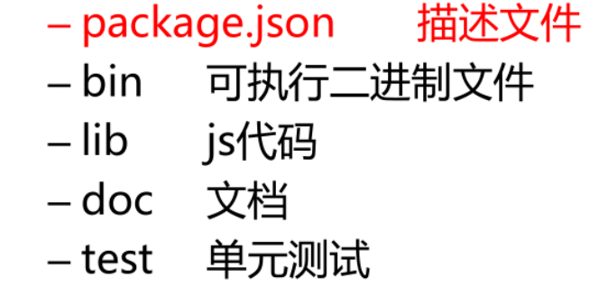
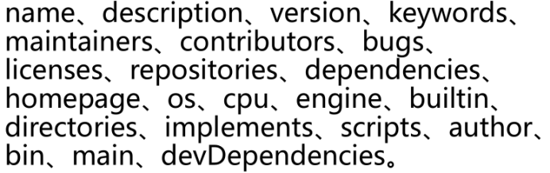

# 1. **包 package**

## 1.1. **概述**

 

​	CommonJS的包规范允许我们将一组相关的模块组合到一起，形成一组完整的工具。CommonJS的包规范由包结构和包描述文件两个部分组成。

​	包结构：用于组织包中的各种文件

​	包描述文件：描述包的相关信息，以供外部读取分析

 

## 1.2. **包结构**

包实际上就是一个压缩文件，解压以后还原为目录。符合规范的目录，应该包含如下文件：

 

## 1.3. **包描述文件**

​	包描述文件用于表达非代码相关的信息，它是一个JSON格式的文件 – package.json，位于包的根目录下，是包的重要组成部分。	package.json中的字段

 

 

 

## 1.4 **package-lock.json**

​	**Npm5版本** 

 

 