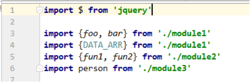
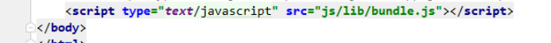

# 1. **ES6导入导出**

## 1.1. **说明**

依赖模块需要编译打包处理

 

## 1.2. **语法**

### 1.2.1. **导出模块: export**

```javascript
1. 分多次导出模块的多个部分
		export class Emp{  }
		export function fun(){  }
		export var person = {};
2. 一次导出模块的多个部分
		class Emp{  }
		function fun(){  }
		var person = {};

		export {Emp, fun, person}
3. default导出(只能有一个)
		export default {}
```

 

### 1.2.2. **引入模块: import**

引入路径确定，在node_modules下，一层一层的找，就能确定路径了


立即加载（第三方组件）

```javascript
 import 'jquery-file-download';
```

懒加载（自己组件）

```javascript
import $ from 'jquery'  

import defaultModule from './myModule';  //导入默认的
import {Emp} from './myModule'; //导入指定的一个
import {Emp, person} from './myModule'; //导入指定的多个
import * as allFromModule from './myModule';  //导入所有
```

 

# 2. **实现兼容es5(浏览器端)**

使用Babel将ES6编译为ES5代码

使用Browserify编译打包js

## 2.1. **项目结构**


 

## 2.2. **安装**

安装babel-cli, babel-preset-es2015和browserify, preset 预设(将es6转换成es5的所有插件打包)

```shell
npm install babel-cli browserify -g 
npm install babel-preset-es2015 --save-dev 
```

 

## 2.3. **定义.babelrc文件** 

```javascript
{
    "presets": ["es2015]
}
```

 

## 2.4. **编码**

### 2.4.1. **暴露**


 

### 2.4.2. **Main.js引入组件**

引入自定义和第三方

 

 

### 2.4.3. **引入第三方包**jQuery

```javascript
1). 下载jQuery模块: 
npm install jquery@1 --save

2). 在app.js中引入并使用
import $ from 'jquery'   

 $('body').css('background', 'red')   
```


### 2.4.4. **编译**

***** 使用Babel将ES6编译为ES5代码(但包含CommonJS语法) : babel js/src -d js/lib
***** 使用Browserify编译js : browserify js/lib/app.js -o js/lib/bundle.js

 

## 2.5. **页面引入**



 

 