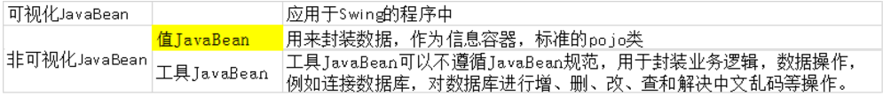
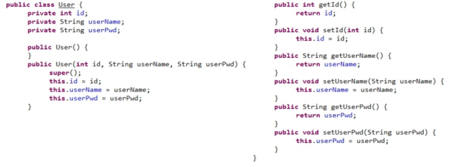
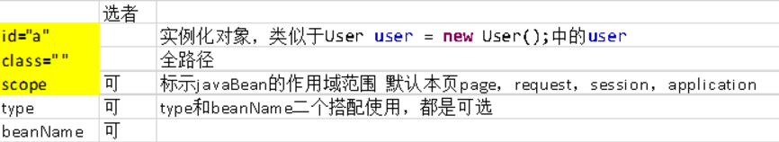
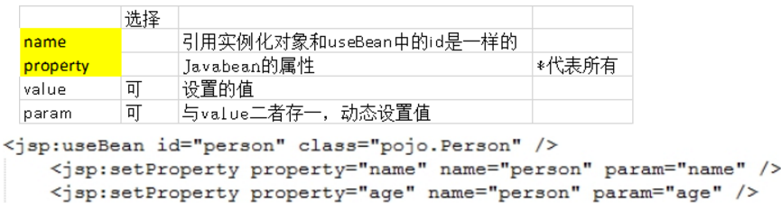
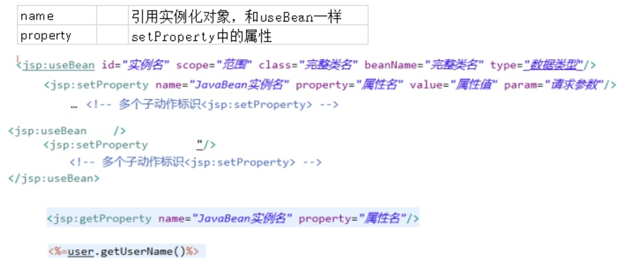

# 1 javabean技术简介

## **1.1 javabean概念**

1.javabean实际就是一个Java类, 	区别：Javabean可以直接被jsp页面引用

2.无参的构造函数（必有），有参构造（建议）

3.类必须public：如果私有，别人怎么访问

4.属性首字母必须小写（不是建议）

5.添加为属性get()和set()方法（必须）

6.值Javabean作为pojo类，用于封装数据，无任何逻辑代码

 

## **1.2 JavaBean概述**

javaBean是方便java实现web编程的一种组件,相当于将类中的属性设置为私有的方式;通过set和get方法来设置和获取属性的值,最主要的是要回使用当做元素设置和获取参数 

1. useBean 动作可在 JSP 页面中提供 JavaBean 组件

2. setProperty 动作用于设置 Bean 的属性值

3. getProperty 动作用于获取 Bean 的值

4. forward 动作用于将用户的请求转发给其他页面

5. include 动作用于将一个页面嵌入当前 JSP 页面

 

## **1.3 JavaBean种类**




# 2 JavaBean在JSP的应用

## **2.1.创建Javabean**

 

## **2.2.useBean**

```html
存在body：   <jsp:useBean id="a" class="bean.User" scope="request"></jsp:useBean>
不存在body:  <jsp:useBean id="a" class="bean.User" scope="request">
```

 


## 2.3.setProperty

```html
<jsp:setProperty name="a" property="id" value="4"/>
获得从jsp页面输入的数据
```

 

 

## 2.4.getProperty

```html
<jsp:getProperty name="JavaBean实例名" property="属性名"/>
也可以用 <%=user.getUserName()%> 获得
```



 


 

 

 