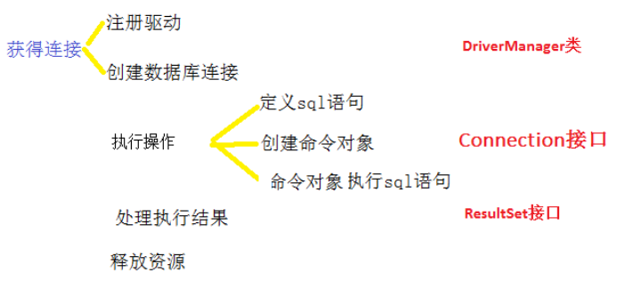
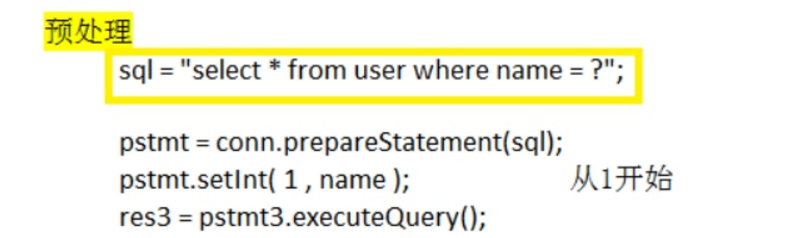

# 1 **概述**

## 1.1 **jdbc是什么?**

​	JDBC（Java Data Base Connectivity,java数据库连接)，简单说:就是可以直接通过java语言，去操作数据库。		

​	jdbc是一套标准,它是由一些接口与类组成的。

​	

 

## 1.2 **JDBC原理示意图**


 

## 1.3 	**什么**是**驱动?及jdbc驱动位置**

​	两个设备要进行通信，满足一定通信数据格式，数据格式由设备提供商规定，设备提供商为设备提供驱动软件，过软件可以与该设备进行通信

Jdbc驱动位置：C:\app\administrator\product\11.2.0\dbhome_1\jdbc

 

## 1.4 **构成**


​	

# 2 **连接数据库**

## 2.1 **开发步骤**

 

 

## 2.2 **DriverManager类**

### 2.2.1 **注册驱动** **(****只做一次****)**

```java
Class.forName(“com.mysql.jdbc.Driver”);
DriverManager.registerDriver(com.mysql.jdbc.Driver);
System.setProperty(“jdbc.drivers”, “com.mysql.jdbc.Driver”);
```

 

### 2.2.2 **创建数据库连接** 

```java
String url = "jdbc:mysql:///one";  
	String username = "root";
	String password = "root";
Connection conn = DriverManager.getConnection(url,username,password); 
```

​	

### 2.2.3 **URL**


```
常用数据库URL地址的写法：
	Oracle写法：jdbc:oracle:thin:@localhost:1521:sid
	MySql—jdbc:mysql://localhost:3306/user
		简写形式： jdbc:mysql:///user
常用属性：useUnicode=true&characterEncoding=UTF-8
```

 

## 2.3 **定义sql语句**


## 2.4 **Connection接口**

​	它代表的是一个连接对象。简单说，就是我们程序与数据库连接。

### 2.4.1 **创建命令对象**

 

### 2.4.2 **操作事务**


## 2.5 执行sql

### 2.5.1 **Statement接口**

#### **命令对象执行sql语句**

 

#### **批处理操作**

看文件：com.jdbcmysql.test.StatementBatchTest


### 2.5.1 **SQL注入**

​	由于没有对用户输入进行充分检查，而SQL又是拼接而成，在用户输入参数时，在参数中添加一些SQL 关键字，达到改变SQL运行结果的目的，也可以完成恶意攻击。

String sql = select * from user where username ='' and password ='' ;

例如：

一、输入 username: 老李' or '1'='1    password 随意

select * from user where username ='老李' or '1'='1' and password =''; 

​	and 优先级 执行 高于 or 

SQL注入原理是什么? 

​	1.在输入时连接一个永远为真的一个值

​	2.使用mysql 中的 – *注释*

为什么PreparedStatement 可以防止SQL注入 ？

​	因为它对sql语句进行预编译。

 

 

1.2 **解决SQL注入--预编译**

​	使用PreparedStatement 取代 Statement 

​	PreparedStatement 解决SQL注入原理，运行在SQL中参数以?占位符的方式表示

select * from user where username = ? and password = ? ;

 

原理：

​	将带有?的SQL 发送给数据库完成编译 （不能执行的SQL 带有?的SQL 进行编译 叫做），在SQL编译后发现缺少两个参数PreparedStatement 可以将? 代替参数 发送给数据库服务器，因为SQL已经编译过，参数中特殊字符不会当做特殊字符编译，无法达到SQL注入的目的 


### 2.5.3 **PreparedStatement接口**

####  **定义sql语句**




####  **创建命令对象**

 

 

#### **命令对象执行sql语句**

 

 

####  批处理操作


看文件：com.jdbcmysql.test.PreparedStatementBatchTest

### 2.5.4 **S 和PS 的区别以及批处理运用场景**


​	业务场景：当需要向数据库发送一批SQL语句执行时，应避免向数据库一条条的发送执行，而应采用JDBC的批处理机制，以提升执行效率。	一次执行多条sql语句

 

### 2.5.5 **execute、executeUpdate 和executeQuery 方法的区别？**

```
* 可以执行的SQL语句
*  execute 执行：任意，特别注意：execute返回返回false说明这条SQL语句执行失败？？？
*           返回值是boolean布尔类型，有结果集，返回true，无结果集，返回false
*           执行更新语句，执行成功，返回false。失败会抛出异常！！！！！！
*           执行结果返回一个ResultSet对象或一个Object，返回true？

*  executeUpdate执行更新：insert、update、delete等DML、DDL
*           返回值是int，更新成功的记录条数
*  executeQuery执行查询：DQL（select）
*           返回值是ResultSet对象，结果集
```


## 2.6 **ResultSet接口**

### 2.6.1 **next()方法**

​	public boolean next();

​	用于判断是否有下一条记录。如果有返回true,并且让游标向下移动一行。如果没有返回false.

  

 

### 2.6.2 **getXxx()**

#### getXxx()


#### 常用数据类型转换表


#### **日期**大数据


 

### 2.6.3 **处理执行结果**


 

## 2.7 **释放资源**

​	Jdbc程序运行完后，切记要释放程序在运行过程中，创建的那些与数据库进行交互的对象，这些对象通常是ResultSet, Statement和Connection对象。

​	特别是Connection对象，它是非常稀有的资源，用完后必须马上释放，如果Connection不能及时、正确的关闭，极易导致系统宕机。Connection的使用原则是尽量晚创建，尽量早的释放。

​	为确保资源释放代码能运行，资源释放代码也一定要放在finally语句中。

```java
res.close();
stmt.close();
conn.close();// 关闭顺序，先开后关
```


# 3 处理存储过程或者函数

##  3.1 **调用存储过程**

### 3.1.1 **需求**

-- 根据输入员工的名字，获取员工的月收入（sal+comm）

### 3.1.2 **oracle**

 

 

### 3.1.3 **java调用**

看文件com.prosay.test.CallProcTest

 

 

## 3.2 **调用存储函数**

### 3.2.1 **需求**

-- 根据员工id返回员工的姓名和职位

 

### 3.2.2 **oracle**

 

 

 

### 3.2.3 **java调用**

两种方式，推荐第二种

 

 

 

 

 

 

 

 

 

 

 

 

 

 

 

 