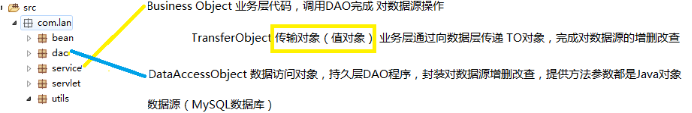
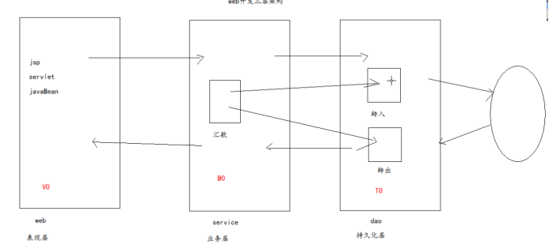

# 1 **DAO模式**

## 1.1 **概述**

​	DAO模式（Data Access Object 数据访问对象）：在持久层通过DAO将数据源操作完全封装起来，业务层通过操作Java对象，完成对数据源操作

​	业务层无需知道数据源底层实现 ，通过java对象操作数据源 

 

 	DAO模式实际上是两个模式的组合，即Data Accessor模式和Active Domain Object模式，前者实现了数据访问和业务逻辑的分离，后者实现了业务数据的对象化封装。

DAO模式通过对业务层提供数据抽象层接口，实现了以下目标：

​	- 数据存储逻辑的分离（业务层不会出现SQL语句和JDBC代码）

​	- 数据访问底层实现的分离（底层可以是数据库、文件系统、云存储服务等）

​	- 资源管理和调度的分离（通过连接池、缓存提升性能而不影响上层系统）

​	- 数据抽象（操作对象而不是数据字段使得业务逻辑更加清晰）

因此，DAO = Data + Accessor + (Domain) Object

 

 

## 1.2 **图解**

