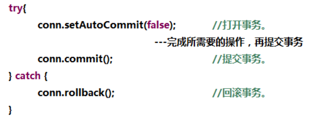
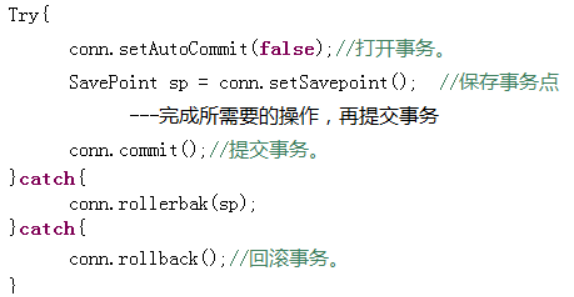
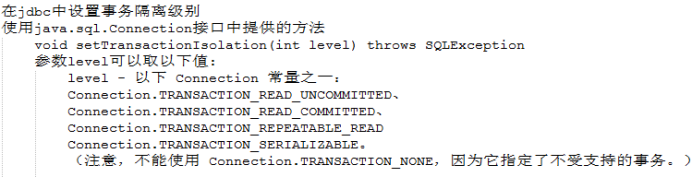

# 1 **事务**

其余的看Mysql

## 1.1 **事务的概念**

​	事务指逻辑上的一组操作，组成这组操作的各个单元，要不全部成功，要不全部不成功。 

​	在开发中，有事务的存在，可以保证数据完整性。

 

## 1.2 **Jdbc怎样操作**事务

### 1.2.1 **事务处理**

https://blog.csdn.net/daijin888888/article/details/50988053

com.lan.bmwai.dao.single.test.TestTran

 

 

### 1.2.2 事务保存点（SavePoint）

<https://www.cnblogs.com/noteless/p/10312824.html>

只回滚一部分事务，当只想撤销事务中的部分操作时可使用SavePoint

com.lan.bmwai.dao.single.test.TestTranPoint

 

 

### 1.2.3 **jdbc中设置隔离级别**

## 