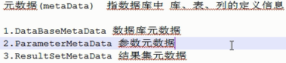
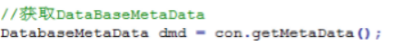
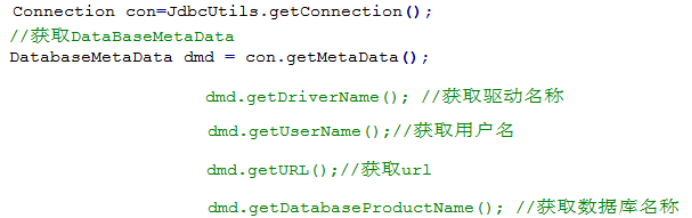
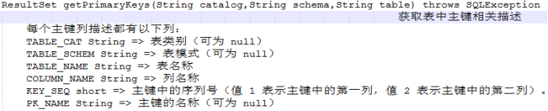
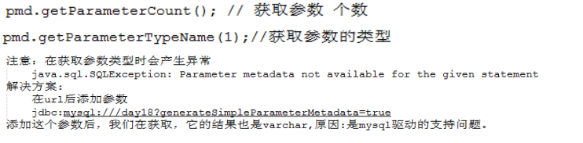
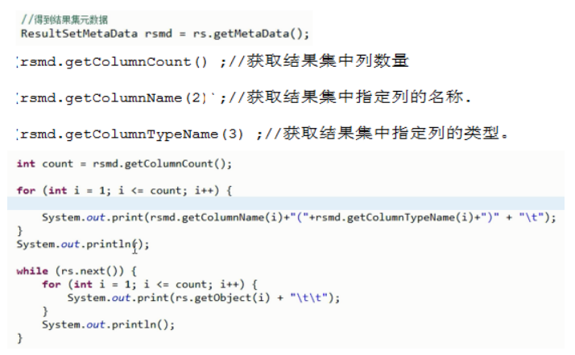

# 1 **元数据**

## 1.1 **概念**

  

## 1.2 **DataBaseMetaData接口**

数据库元数据

### 1.2.1 **获取**

 

### 1.2.2 **方法**

#### 1.2.2.1 **数据库连接的基本参数**

 

 

#### 1.2.2.2 **数据库、表、列、主键、外键 定义信息** 

getTables

getColumns

getPrimaryKeys

  

 

## 1.3 **ParameterMetaData接口**

​	参数元数据：参数元数据主要用于获取:sql语句中占位符的相关信息.

### 1.3.1 **获取**

​		PreparedStatement . getParameterMetaData()  获得代表PreparedStatement元数据的ParameterMetaData对象。 

Select * from user where name=? And password=?

 

### 1.3.2 **方法**

   

## 1.4 **ResultSetMetaData**

​	结果集元数据

### 1.4.1 **获取**

可以通过ResultSet的getMetaData()方法获取.

 

### 1.4.2 **方法**

 

 