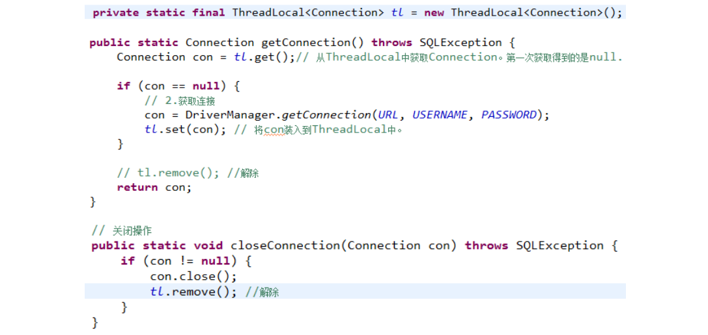

 

# 1 **Druid连接池**

## 1.1 demo

### 1.1.1 **Jar**

 

 

### 1.2.1 **读取**

看文件：JDBC_Oracle3#com.prosay.utils.DruidUtils

 

 

## 1.2 连接池中Connection关闭

 <https://blog.csdn.net/zl5230/article/details/105259264>

​	注意：连接池中获得的Connection是DruidPooledConnection实现类，调用的close()方法不是关闭资源，而是将资源放回池中！

 

# 2 读取配置文件

## 2.1 **jdbc.properties**

```properties
jdbc.driver=com.mysql.jdbc.Driver
jdbc.url=jdbc:mysql://127.0.0.1:3306/crawler?useUnicode=true&characterEncoding=utf8
jdbc.user=root
jdbc.password=root
```

## 2.2 方式1:直接去资源文件下扫描

看文件com.jdbcmysql.JdbcUtils

```java
static {
        /**
         * ResourceBundle rsb = ResourceBundle.getBundle("db.properties"); 等价
         * ResourceBundle rsb = ResourceBundle.getBundle("db");
         */
        DRIVERCLASS = ResourceBundle.getBundle("jdbc").getString("driverClass");
        URL = ResourceBundle.getBundle("jdbc").getString("url");
        USERNAME = ResourceBundle.getBundle("jdbc").getString("username");
        PASSWORD = ResourceBundle.getBundle("jdbc").getString("password");
    }
```

## 2.3 方式2:输入流扫描

看文件com.jdbcmysql.JdbcUtils2

```java
 static {
        /**
         * 输入流
         */
        InputStream in = JdbcUtils2.class.getClassLoader().getResourceAsStream("jdbc.properties");
        Properties properties = new Properties();

        try {
            //将输入流加载到配置文件的
            properties.load(in);
        } catch (IOException e) {
            System.out.println("jdbc.properties加载失败");
            e.printStackTrace();
        }

        //读取配置文件参数
        driver = properties.getProperty("driverClass");
        url = properties.getProperty("url");
        user = properties.getProperty("username");
        password = properties.getProperty("password");

    }
```


# 3 **绑定ThreadLocal—线程池**

## 3.1 **ThreadLocal类**

### 3.1.1 **构造方法**

```
ThreadLocal() 创建一个线程本地变量
```

### 3.1.2 **常用方法**

```
T get()			返回当前线程副本的值
protected I initialValue()	返回当前线程"初始值"
void remove()	移除当前线程
void set(T value)	将当前线程的副本中的值设置为指定值 
```

 

### 3.1.3 **MyThreadLocal<T>**

```java
public class MyThreadLocal<T> {

	private Map<Thread, T> map;

	private MyThreadLocal() {
		map = new HashMap<Thread, T>();
	}

	public void set(T t) {
		map.put(Thread.currentThread(), t);
	}
 
	public T get() {
		return map.get(Thread.currentThread());
	}
}
```

 

## 3.2 **关于Jdbc中使用ThreadLocal**



 

## 3.3 **Druid连接池，线程事务**

 com.prosay.utils.DruidUtils

```java
public class DruidUtils {

	// 无参构造方法会去获取c3p0-config.xml配置文件中的默认配置信息default-config
	//static DataSource ds = new ComboPooledDataSource();
	// 获取配置文件中named-config name="oracle11gorcl"对应的配置
	static DruidDataSourceFactory f = new DruidDataSourceFactory();
	static DataSource ds = null;
	static{
		Properties properties = new Properties();
		try {
			properties.load(DruidUtils.class.getClassLoader().getResourceAsStream("db.properties"));
			properties.setProperty("driverClassName", properties.getProperty("jdbc.driver"));
			properties.setProperty("url", properties.getProperty("jdbc.url"));
			properties.setProperty("username", properties.getProperty("jdbc.user"));
			properties.setProperty("password", properties.getProperty("jdbc.password"));
			ds = f.createDataSource(properties);	// 由此倒推
		} catch (Exception e) {
			e.printStackTrace();
		}
	}
	public static Connection getConnection(){
		try {
			return ds.getConnection();
		} catch (SQLException e) {
			return null;
		}
	}

	public static void closeConnection(){

	}

	public static void main(String[] args) {
		for (int i = 0; i < 4; i++) {
			System.out.println(DruidUtils.getConnection());
		}
	}
}
```

 

 

 

 

 

 

 

 

 

 

 