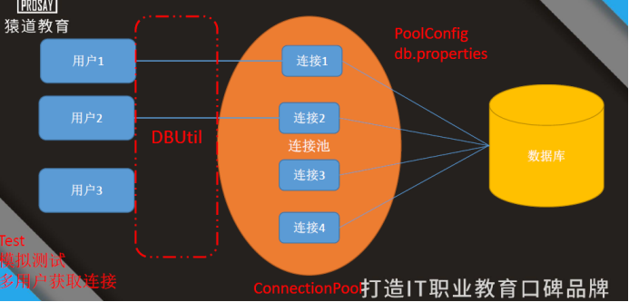
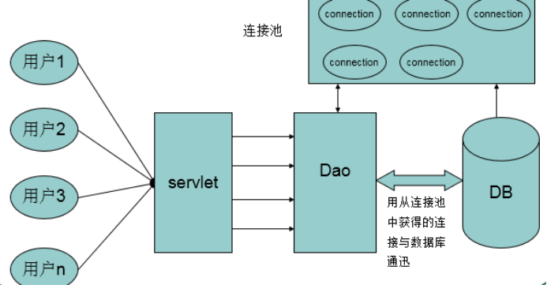

# 1 **数据库连接池**

## 1.1 **连接池介绍**

连接池:

​	就是创建一个容器，用于装入多个Connection对象，在使用连接对象时，从容器中获取一个Connection，使用完成后，在将这个Connection重新装入到容器中。这个容器就是连接池。(DataSource) 也叫做数据源.   

​	我们可以通过连接池获取连接对象.-- Connection

对于conn.close() 不再是关闭连接，而是将Connection对象重新装入到连接池.

 

 

## 1.2 **图解**

 

 

 

## 1.3 **优点:**

​	1.节省创建连接与释放连接 性能消耗 

​	2.连接池中连接起到复用的作用 ，提高程序性能	

 