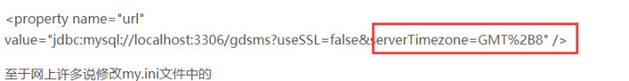

# 1 **Mysql8.0**

## 1.1 **数据库5.7-驱动8.0**

### 

```xml
驱动8.0
<jdbc.mysql.version>8.0.11</jdbc.mysql.version>

<dependency>
   <groupId>mysql</groupId>
   <artifactId>mysql-connector-java</artifactId>
   <version>${jdbc.mysql.version}</version>
   <scope>compile</scope>
</dependency>

 Jpa方言
driver-class-name: com.mysql.jdbc.Driver

mysql版本
5.7.17-log
```


## 1.2 **数据库8.0-驱动8.0**

```
驱动8.0

 Jpa方言
driver-class-name: com.mysql.cj.jdbc.Driver

mysql版本
8.0.16
```

 

# 2 **参数说明**

## 2.1 **参数**

### 2.1.1 **useSSL**

 

 

### 2.1.2 **serverTimezone**

 

## 2.2 **问题**

### 2.2.1 **java与MySQL之间总差8个小时的问题**

https://blog.csdn.net/as849167276/article/details/88198175



 

 

 

 

 