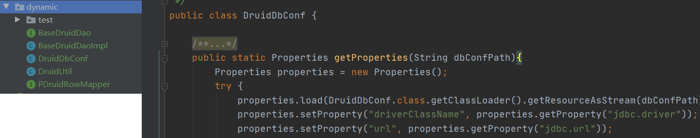
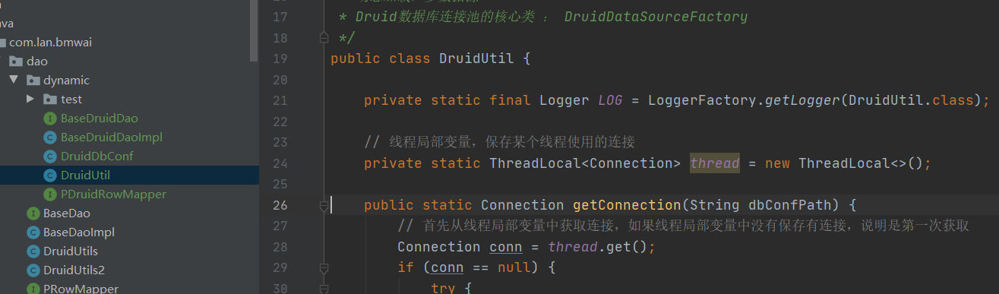
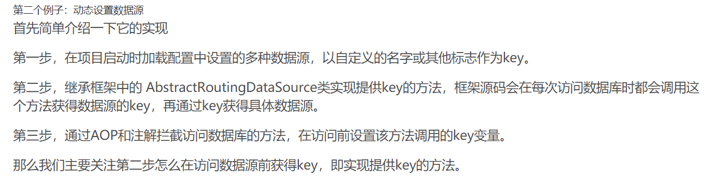

参看代码: lan_bmwai: com.lan.bmwai.dao.dynamic

<https://blog.csdn.net/qq_36632687/article/details/79551828>

# 1 ThreadLocal

## 1.1 概述

配置文件参数获取，在连接是传入配置文件路径



多数据源控制保证Connection唯一



## 1.2 保证同一个连接

​	通过ThreadLocal设置该线程中访问数据源的key，起到很好的保护对象的作用。总结一下，个人认为使用ThreadLocal的场景最好满足两个条件，一是该对象不需要在多线程之间共享；二是该对象需要在线程内被传递。

## 1.3 baseDao单列模式

```
BaseDruidDao baseDruidDao = BaseDruidDaoImpl.getInstance();
```


## 1.4 问题

### 1.4.1 connection holder is null

<https://blog.csdn.net/xiaomin1991222/article/details/50981955>

```java
properties.setProperty("removeAbandoned", "true");
properties.setProperty("removeAbandonedTimeout", "1800");
```


# 2 SpringBoot 集成

<https://blog.csdn.net/qq_36632687/article/details/79551828>

