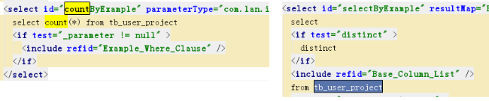

目前都是用mybatis-plus 插件的分页，了解即可，官网：https://pagehelper.github.io/docs/howtouse/


# 1 **PageHelper**

​	就是写一个查询的sql语句，封装进去后就自动调用，底层是2条sql语句，一句你要查询的列，一句统计总行数，这是逆向工程的东西

 

## 1.1 **分页插件**

你也在用Mybatis，建议尝试该分页插件，这个一定是最方便使用的分页插件。

该插件目前支持Oracle,Mysql,MariaDB,SQLite,Hsqldb,PostgreSQL六种数据库分页。

 

 

## 1.2 **使用方法**

### 1.2.1 Pom

把PageHelper依赖的jar包添加到工程中。

```xml
<dependency>
  <groupId>com.github.pagehelper</groupId>
  <artifactId>pagehelper</artifactId>
  <version>${pagehelper.version}</version>
</dependency>
```


### 1.2.2 **SqlMapConfig**

在Mybatis配置xml中配置拦截器插件:

```xml-dtd
<plugins>
    <!-- com.github.pagehelper为PageHelper类所在包名 -->
    <plugin interceptor="com.github.pagehelper.PageHelper">
        <!-- 设置数据库类型 Oracle,Mysql,MariaDB,SQLite,Hsqldb,PostgreSQL六种数据库-->        
        <property name="dialect" value="mysql"/>
    </plugin>
</plugins>
```


### 1.2.3 **java中常用方法**

在代码中使用

```java
1、设置分页信息：
    //获取第1页，10条内容，默认查询总数count
    PageHelper.startPage(1, 10);
    //紧跟着的第一个select方法会被分页
List<Country> list = countryMapper.selectIf(1);

2、取分页信息
//分页后，实际返回的结果list类型是Page<E>，如果想取出分页信息，需要强制转换为Page<E>，
Page<Country> listCountry = (Page<Country>)list;
listCountry.getTotal();

3、取分页信息的第二种方法
//获取第1页，10条内容，默认查询总数count
PageHelper.startPage(1, 10);
List<Country> list = countryMapper.selectAll();

//用PageInfo对结果进行包装
PageInfo page = new PageInfo(list);

//测试PageInfo全部属性

//PageInfo包含了非常全面的分页属性
assertEquals(1, page.getPageNum());
assertEquals(10, page.getPageSize());
assertEquals(1, page.getStartRow());
assertEquals(10, page.getEndRow());
assertEquals(183, page.getTotal());
assertEquals(19, page.getPages());
assertEquals(1, page.getFirstPage());
assertEquals(8, page.getLastPage());
assertEquals(true, page.isFirstPage());
assertEquals(false, page.isLastPage());
assertEquals(false, page.isHasPreviousPage());
assertEquals(true, page.isHasNextPage());
```

 

 

## 1.3 常用类

### 1.3.1**PageHelper**

####  **startPage**

```java
PageHelper.startPage(operationLogRequest.getPageCurrent(), operationLogRequest.getPageSize()); 
```


### 1.3.2 **PageInfo**

#### **构造方法**

```java
PageInfo<OperationLog> operationLogPageInfo = new PageInfo<>(operationLogList);
```

 