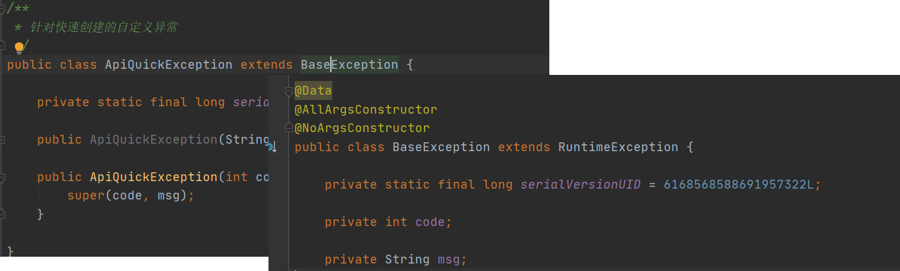

参看：<https://blog.csdn.net/hbtj_1216/article/details/81102063>

# 1. **统一异常处理**

## 1.1 **概念**

​	springmvc在处理请求过程中出现异常信息交由异常处理器进行处理，自定义异常处理器可以实现一个系统的异常处理逻辑。

​	一般项目中都需要作异常处理，基于系统架构的设计考虑，使用统一的异常处理方法。


## 1.2 **异常处理思路**

​	系统中异常包括两类：预期异常和运行时异常RuntimeException，

前者通过捕获异常从而获取异常信息，在代码手动处理异常可以try/catch捕获，可以向上抛出。后者主要通过规范代码开发、测试通过手段减少运行时异常的发生。

​	系统的dao、service、controller出现都通过throws Exception向上抛出，最后**由springmvc前端控制器交由异常处理器**进行异常处理，如下图：


## 1.3 自定义异常（统一异常处理解决方案）


### 1.3.1 **自定义异常类**

​	为了区别不同的异常,通常根据异常类型进行区分，这里我们创建一个自定义系统异常。

​	系统自定义的异常类是ApiQuickException ，在controller方法中、service方法中手动抛出此类异常。针对系统自定义的ApiQuickException 异常，就可以直接从异常类中获取异常信息，将异常处理在错误页面展示。针对非ApiQuickException 异常，对这类重新构造成一个ApiQuickException ，异常信息为“未知错误”，此类错误需要在系统测试阶段去排除。

​	如果controller、service、dao抛出此类异常说明是系统预期处理的异常信息。



### 1.3.2 **自定义异常处理器**

​	前端控制器DispatcherServlet在进行HandlerMapping、调用HandlerAdapter执行Handler过程中，如果遇到异常，进行异常处理。


或者

```java
@Slf4j
@RestControllerAdvice
public class ControllerExceptionHanler {
    
     /**
     * 捕获所有系统异常  包括系统的404,403等
     * @param
     * @return
     */
    @ExceptionHandler(Exception.class)
    @ResponseStatus(HttpStatus.BAD_REQUEST)
    @ResponseBody
    public Map<String, String> exceptionHandler(Exception e) {
        
        // 参数校验异常看下一个
        
    /**
     * 业务异常
     **/ 
    @ExceptionHandler(ApiQuickException.class)
    @ResponseStatus(HttpStatus.BAD_REQUEST)
    @ResponseBody
    public Map<String, Object> apiQuickExceptionHandler(ApiQuickException e) {    
```


### 1.3.3 全局异常信息（枚举）

