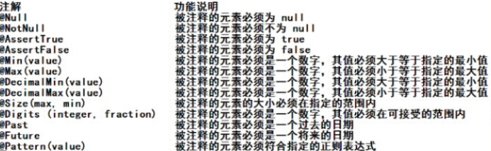
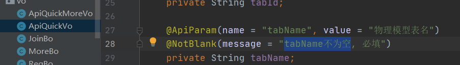
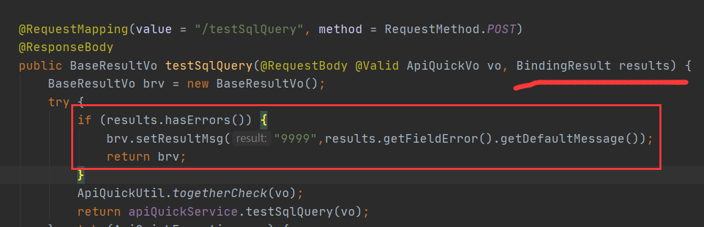
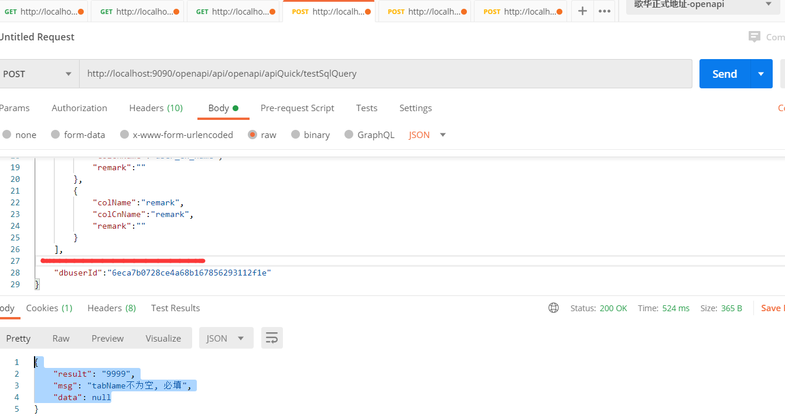
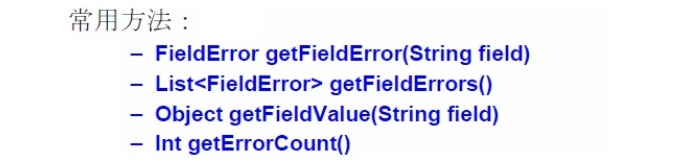
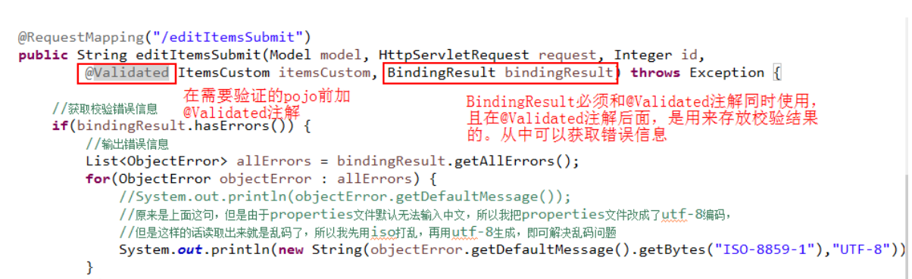
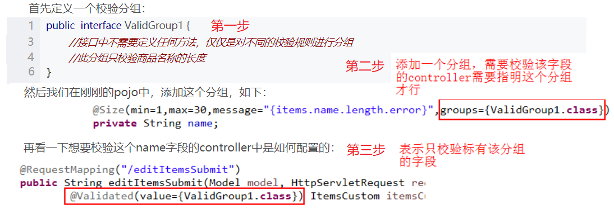
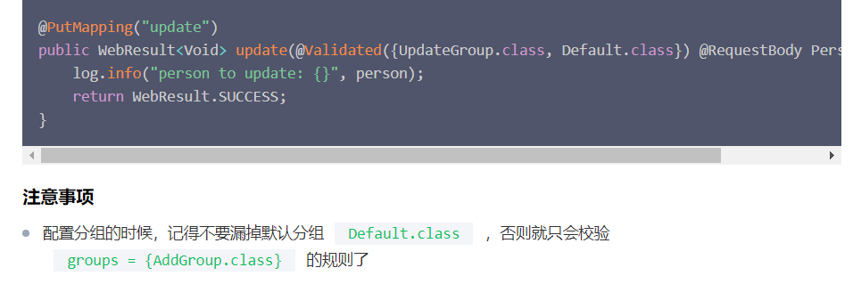

 

参看链接：<https://blog.csdn.net/eson_15/article/details/51725470>

# 1 数据检验**

## **1.1 JSR 303**

​	**JSR 303** 是 Java 为 Bean 数据合法性校验提供的标准框架，它已经包含在 JavaEE 6.0 中 .

​	JSR 303 通过在 **Bean** 属性上标注类似于 @NotNull、@Max等标准的注解指定校验规则，并通过标准的验证接口对 Bean 进行验证

 

## **1.2 Hibernate Validator **

### 1.2.1 概述

​	Hibernate Validator是Hibernate提供的一个开源框架，使用注解方式非常方便的实现服务端的数据校验。

官网：<http://hibernate.org/validator/>

**hibernate Validator** 是 Bean Validation 的参考实现 。

Hibernate Validator 提供了 JSR 303 规范中所有内置 constraint（约束） 的实现，除此之外还有一些附加的 constraint。

在日常开发中，Hibernate Validator经常用来验证bean的字段，基于注解，方便快捷高效。


### 1.2.2 Bean校验的注解

常用注解如下：

| **Constraint**                                   | **详细信息**                                                 |
| ------------------------------------------------ | ------------------------------------------------------------ |
| **@Valid**                                       | 被注释的元素是一个对象，需要检查此对象的所有字段值           |
| **@Null**                                        | 被注释的元素必须为 null                                      |
| **@NotNull**                                     | 被注释的元素必须不为 null                                    |
| **@AssertTrue**                                  | 被注释的元素必须为 true                                      |
| **@AssertFalse**                                 | 被注释的元素必须为 false                                     |
| **@Min(value)**                                  | 被注释的元素必须是一个数字，其值必须大于等于指定的最小值     |
| **@Max(value)**                                  | 被注释的元素必须是一个数字，其值必须小于等于指定的最大值     |
| **@DecimalMin(value)**                           | 被注释的元素必须是一个数字，其值必须大于等于指定的最小值     |
| **@DecimalMax(value)**                           | 被注释的元素必须是一个数字，其值必须小于等于指定的最大值     |
| **@Size(max, min)**                              | 被注释的元素的大小必须在指定的范围内                         |
| **@Digits (integer, fraction)**                  | 被注释的元素必须是一个数字，其值必须在可接受的范围内         |
| **@Past**                                        | 被注释的元素必须是一个过去的日期                             |
| **@Future**                                      | 被注释的元素必须是一个将来的日期                             |
| **@Pattern(value)**                              | 被注释的元素必须符合指定的正则表达式                         |
| **@Email**                                       | 被注释的元素必须是电子邮箱地址                               |
| **@Length**                                      | 被注释的字符串的大小必须在指定的范围内                       |
| **@NotEmpty**                                    | 被注释的字符串的必须非空                                     |
| **@Range**                                       | 被注释的元素必须在合适的范围内                               |
| **@NotBlank**                                    | 被注释的字符串的必须非空                                     |
| **@URL(protocol=,host=, port=,regexp=, flags=)** | 被注释的字符串必须是一个有效的url                            |
| **@CreditCardNumber**                            | 被注释的字符串必须通过Luhn校验算法，银行卡，信用卡等号码一般都用Luhn计算合法性 |

### 1.2.3 使用

#### **1.2.3.1 给po,vo添加校验**

​	对象的部分属性上添加注解：



 

#### 1.2.3.2 在controller上@Valid

在controller中改造register方法，只需要给User添加 @Valid注解即可。




#### **1.2.3.3 测试**

我们故意填错：

 

### 1.2.4 **捕获校验错误信息**

​	在需要校验的pojo前边添加@Validated，在需要校验的pojo后边添加BindingResult bindingResult来接收校验出错信息。值得注意的是：@Validated和BindingResult bindingResult是配对出现，并且形参顺序是固定的（一前一后）。这样就可以顺利接收到错误信息了。





### **1.2.5 分组校验**@Validated

#### 分组group

​	一个controller不需要去校验生产日期，只要校验一下商品名称即可，另一个controller两个都要校验，这样就没法做了，因为两个controller都使用同一个pojo。
　　为了解决这个问题，我们可以定义多个校验分组（其实是一个java接口），分组中定义有哪些规则，每个controller方法使用不同的校验分组即可



```
分别POST请求：(数据接口上有)
http://localhost:8080/api/openapi/apiQuick/testSqlQuery
http://localhost:8080/api/openapi/apiQuick/saveSqlQuery （"msg": "apiCode 不为空, 必填",）

{"authType":"授权","requestUrl":"testApiFast","remark":"testApiFast","reqs":[{"tabId":"a9711c3ce6809a5809e50fbc34f6fc5c","colName":"user_name","colCon":"=","colDefaultVal":"sys"}],"tabId":"a9711c3ce6809a5809e50fbc34f6fc5c", "tabName": "fw_user", "dbuserId": "1"}
```

#### 默认分组Default.class

<https://cloud.tencent.com/developer/article/1426233>



可以这样规避

```java
public interface Create extends Default {
}
```


## 1.3 常见校验

```java
@Length(max = 20, message = "用户名不能超过20个字符")
@Pattern(regexp = "^[\\u4E00-\\u9FA5A-Za-z0-9\\*]*$", message = "用户昵称限制：最多20字符，包含文字、字母和数字")
   
/** 手机号*/
@NotBlank(message = "手机号不能为空")
@Pattern(regexp = "^[1][3,4,5,6,7,8,9][0-9]{9}$", message = "手机号格式有误")

@NotBlank(message = "联系邮箱不能为空")
@Email(message = "邮箱格式不对")

/*** 创建时间 */
@Future(message = "时间必须是将来时间")
```

## 1.4 自定义参数注解

https://juejin.cn/post/6940114159493185566#heading-11

### 1.4.1 比如我们来个 自定义身份证校验 注解

```java
@Documented
@Target({ElementType.PARAMETER, ElementType.FIELD})
@Retention(RetentionPolicy.RUNTIME)
@Constraint(validatedBy = IdentityCardNumberValidator.class)
public @interface IdentityCardNumber {

    String message() default "身份证号码不合法";

    Class<?>[] groups() default {};

    Class<? extends Payload>[] payload() default {};
}
```

这个注解是作用在 Field 字段上，运行时生效，触发的是 IdentityCardNumber 这个验证类。

- message 定制化的提示信息，主要是从 ValidationMessages.properties 里提取，也可以依据实际情况进行定制
- groups 这里主要进行将 validator 进行分类，不同的类 group 中会执行不同的 validator 操作
- payload 主要是针对 bean 的，使用不多。

### 1.4.2  然后自定义 Validator

这个是真正进行验证的逻辑代码：

```java
public class IdentityCardNumberValidator implements ConstraintValidator<IdentityCardNumber, Object> {

    @Override
    public void initialize(IdentityCardNumber identityCardNumber) {
    }

    @Override
    public boolean isValid(Object o, ConstraintValidatorContext constraintValidatorContext) {
        return IdCardValidatorUtils.isValidate18Idcard(o.toString());
    }
}
```

IdCardValidatorUtils 在项目源码中, 可自行查看

### 1.4.3 使用自定义的注解

```java
    @NotBlank(message = "身份证号不能为空")
    @IdentityCardNumber(message = "身份证信息有误,请核对后提交")
    private String clientCardNo;
```

### 1.4.4 使用 groups 的校验

再在需要校验的地方 @Validated 声明校验组

```java
 /**
     * 走参数校验注解的 groups 组合校验
     *
     * @param userDTO
     * @return
     */
    @PostMapping("/update/groups")
    public RspDTO update(@RequestBody @Validated(Update.class) UserDTO userDTO) {
        userService.updateById(userDTO);
        return RspDTO.success();
    }
```


# 2 全局异常拦截

## 2.1 ControllerExceptionHanler

```java
@Slf4j
@RestControllerAdvice
public class ControllerExceptionHanler {
```

##  2.2 拦截异常

```java
/**
 * 1.参数校验异常捕获  @Validated
 */
@ExceptionHandler({MethodArgumentNotValidException.class})
public R MethodArgumentNotValidExceptionHandler(MethodArgumentNotValidException e) {
    // 从异常对象中拿到ObjectError对象
    ObjectError objectError = e.getBindingResult().getAllErrors().get(0);
    // 然后提取错误提示信息进行返回
    return R.fail(objectError.getDefaultMessage());
}

/**
 * 2.参数校验异常捕获  @Valid
 */
@ExceptionHandler({BindException.class })
public R BindExceptionHandler(BindException e) {
    // 从异常对象中拿到ObjectError对象
    ObjectError objectError = e.getBindingResult().getAllErrors().get(0);
    // 然后提取错误提示信息进行返回
    return R.fail(objectError.getDefaultMessage());
}

    /**
      * ValidationException
    */
    @ExceptionHandler(ValidationException.class)
    public R handleValidationException(ValidationException e) {
        log.error(e.getMessage(), e);
        return R.fail(e.getCause().getMessage());
    }

    /**
      * ConstraintViolationException
      */
    @ExceptionHandler(ConstraintViolationException.class)
    public R handleConstraintViolationException(ConstraintViolationException e) {
        log.error(e.getMessage(), e);
        return R.fail(e.getMessage());
    }

    
    @ExceptionHandler(NoHandlerFoundException.class)
    public R handlerNoFoundException(Exception e) {
        log.error(e.getMessage(), e);
        return R.fail("路径不存在，请检查路径是否正确");
    }
    
    @ExceptionHandler(DuplicateKeyException.class)
    public R handleDuplicateKeyException(DuplicateKeyException e) {
        log.error(e.getMessage(), e);
        return R.fail("数据重复，请检查后提交");
    }
```

 

 

 

 

 

 