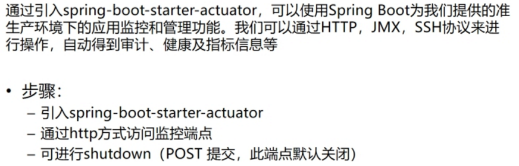
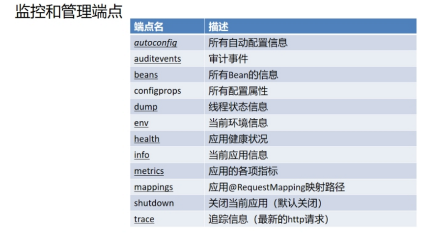
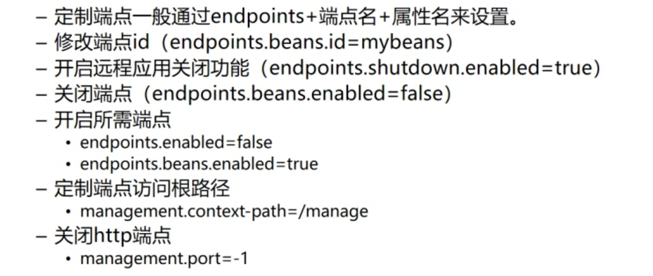

# 监控管理

## 友好关闭

  

## 脚本优化停止

[SpringBoot 项目在 Windows 系统启动脚本、关闭脚本_m0_37822338的博客-CSDN博客](https://blog.csdn.net/m0_37822338/article/details/104304302) 

[Springboot 优雅停止服务的几种方法 - 黄青石 - 博客园 (cnblogs.com)](https://www.cnblogs.com/huangqingshi/p/11370291.html)

 

#  定制端点

 

 

 

 

 

 

 

 

