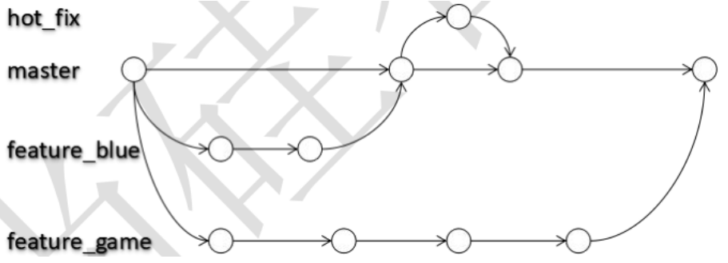
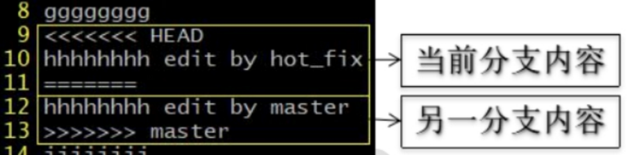
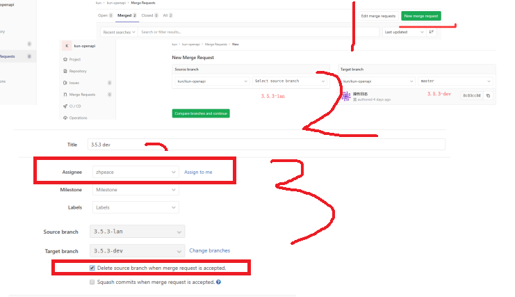
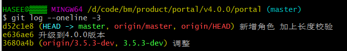
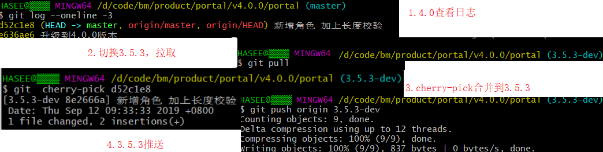

[TOC]


# 3. **分支管理**

## 3.1 **什么是分支？**

在版本控制过程中，使用多条线同时推进多个任务。



 

**分支的好处？**

​	同时并行推进多个功能开发，提高开发效率,各个分支在开发过程中，如果某一个分支开发失败，不会对其他分支有任何影响。失败的分支删除重新开始即可。

## 3.2. 解决冲突

 **冲突的表现**




**冲突的解决**

```
 第一步：编辑文件，删除特殊符号
 第二步：把文件修改到满意的程度，保存退出
 第三步：git add [文件名]
 第四步：git commit -m "日志信息"，注意：此时 commit 一定不能带具体文件名
```

 

## 3.3 **分支操作**

```shell
创建分支：git branch [分支名]
	git branch -a//查看所有分支

查看分支：git branch -v

切换分支：git checkout [分支名]
	git checkout xiangtan//切换分支

合并分支：
	第一步：切换到接受修改的分支（被合并，增加新内容）上，git checkout [被合并分支名]
	第二步：执行 merge 命令，git merge [有新内容分支名] 
```

## 3.4. **代码申请审核**

https://blog.csdn.net/liuchunming033/article/details/87195568

### 3.4.1. **第一步 本地分支并推送**

新建本地分支提交，推送，如果推送不起，使用小乌龟推送 

 

### 3.4.2. **第二部 浏览器**申请合并

将自己分支申请合并到需要的分支

 

## 3.5 **分支合并cherry-pick**

4.0.0 提交



切换3.5.3 拉取，提交，推送




## 

 