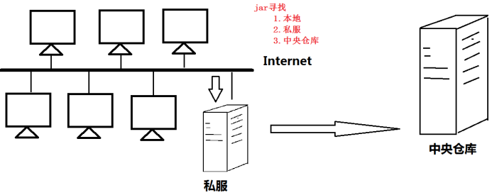

# 1 **Maven仓库管理**

## 1.1 **什么是Maven仓库？**

​	用来统一存储所有Maven共享构建的位置就是仓库。根据Maven坐标定义每个构建在仓库中唯一存储路径大致为：groupId/artifactId/version/artifactId-version.packaging



## 1.2 **仓库的分类**

1、本地仓库

~/.m2/repository 每个用户只有一个本地仓库

2、远程仓库

```
中央仓库：Maven默认的远程仓库，不包含版权资源  http://repo1.maven.org/maven2
私服：是一种特殊的远程仓库，它是架设在局域网内的仓库
```


# **2 中央仓库**

## 2.1 **阿里云仓库** 

```xml
<!-- 阿里云仓库 -->
    <mirror>  
		<id>nexus-aliyun</id>  
		<mirrorOf>central</mirrorOf>    
		<name>Nexus aliyun</name>  
		<url>http://maven.aliyun.com/nexus/content/groups/public</url>  
	</mirror>
```

 

## 2.2 **私服和阿里云搭配**

http://www.manongjc.com/detail/8-argxgrzgisoomqw.html

### 2.2.1 **Pom文件使用**

https://www.cnblogs.com/cralor/p/9092971.html

```xml
<repository>
            <id>alimaven</id>
            <name>Maven Aliyun Mirror</name>
            <url>http://maven.aliyun.com/nexus/content/repositories/central/</url>
            <releases>
                <enabled>true</enabled>
            </releases>
            <snapshots>
                <enabled>false</enabled>
            </snapshots>	
        </repository>
```

# 3 本地仓库

适用在没有外网的环境，比如公安内网，仓库里包只能自己更新，并且设置idea 离线模式

<https://blog.csdn.net/xqnode/article/details/88091986>

