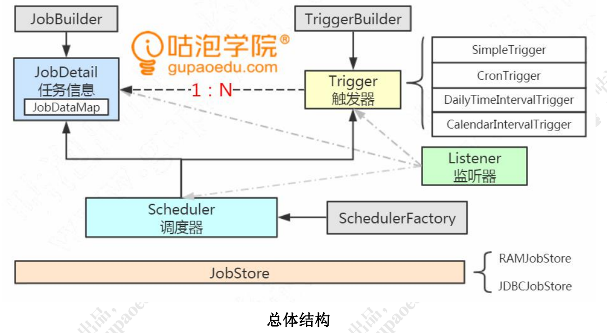
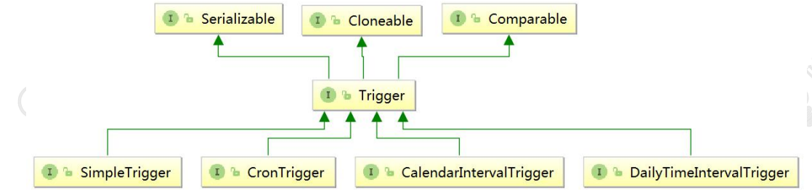
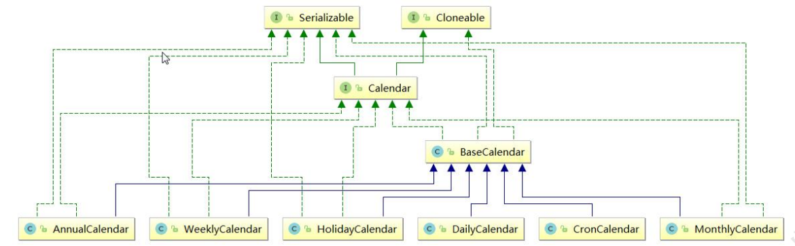
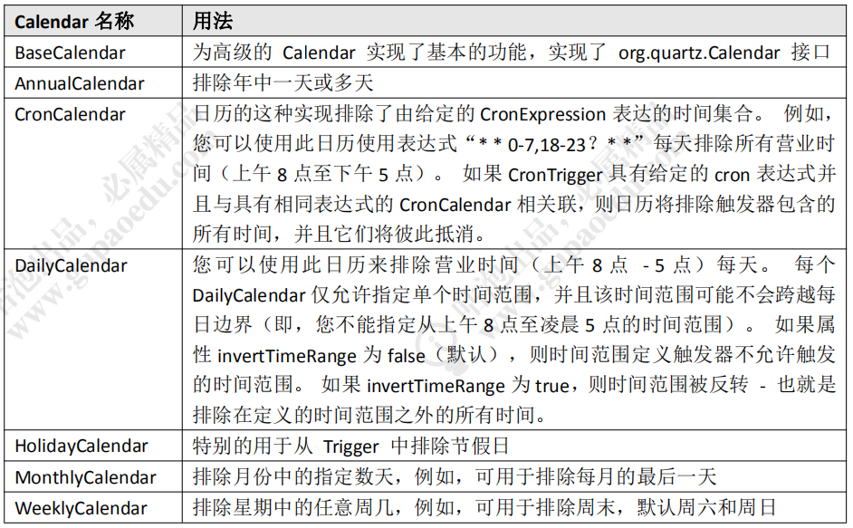
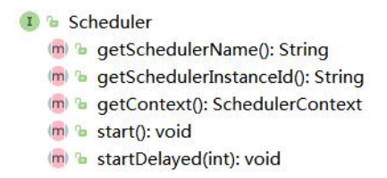
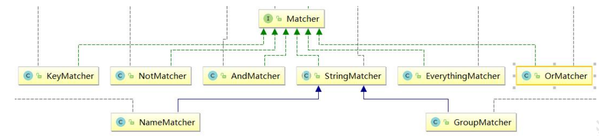
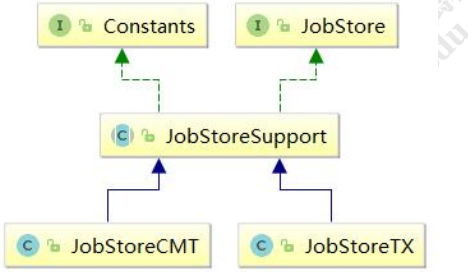

# 3 Quartz Java 编程 

http://www.quartz-scheduler.org/documentation/quartz-2.3.0/ 

http://www.quartz-scheduler.org/documentation/quartz-2.3.0/quick-start.html 

## 3.1 引入依赖 

```xml
<dependency> 
	<groupId>org.quartz-scheduler</groupId> 
	<artifactId>quartz</artifactId> 
	<version>2.3.0</version> 
</dependency> 
```

## 3.2 默认配置文件 

​	org.quartz.core 包下，有一个默认的配置文件，quartz.properties。当我们没有定义一个同名的配置文件的时候，就会使用默认配置文件里面的配置。 

```properties
org.quartz.scheduler.instanceName: DefaultQuartzScheduler 
org.quartz.scheduler.rmi.export: false 
org.quartz.scheduler.rmi.proxy: false 
org.quartz.scheduler.wrapJobExecutionInUserTransaction: false 
org.quartz.threadPool.class: org.quartz.simpl.SimpleThreadPool 
org.quartz.threadPool.threadCount: 10 
org.quartz.threadPool.threadPriority: 5 
org.quartz.threadPool.threadsInheritContextClassLoaderOfInitializingThread: true 
org.quartz.jobStore.misfireThreshold: 60000 
org.quartz.jobStore.class: org.quartz.simpl.RAMJobStore
```

代码示例：com.gupaoedu.scheduler.MyScheduler

## 3.3 创建 Job 

实现唯一的方法 execute()，方法中的代码就是任务执行的内容。此处仅输出字符串。

```java
public class MyJob1 implements Job { 
    public void execute(JobExecutionContext context) throws JobExecutionException { 
        System.out.println("假发在哪里买的"); 
    } 
}
```

在测试类 main()方法中，把 Job 进一步包装成 JobDetail。 

必须要指定 JobName 和 groupName，两个合起来是唯一标识符。 

可以携带 KV 的数据（JobDataMap），用于扩展属性，在运行的时候可以从 context 获取到。 

```java
JobDetail jobDetail = JobBuilder.newJob(MyJob1.class) 
    .withIdentity("job1", "group1") 
    .usingJobData("gupao","2673") 
    .usingJobData("moon",5.21F) 
    .build();
```

## 3.4 创建 Trigger 

​	在测试类 main()方法中，基于 SimpleTrigger 定义了一个每 2 秒钟运行一次、不断重复的 Trigger：

```java
Trigger trigger = TriggerBuilder.newTrigger() 
	.withIdentity("trigger1", "group1") 
	.startNow() 
	.withSchedule(SimpleScheduleBuilder.simpleSchedule() 
	.withIntervalInSeconds(2) 
	.repeatForever()) 
	.build();
```

## 3.5 创建 Scheduler 

​	在测试类 main()方法中，通过 Factory 获取调度器的实例，把 JobDetail 和 Trigger 绑定，注册到容器中。 

Scheduler 先启动后启动无所谓，只要有 Trigger 到达触发条件，就会执行任务。

```java
SchedulerFactory factory = new StdSchedulerFactory(); 
Scheduler scheduler = factory.getScheduler(); 
scheduler.scheduleJob(jobDetail, trigger); 
scheduler.start();
```

​	注意这里，调度器一定是单例的

## 3.6 体系结构总结



### 3.6.1 JobDetail 

​	我们创建一个实现 Job 接口的类，使用 JobBuilder 包装成 JobDetail，它可以携带 KV 的数据。 

### 3.6.2 Trigger 

​	定义任务的触发规律，Trigger，使用 TriggerBuilder 来构建。 JobDetail 跟 Trigger 是 1:N 的关系。 

思考：为什么要解耦？ 

Trigger 接口在 Quartz 有 4 个继承的子接口： 

| 子接口                   | 描述                     | 特点                                                         |
| ------------------------ | ------------------------ | ------------------------------------------------------------ |
| SimpleTrigger            | 简单触发器               | 固定时刻或时间间隔，毫秒                                     |
| CalendarIntervalTrigger  | 基于日历的触发器         | 比简单触发器更多时间单位，<br />支持非固定时间的触发，例如<br />一年可能 365/366，一个月可能 28/29/30/31 |
| DailyTimeIntervalTrigger | 基于日期的触发器         | 每天的某个时间段                                             |
| CronTrigger              | 基于 Cron 表达式的触发器 |                                                              |

MutableTrigger 和 CoreTrigger 最终也是用到以上四个类的实现类



代码：standalone com.gupaoedu.trigger.TriggerDefine 

#### SimpleTrigger 

SimpleTrigger 可以定义固定时刻或者固定时间间隔的调度规则（精确到毫秒）。 

例如：每天 9 点钟运行；每隔 30 分钟运行一次

#### CalendarIntervalTrigger 

CalendarIntervalTrigger 可以定义更多时间单位的调度需求，精确到秒。 

好处是不需要去计算时间间隔，比如 1 个小时等于多少毫秒。 

例如每年、每个月、每周、每天、每小时、每分钟、每秒。 

每年的月数和每个月的天数不是固定的，这种情况也适用。 

#### DailyTimeIntervalTrigger 

每天的某个时间段内，以一定的时间间隔执行任务。 

例如：每天早上 9 点到晚上 9 点，每隔半个小时执行一次，并且只在周一到周六执行

#### CronTrigger 

CronTirgger 可以定义基于 Cron 表达式的调度规则，是最常用的触发器类型。 

Cron 表达式

| 位置 | 时间域       |         | 特殊值          |
| ---- | ------------ | ------- | --------------- |
| 1    | 秒           | 0-59    | , - * /         |
| 2    | 分钟         | 0-59    | , - * /         |
| 3    | 小时         | 0-23    | , - * /         |
| 4    | 日期         | 1月31日 | , - * ? / L W C |
| 5    | 月份         | 1月12日 | , - * /         |
| 6    | 星期         | 1月7日  | , - * ? / L W C |
| 7    | 年份（可选） | 1月31日 | , - * /         |

​	星号(*)：可用在所有字段中，表示对应时间域的每一个时刻，例如，在分钟字段时，表示“每分钟”； 

​	问号（?）：该字符只在日期和星期字段中使用，它通常指定为“无意义的值”，相当于点位符； 

​	减号(-)：表达一个范围，如在小时字段中使用“10-12”，则表示从 10 到 12 点，即 10,11,12； 

​	逗号(,)：表达一个列表值，如在星期字段中使用“MON,WED,FRI”，则表示星期一，星期三和星期五； 

​	斜杠(/)：x/y 表达一个等步长序列，x 为起始值，y 为增量步长值。如在分钟字段中使用 0/15，则表示为 0,15,30 和 45 秒，而 5/15 在分钟字段中表示 5,20,35,50，你也可以使用*/y，它等同于 0/y； 


​	L：该字符只在日期和星期字段中使用，代表“Last”的意思，但它在两个字段中意思不同。L 在日期字段中，表示这个月份的最后一天，如一月的 31 号，非闰年二月的 28 号；如果 L 用在星期中，则表示星期六，等同于 7。但是，如果 L 出现在星期字段里，而且在前面有一个数值 X，则表示“这个月的最后 X 天”，例如，6L 表示该月的最后星期五； 

​	W：该字符只能出现在日期字段里，是对前导日期的修饰，表示离该日期最近的工作日。例如 15W 表示离该月 15号最近的工作日，如果该月 15 号是星期六，则匹配 14 号星期五；如果 15 日是星期日，则匹配 16 号星期一；如果 15号是星期二，那结果就是 15 号星期二。但必须注意关联的匹配日期不能够跨月，如你指定 1W，如果 1 号是星期六，结果匹配的是 3 号星期一，而非上个月最后的那天。W 字符串只能指定单一日期，而不能指定日期范围； 

​	LW 组合：在日期字段可以组合使用 LW，它的意思是当月的最后一个工作日； 

​	井号(#)：该字符只能在星期字段中使用，表示当月某个工作日。如 6#3 表示当月的第三个星期五(6 表示星期五，#3 表示当前的第三个)，而 4#5 表示当月的第五个星期三，假设当月没有第五个星期三，忽略不触发； 

​	C：该字符只在日期和星期字段中使用，代表“Calendar”的意思。它的意思是计划所关联的日期，如果日期没有被关联，则相当于日历中所有日期。例如 5C 在日期字段中就相当于日历 5 日以后的第一天。1C 在星期字段中相当于星期日后的第一天。 

​	Cron 表达式对特殊字符的大小写不敏感，对代表星期的缩写英文大小写也不敏感。


#### 基于 Calendar 的排除规则 

​	上面我们定义的都是在什么时间执行，但是我们有一些在什么时间不执行的需求， 比如：理财周末和法定假日购买不计息；证券公司周末和法定假日休市。 

​	是不是要把日期写在数据库中，然后读取基于当前时间判断呢？

​	如果要在触发器的基础上，排除一些时间区间不执行任务，就要用到 Quartz 的Calendar 类（注意不是 JDK 的 Calendar）。可以按年、月、周、日、特定日期、Cron表达式排除。



​	调用 Trigger 的 modifiedByCalendar()添加到触发器中，并且调用调度器的addCalendar()方法注册排除规则。 

代码示例：standalone 工程：com.gupaoedu.calendar.CalendarDemo



### 3.6.3 Scheduler

​	调度器，是 Quartz 的指挥官，由 StdSchedulerFactory 产生。它是单例的。 并且是 Quartz 中最重要的 API，默认是实现类是 StdScheduler，里面包含了一个 QuartzScheduler。QuartzScheduler 里面又包含了一个 QuartzSchedulerThread。 



Scheduler 中的方法主要分为三大类： 

​	1）操作调度器本身，例如调度器的启动 start()、调度器的关闭 shutdown()。 

​	2）操作 Trigger，例如 pauseTriggers()、resumeTrigger()。 

​	3）操作 Job，例如 scheduleJob()、unscheduleJob()、rescheduleJob() 这些方法非常重要，可以实现任务的动态调度。 


### 3.6.4 Listener 

​	我们有这么一种需求，在每个任务运行结束之后发送通知给运维管理员。那是不是要在每个任务的最后添加一行代码呢？这种方式对原来的代码造成了入侵，不利于维护。 

​	如果代码不是写在任务代码的最后一行，怎么知道任务执行完了呢？或者说，怎么监测到任务的生命周期呢？ 

​	观察者模式：定义对象间一种一对多的依赖关系，使得每当一个对象改变状态，则所有依赖它的对象都会得到通知并自动更新。 

​	Quartz 中提供了三种 Listener，监听 Scheduler 的，监听 Trigger 的，监听 Job 的。 

​	只需要创建类实现相应的接口，并在 Scheduler 上注册 Listener，便可实现对核心对象的监听。 

standalone 工程：

com.gupaoedu.listener#MyJobListenerTest  #MySchedulerListenerTest  #MyTriggerListenerTest

#### JobListener 

四个方法： 

| 方法                 | 作用或执行实际                                               |
| -------------------- | ------------------------------------------------------------ |
| getName()            | 返回 JobListener 的名称                                      |
| jobToBeExecuted()    | Scheduler 在 JobDetail 将要被执行时调用这个方法              |
| jobExecutionVetoed() | Scheduler 在 JobDetail 即将被执行，<br />但又被 TriggerListener 否决了时调用这个方法 |
| jobWasExecuted()     | Scheduler 在 JobDetail 被执行之后调用这个方法                |

工具类：ListenerManager，用于添加、获取、移除监听器 

工具类：Matcher，主要是基于 groupName 和 keyName 进行匹配。



#### TriggerListener

| 方法               | 作用或执行实际                                               |
| ------------------ | ------------------------------------------------------------ |
| getName()          | 返回监听器的名称                                             |
| triggerFired()     | Trigger 被触发，Job 上的 execute() 方法将要被执行时，Scheduler 就调用这个方法 |
| vetoJobExecution() | 在 Trigger 触 发 后 ， Job 将 要 被 执 行 时 由 Scheduler 调 用 这 个 方 法 。TriggerListener 给了一个选择去否决 Job 的执行。假如这个方法返回 true，这个 Job 将不会为此次 Trigger 触发而得到执行 |
| triggerMisfired()  | Trigger 错过触发时调用                                       |
| triggerComplete()  | Trigger 被触发并且完成了 Job 的执行时，Scheduler 调用这个方法 |

#### SchedulerListener 

方法比较多，省略。 


### 3.6.5 JobStore 

问题：最多可以运行多少个任务（磁盘、内存、线程数） 

​	Jobstore 用来存储任务和触发器相关的信息，例如所有任务的名称、数量、状态等等。Quartz 中有两种存储任务的方式，一种在在内存，一种是在数据库。

#### RAMJobStore 

​	Quartz **默认**的 JobStore 是 RAMJobstore，也就是把任务和触发器信息运行的信息存储在内存中，用到了 HashMap、TreeSet、HashSet 等等数据结构。 

​	如果程序崩溃或重启，所有存储在内存中的数据都会丢失。所以我们需要把这些数据持久化到磁盘

#### JDBCJobStore 

​	JDBCJobStore 可以通过 JDBC 接口，将任务运行数据保存在数据库中。



JDBC 的实现方式有两种，JobStoreSupport 类的两个子类： 

​	JobStoreTX：在独立的程序中使用，自己管理事务，不参与外部事务。 

​	JobStoreCMT：(Container Managed Transactions (CMT)，如果需要容器管理事务时，使用它。 

使用 JDBCJobSotre 时，需要配置数据库信息： 

```properties
org.quartz.jobStore.class:org.quartz.impl.jdbcjobstore.JobStoreTX 
org.quartz.jobStore.driverDelegateClass:org.quartz.impl.jdbcjobstore.StdJDBCDelegate 
# 使用 quartz.properties，不使用默认配置 
org.quartz.jobStore.useProperties:true 
#数据库中 quartz 表的表名前缀 
org.quartz.jobStore.tablePrefix:QRTZ_ 
org.quartz.jobStore.dataSource:myDS

#配置数据源 
org.quartz.dataSource.myDS.driver:com.mysql.jdbc.Driver 
org.quartz.dataSource.myDS.URL:jdbc:mysql://localhost:3306/gupao?useUnicode=true&characterEncoding=utf8 
org.quartz.dataSource.myDS.user:root 
org.quartz.dataSource.myDS.password:123456 
org.quartz.dataSource.myDS.validationQuery=select 0 from dual
```

​	问题来了？需要建什么表？表里面有什么字段？字段类型和长度是什么？ 

在官网的 Downloads 链接中，提供了 11 张表的建表语句： quartz-2.2.3-distribution\quartz-2.2.3\docs\dbTables 2.3 的版本在这个路径下：src\org\quartz\impl\jdbcjobstore 

表名与作用： 

| 表名                     | 作用                                                         |
| ------------------------ | ------------------------------------------------------------ |
| QRTZ_BLOB_TRIGGERS       | Trigger 作为 Blob 类型存储                                   |
| QRTZ_CALENDARS           | 存储 Quartz 的 Calendar 信息                                 |
| QRTZ_CRON_TRIGGERS       | 存储 CronTrigger，包括 Cron 表达式和时区信息                 |
| QRTZ_FIRED_TRIGGERS      | 存储与已触发的 Trigger 相关的状态信息，以及相关 Job 的执行信息 |
| QRTZ_JOB_DETAILS         | 存储每一个已配置的 Job 的详细信息                            |
| QRTZ_LOCKS               | 存储程序的悲观锁的信息                                       |
| QRTZ_PAUSED_TRIGGER_GRPS | 存储已暂停的 Trigger 组的信息                                |
| QRTZ_SCHEDULER_STATE     | 存储少量的有关 Scheduler 的状态信息，和别的 Scheduler 实例   |
| QRTZ_SIMPLE_TRIGGERS     | 存储 SimpleTrigger 的信息，包括重复次数、间隔、以及已触的次数 |
| QRTZ_SIMPROP_TRIGGERS    | 存储 CalendarIntervalTrigger 和 DailyTimeIntervalTrigger 两种类型的触发器 |
| QRTZ_TRIGGERS            | 存储已配置的 Trigger 的信息                                  |


