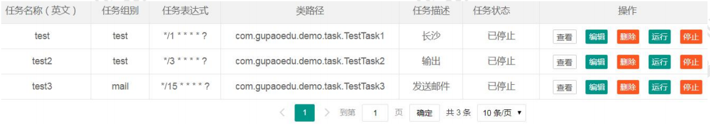
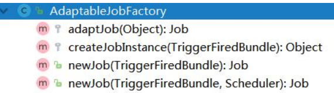

# 5 动态调度的实现

​	springboot-quartz 工程 

​	传统的 Spring 方式集成，由于任务信息全部配置在 xml 文件中，如果需要操作任务或者修改任务运行频率，只能重新编译、打包、部署、重启，如果有紧急问题需要处理，会浪费很多的时间。 

​	有没有可以动态调度任务的方法？比如停止一个 Job？启动一个 Job？修改 Job 的 触发频率？ 	读取配置文件、写入配置文件、重启 Scheduler 或重启应用明显是不可取的。 

​	对于这种频繁变更并且需要实时生效的配置信息，我们可以放到哪里？ ZK、Redis、DB tables。 并且，我们可以提供一个界面，实现对数据表的轻松操作

## 5.1 配置管理 

这里我们用最简单的数据库的实现。 

问题 1：建一张什么样的表？参考 JobDetail 的属性。

```sql
CREATE TABLE `sys_job` (
	`id` INT ( 11 ) NOT NULL AUTO_INCREMENT COMMENT 'ID',
	`job_name` VARCHAR ( 512 ) NOT NULL COMMENT '任务名称',
	`job_group` VARCHAR ( 512 ) NOT NULL COMMENT '任务组名',
	`job_cron` VARCHAR ( 512 ) NOT NULL COMMENT '时间表达式',
	`job_class_path` VARCHAR ( 1024 ) NOT NULL COMMENT '类路径,全类型',
	`job_data_map` VARCHAR ( 1024 ) DEFAULT NULL COMMENT '传递 map 参数',
	`job_status` INT ( 2 ) NOT NULL COMMENT '状态:1 启用 0 停用',
	`job_describe` VARCHAR ( 1024 ) DEFAULT NULL COMMENT '任务功能描述',
PRIMARY KEY ( `id` ) 
) ENGINE = INNODB AUTO_INCREMENT = 25 DEFAULT CHARSET = utf8;
```

## 5.2 数据操作与任务调度 

​	操作数据表非常简单，SSM 增删改查。 但是在修改了表的数据之后，怎么让调度器知道呢？ 

​	调度器的接口：Scheduler 在我们的需求中，我们需要做的事情： 

1、 新增一个任务 

2、 删除一个任务 

3、 启动、停止一个任务 

4、 修改任务的信息（包括调度规律） 

因 此 可 以 把 相 关 的 操 作 封 装 到 一 个 工 具 类 中 。 com.gupaoedu.demo.util.SchedulerUtil 

## 5.3 前端界面 



接下来我们有两个问题要解决： 

## 5.4 容器启动与 Service 注入 

### 5.4.1 容器启动 

​	因为任务没有定义在 ApplicationContext.xml 中，而是放到了数据库中，Spring Boot 启动时，怎么读取任务信息？ 或者，怎么在 Spring 启动完成的时候做一些事情？ 

​	创建一个类，实现 CommandLineRunner 接口，实现 run 方法。 从表中查出状态是 1 的任务，然后构建。 

### 5.4.2 Service 类注入到 Job 中 

#### 问题：空指针异常

Spring Bean 如何注入到实现了 Job 接口的类中？ 

​	例如在 TestTask3 中，需要注入 ISysJobService，查询数据库发送邮件。 如果没有任何配置，注入会报空指针异常。 

#### 原因：

​	 因为定时任务 Job 对象的实例化过程是在 Quartz 中进行的，而 Service Bean 是由 Spring 容器管理的，Quartz 察觉不到 Service Bean 的存在，所以无法将 Service Bean 装配到 Job 对象中。 

#### 分析： 

​	Quartz 集成到 Spring 中，用到 SchedulerFactoryBean，其实现了 InitializingBean 方法，在唯一的方法 afterPropertiesSet()在 Bean 的属性初始化后调用。 

​	调度器用 AdaptableJobFactory 对 Job 对象进行实例化。所以，如果我们可以把这 个 JobFactory 指定为我们自定义的工厂的话，就可以在 Job 实例化完成之后，把 Job 纳入到 Spring 容器中管理。 

#### 解决这个问题的步骤： 

​	1、定义一个 AdaptableJobFactory，实现 JobFactory 接口，实现接口定义的 newJob 方法，在这里面返回 Job 实例 



​	2、定义一个 MyJobFactory，继承 AdaptableJobFactory。 

使用 Spring 的 AutowireCapableBeanFactory，把 Job 实例注入到容器中。

```java
@Component
public class MyJobFactory extends AdaptableJobFactory {
    @Autowired
    private AutowireCapableBeanFactory capableBeanFactory;

    protected Object createJobInstance(TriggerFiredBundle bundle) throws Exception {
        //调用父类的方法
        Object jobInstance = super.createJobInstance(bundle);
        capableBeanFactory.autowireBean(jobInstance);

        return jobInstance;
    }
}
```

​	3、指定 Scheduler 的 JobFactory 为自定义的 JobFactory。 com.gupaoedu.demo.config.InitStartSchedule 中： scheduler.setJobFactory(myJobFactory); 


